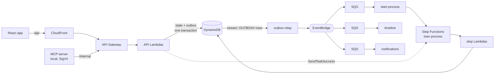
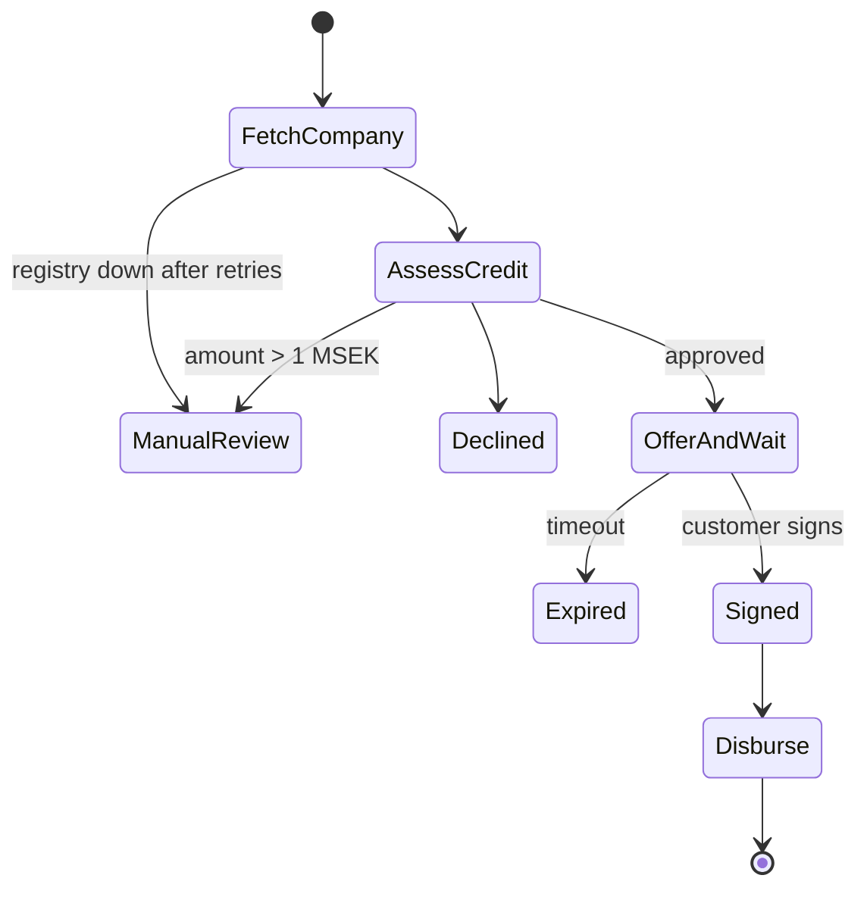

# LoanFlow

A demo **business-loan process** — apply, credit decision, offer, sign, payout, repayment — built as an **event-driven, serverless** system on AWS in TypeScript.

> ⚠️ Demo only. No real money, no real companies, no real credit data.

## What it shows

- **Orchestration inside the process** (Step Functions), **choreography between parts** (EventBridge).
- **Transactional outbox**: state and event are saved in one DynamoDB transaction; a stream Lambda publishes.
- **Exactly-once in effect**: idempotency keys on the API, idempotent consumers, crash-safe payout.
- **Money done right**: integer öre, double-entry append-only ledger, property-based tests.
- **Failure handling**: retries with jitter, DLQs with alarms, race-free signing vs. expiry.
- **Production basics**: CI/CD with OIDC (no keys), structured logs, tracing, metrics, dashboard, smoke test.
- **AI in the workflow**: a read-only MCP server for case handlers.

## Architecture



### The loan process



## Test companies

| Company | Outcome |
|---|---|
| Kafé Solsidan AB | Approved |
| Bygg & Montage AB | Approved with a lower amount |
| Skuldsatt AB | Declined (payment remarks) |
| Långsam Data AB | Registry down → retries → manual review |

## Run it

```bash
pnpm install
pnpm test                         # all unit, property and CDK tests
aws login                         # short-lived credentials, no keys
pnpm --filter @loanflow/web build
cd infra && pnpm exec cdk deploy LoanFlow -c alertEmail=you@example.com -c offerTimeoutSeconds=300
```

Smoke test: `pnpm exec tsx scripts/smoke.ts <SiteUrl> <ApiUrl>`.

### MCP server

See Task 13 in `docs/superpowers/plans/2026-10-02-loanflow.md` for the AWS profile and the `claude mcp add` command. Then ask: *"Which applications are in manual review, and why?"*

## Decisions

See [`docs/decisions`](docs/decisions): why each choice was made and what it costs.
