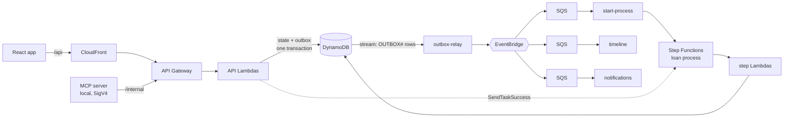
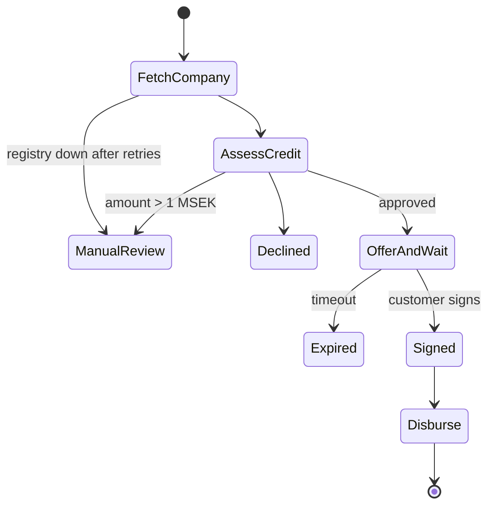

# LoanFlow

A demo **business-loan process** — apply, credit decision, offer, sign, payout, repayment — built as an **event-driven, serverless** system on AWS in TypeScript.

> ⚠️ Demo only. No real money, no real companies, no real credit data.

## What it shows

- **Orchestration inside the process** (Step Functions), **choreography between parts** (EventBridge).
- **Transactional outbox**: state and event are saved in one DynamoDB transaction; a stream Lambda publishes.
- **Exactly-once in effect**: idempotency keys on the API, idempotent consumers, crash-safe payout.
- **Money done right**: integer öre, double-entry append-only ledger, property-based tests.
- **Failure handling**: retries with jitter, DLQs with alarms, race-free signing vs. expiry.
- **Production basics**: CI/CD with OIDC (no keys), structured logs, tracing, metrics, dashboard, smoke test.
- **AI in the workflow**: a read-only MCP server for case handlers.

## Architecture



### The loan process



## Test companies

| Company | Outcome |
|---|---|
| Kafé Solsidan AB | Approved |
| Bygg & Montage AB | Approved with a lower amount |
| Skuldsatt AB | Declined (payment remarks) |
| Långsam Data AB | Registry down → retries → manual review |

## Run it

```bash
pnpm install
pnpm test                         # all unit, property and CDK tests
aws login --profile loanflow      # short-lived credentials, no keys
export AWS_PROFILE=loanflow
pnpm --filter @loanflow/web build
(cd infra && pnpm exec cdk deploy LoanFlow -c alertEmail=you@example.com -c offerTimeoutSeconds=300)
scripts/create-budget.sh you@example.com   # once per account: $5/month cost alert
```

Smoke test: `pnpm exec tsx scripts/smoke.ts <SiteUrl> <ApiUrl>`.

### MCP server

A local, **read-only** MCP server for case handlers. Tools: `list_applications`, `get_application`, `explain_decision`, `list_events`, `get_ledger`. It calls the IAM-protected `/internal/*` routes with SigV4 — no API keys.

**Quick setup:** `aws login --profile loanflow && scripts/setup-mcp.sh` does steps 1–2 and the 403 check below in one go (safe to re-run). The manual steps:

**1. Add a profile** to `~/.aws/config` that assumes the read-only role (`McpReaderRoleArn` stack output). `source_profile` is the profile you log in with:

```ini
[profile loanflow-mcp]
role_arn = <McpReaderRoleArn>
source_profile = loanflow
region = eu-north-1
```

Check it: `AWS_PROFILE=loanflow-mcp aws sts get-caller-identity` → `assumed-role/loanflow-mcp-reader/…`.

**2. Register the server** with Claude Code, from the repo root (local scope = only this project):

```bash
API_URL=$(jq -r '.LoanFlow.ApiUrl' infra/cdk-outputs.json)
claude mcp add loanflow -s local -e LOANFLOW_API_URL="$API_URL" -e AWS_PROFILE=loanflow-mcp -- \
  "$PWD/services/mcp/node_modules/.bin/tsx" "$PWD/services/mcp/src/server.ts"
```

**3. Use it:**

```bash
aws login --profile loanflow   # if the session has expired
claude                         # then /mcp → "loanflow" should be connected
```

Ask: *"Which applications are in manual review, and why?"*

The internal API refuses unsigned calls: `curl -s -o /dev/null -w '%{http_code}' "$API_URL/internal/applications"` → `403`.

## CI setup

The PR workflow runs lint, typecheck and tests, and posts a `cdk diff`. It needs:

- **GitHub variables** (Settings → Secrets and variables → Actions → Variables): `AWS_ACCOUNT_ID`, `OFFER_TIMEOUT_SECONDS`.
- **GitHub secret:** `ALERT_EMAIL` (a secret, so the address is masked in the public Actions logs).
- **One-time deploy** of the OIDC role the workflow assumes (no stored AWS keys):

```bash
cd infra && pnpm exec cdk deploy LoanFlowGithubOidc
```

## Decisions

See [`docs/decisions`](docs/decisions): why each choice was made and what it costs.
