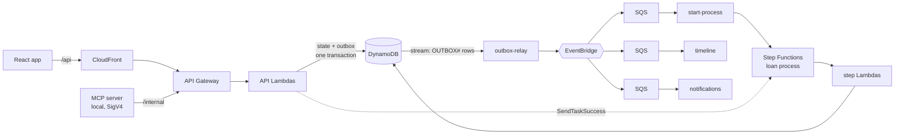
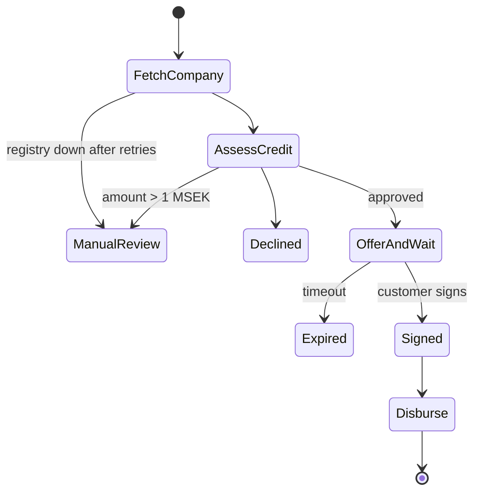

# LoanFlow Implementation Plan

> **For agentic workers:** REQUIRED SUB-SKILL: Use superpowers:subagent-driven-development (recommended) or superpowers:executing-plans to implement this plan task-by-task. Steps use checkbox (`- [ ]`) syntax for tracking.

**Goal:** A deployed, event-driven, serverless business-loan demo (apply → decision → offer → sign → payout → repayment) with a live event timeline and a read-only MCP server for case handlers.

**Architecture:** API Lambdas write state + an outbox row in one DynamoDB transaction. A stream Lambda relays outbox rows to EventBridge. A Step Functions Standard state machine orchestrates the loan process (started by an `ApplicationSubmitted` consumer, waits for signing with a task token). SQS-backed consumers build the UI timeline and send fake notifications. All money logic lives in a pure `core` package.

**Tech Stack:** TypeScript 5.9 (strict), Node.js 22 on Lambda ARM64, pnpm workspaces, AWS CDK v2, DynamoDB, Step Functions, EventBridge, SQS, API Gateway HTTP API, CloudFront + S3, React 19 + Vite, zod 4, Vitest 5, fast-check, AWS Lambda Powertools, `@modelcontextprotocol/sdk`.

**Spec:** `docs/superpowers/specs/2026-10-02-loanflow-design.md`

## Global Constraints

- Region `eu-north-1`. Stack name `LoanFlow`. Metrics namespace `LoanFlow`. Event source `loanflow`. Bus name `loanflow`.
- No Qred branding anywhere. Product name **LoanFlow**. Banner text: `Demo — inga riktiga lån`.
- UI copy in Swedish. Code, comments, docs and commit messages in English.
- **Money is integer öre** using the branded `Ore` type from `@loanflow/core`. Never floats for stored amounts.
- No VPC, NAT Gateway, RDS, Fargate, Secrets Manager or customer-managed KMS keys.
- Every Lambda: `NODEJS_22_X`, `ARM_64`, `tracing: ACTIVE`, own IAM role with only the actions it uses, log retention one month.
- Every SQS queue has a DLQ with `maxReceiveCount: 3`. Visibility timeout = 6 × consumer Lambda timeout.
- Only `outbox-relay` calls `PutEvents`. Business code writes outbox rows inside the same `TransactWriteItems` as the state change.
- `POST /api/applications`, `POST /api/applications/{id}/sign` and `POST /api/loans/{id}/payments` require an `Idempotency-Key` header.
- Errors are `application/problem+json`: `{ type, title, status, detail, correlationId }`.
- Offer timeout: `OFFER_TIMEOUT_SECONDS` = 604800 (7 days) by default; CDK context `offerTimeoutSeconds` overrides it (300 for the live demo).
- No long-lived AWS access keys anywhere. GitHub Actions uses OIDC.
- AWS Budget alert at **$5**.
- Do not commit `interview.md` (already in `.git/info/exclude`).

## Review Focus

1. **Double-click or network retry on "Signera" / "Betala nästa delbetalning"** → exactly one effect. The web app must reuse the same `Idempotency-Key` for retries of one user action (Task 11 test: `useActionKey` returns the same key until `reset()`).
2. **Signing an offer that just expired** → `409` with `detail: "Erbjudandet har gått ut"`, never a 500 (Task 5 test: `sign returns 409 when Step Functions says TaskTimedOut`).
3. **Polling while the process runs** → `GET /api/applications/{id}` never leaks `taskToken` (Task 5 test: `get never returns taskToken`; Task 9 test for the internal route).
4. **The same event delivered twice or out of order** → the timeline shows it once and in time order (Task 8 test: `duplicate event is ignored`; Task 11 test: `Timeline sorts by occurredAt then sequence`).
5. **Amounts that do not divide evenly by the term** (e.g. 100 000 kr over 12 months) → principal parts sum exactly to the amount, and the UI only accepts whole kronor (Task 1 property test; Task 11 test: `toOre rejects decimals and out-of-range`).

## File Map

```
package.json, pnpm-workspace.yaml, tsconfig.base.json, eslint.config.js, .prettierrc, .nvmrc
packages/core/src/
  money.ts          Ore brand, kr(), add/sub/percentOf, formatKr
  pricing.ts        TERMS, risk bands, buildOffer(), maxMonthlyCost()
  status.ts         application status machine
  companies.ts      the four test companies
  credit.ts         assess(), RULES_VERSION
  ledger.ts         double-entry entries, receivableBalance()
  domain.ts         Application, Loan, nextInstalment(), toPublicApplication()
  events.ts         event envelope, zod schemas, makeEvent(), parseEvent(), summarize()
  index.ts          re-exports
services/api/src/
  http.ts           httpHandler, HttpError, parseBody, pathId, idempotencyKey, requestHash
  sqs.ts            sqsBatch() helper for SQS consumers
  db/client.ts      doc client, tableName(), transact(), ConditionFailedError
  db/keys.ts        key builders, ttlIn()
  db/outbox.ts      outboxPut()
  db/idempotency.ts checkIdempotency(), idempotencyPut(), rememberResult()
  db/applications.ts application repo + eventMeta()
  db/loans.ts       loan + ledger repo
  fakes/registry.ts lookupCompany(), RegistryUnavailableError
  fakes/bank.ts     payout()
  handlers/companies-api.ts
  handlers/applications-api.ts
  handlers/loans-api.ts
  handlers/internal-api.ts
  handlers/start-process.ts
  handlers/outbox-relay.ts
  handlers/timeline-consumer.ts
  handlers/notifications-consumer.ts
  steps/fetch-company.ts, assess-credit.ts, create-offer.ts, set-status.ts, disburse.ts
services/mcp/src/   client.ts (SigV4 fetch), tools.ts, server.ts
infra/              bin/app.ts, lib/{loanflow-stack,functions,data,process,events,api,web,monitoring,github-oidc-stack}.ts, test/
apps/web/src/       api.ts, format.ts, useActionKey.ts, pages/*, components/*
scripts/smoke.ts
docs/decisions/0001..0007-*.md, README.md
```

---

### Task 1: Monorepo scaffold, money and pricing

**Files:**
- Create: `package.json`, `pnpm-workspace.yaml`, `tsconfig.base.json`, `eslint.config.js`, `.prettierrc`, `.nvmrc`
- Create: `packages/core/package.json`, `packages/core/tsconfig.json`, `packages/core/src/money.ts`, `packages/core/src/pricing.ts`, `packages/core/src/index.ts`
- Test: `packages/core/test/money.test.ts`, `packages/core/test/pricing.test.ts`

**Interfaces:**
- Produces: `Ore`, `ore(n)`, `kr(n)`, `addOre(...v)`, `subOre(a,b)`, `percentOf(a, rate)`, `formatKr(o)`, `OreSchema`; `TERMS`, `TermMonths`, `RiskBand`, `MONTHLY_FEE_RATE`, `Instalment`, `Offer`, `buildOffer(amount, termMonths, riskBand)`, `maxMonthlyCost(offer)`.

- [ ] **Step 1: Create root workspace files**

`package.json`:
```json
{
  "name": "loanflow",
  "private": true,
  "type": "module",
  "scripts": {
    "lint": "eslint .",
    "typecheck": "pnpm -r typecheck",
    "test": "pnpm -r test",
    "format": "prettier --write ."
  },
  "packageManager": "pnpm@10.33.0",
  "devDependencies": {
    "@eslint/js": "^10.0.1",
    "eslint": "^10.11.0",
    "eslint-plugin-react-hooks": "^7.1.1",
    "prettier": "^3.9.9",
    "typescript": "^5.9.3",
    "typescript-eslint": "^8.71.0"
  }
}
```

`pnpm-workspace.yaml`:
```yaml
packages:
  - apps/*
  - services/*
  - packages/*
  - infra
onlyBuiltDependencies:
  - esbuild
```

`tsconfig.base.json`:
```json
{
  "compilerOptions": {
    "target": "ES2022",
    "lib": ["ES2022"],
    "module": "ESNext",
    "moduleResolution": "Bundler",
    "strict": true,
    "noUncheckedIndexedAccess": true,
    "isolatedModules": true,
    "esModuleInterop": true,
    "resolveJsonModule": true,
    "skipLibCheck": true,
    "forceConsistentCasingInFileNames": true,
    "noEmit": true
  }
}
```

`eslint.config.js`:
```js
import js from '@eslint/js';
import tseslint from 'typescript-eslint';
import reactHooks from 'eslint-plugin-react-hooks';

export default tseslint.config(
  { ignores: ['**/dist/**', '**/cdk.out/**', '**/node_modules/**'] },
  js.configs.recommended,
  ...tseslint.configs.recommended,
  {
    files: ['apps/web/**/*.tsx'],
    plugins: { 'react-hooks': reactHooks },
    rules: { 'react-hooks/rules-of-hooks': 'error', 'react-hooks/exhaustive-deps': 'warn' },
  },
);
```

`.prettierrc`:
```json
{ "singleQuote": true, "printWidth": 110, "trailingComma": "all" }
```

`.nvmrc`:
```
22
```

`packages/core/package.json`:
```json
{
  "name": "@loanflow/core",
  "version": "0.0.0",
  "private": true,
  "type": "module",
  "main": "./src/index.ts",
  "types": "./src/index.ts",
  "exports": { ".": "./src/index.ts" },
  "scripts": { "typecheck": "tsc --noEmit", "test": "vitest run" },
  "dependencies": { "zod": "^4.6.5" },
  "devDependencies": { "fast-check": "^4.3.0", "typescript": "^5.9.3", "vitest": "^5.0.3" }
}
```

`packages/core/tsconfig.json`:
```json
{ "extends": "../../tsconfig.base.json", "include": ["src", "test"] }
```

Run: `pnpm install`
Expected: lockfile created, no errors.

- [ ] **Step 2: Write the failing money tests**

`packages/core/test/money.test.ts`:
```ts
import { describe, expect, it } from 'vitest';
import { addOre, formatKr, kr, ore, OreSchema, percentOf, subOre } from '../src/money';

describe('money', () => {
  it('kr converts kronor to integer öre', () => {
    expect(kr(1234.5)).toBe(123450);
  });

  it('ore rejects non-integers', () => {
    expect(() => ore(1.5)).toThrow(RangeError);
  });

  it('adds and subtracts', () => {
    expect(addOre(kr(1), kr(2), kr(3))).toBe(kr(6));
    expect(subOre(kr(10), kr(4))).toBe(kr(6));
  });

  it('percentOf rounds to whole öre', () => {
    expect(percentOf(ore(333), 0.5)).toBe(167);
  });

  it('formats Swedish kronor', () => {
    expect(formatKr(kr(100000)).replace(/\s/g, ' ')).toBe('100 000 kr');
  });

  it('OreSchema accepts integers and rejects decimals', () => {
    expect(OreSchema.parse(500)).toBe(500);
    expect(() => OreSchema.parse(5.5)).toThrow();
  });
});
```

- [ ] **Step 3: Run test to verify it fails**

Run: `pnpm --filter @loanflow/core test`
Expected: FAIL — cannot find module `../src/money`.

- [ ] **Step 4: Implement money**

`packages/core/src/money.ts`:
```ts
import { z } from 'zod';

declare const oreBrand: unique symbol;
/** All money is integer öre (1 kr = 100 öre). The brand stops raw numbers sneaking in. */
export type Ore = number & { readonly [oreBrand]: true };

export function ore(value: number): Ore {
  if (!Number.isSafeInteger(value)) throw new RangeError(`Not an integer öre amount: ${value}`);
  return value as Ore;
}

export const kr = (amount: number): Ore => ore(Math.round(amount * 100));
export const addOre = (...values: Ore[]): Ore => ore(values.reduce((sum, v) => sum + v, 0));
export const subOre = (a: Ore, b: Ore): Ore => ore(a - b);
/** Multiplies by a rate and rounds to the nearest whole öre. */
export const percentOf = (amount: Ore, rate: number): Ore => ore(Math.round(amount * rate));

export const OreSchema = z
  .number()
  .int()
  .transform((v) => ore(v));

export function formatKr(value: Ore): string {
  const hasOre = value % 100 !== 0;
  return new Intl.NumberFormat('sv-SE', {
    style: 'currency',
    currency: 'SEK',
    minimumFractionDigits: hasOre ? 2 : 0,
    maximumFractionDigits: 2,
  }).format(value / 100);
}
```

- [ ] **Step 5: Run money tests**

Run: `pnpm --filter @loanflow/core test`
Expected: PASS (6 tests).

- [ ] **Step 6: Write the failing pricing tests**

`packages/core/test/pricing.test.ts`:
```ts
import fc from 'fast-check';
import { describe, expect, it } from 'vitest';
import { kr, ore } from '../src/money';
import { buildOffer, maxMonthlyCost, TERMS } from '../src/pricing';

describe('buildOffer', () => {
  it('builds a straight-amortisation plan with a fixed monthly fee', () => {
    const offer = buildOffer(kr(100_000), 12, 'A');
    expect(offer.monthlyFee).toBe(kr(1_200)); // 1.2 % of 100 000 kr
    expect(offer.schedule).toHaveLength(12);
    expect(offer.schedule[0]!.principal).toBe(833_333);
    expect(offer.schedule[11]!.principal).toBe(833_337); // last one absorbs rounding
    expect(offer.totalFees).toBe(kr(14_400));
    expect(offer.totalCost).toBe(kr(114_400));
  });

  it('maxMonthlyCost is the largest instalment', () => {
    const offer = buildOffer(kr(100_000), 12, 'A');
    expect(maxMonthlyCost(offer)).toBe(833_337 + kr(1_200));
  });

  it('rejects zero or negative amounts', () => {
    expect(() => buildOffer(ore(0), 12, 'A')).toThrow(RangeError);
  });

  it('principal parts always sum exactly to the amount (Review Focus 5)', () => {
    fc.assert(
      fc.property(
        fc.integer({ min: kr(10_000), max: kr(2_000_000) }),
        fc.constantFrom(...TERMS),
        fc.constantFrom('A' as const, 'B' as const, 'C' as const),
        (amount, term, band) => {
          const offer = buildOffer(ore(amount), term, band);
          const sum = offer.schedule.reduce((s, i) => s + i.principal, 0);
          expect(sum).toBe(amount);
          expect(offer.schedule.every((i) => i.principal > 0 && i.total === i.principal + i.fee)).toBe(true);
          expect(offer.totalCost).toBe(offer.schedule.reduce((s, i) => s + i.total, 0));
        },
      ),
    );
  });
});
```

- [ ] **Step 7: Run test to verify it fails**

Run: `pnpm --filter @loanflow/core test`
Expected: FAIL — cannot find module `../src/pricing`.

- [ ] **Step 8: Implement pricing**

`packages/core/src/pricing.ts`:
```ts
import { addOre, ore, percentOf, type Ore } from './money';

export const TERMS = [6, 12, 24] as const;
export type TermMonths = (typeof TERMS)[number];

export type RiskBand = 'A' | 'B' | 'C';
/** Made-up pricing: a fixed monthly fee as a share of the loan amount. Not Qred's real model. */
export const MONTHLY_FEE_RATE: Record<RiskBand, number> = { A: 0.012, B: 0.018, C: 0.025 };

export type Instalment = { number: number; principal: Ore; fee: Ore; total: Ore };

export type Offer = {
  amount: Ore;
  termMonths: TermMonths;
  riskBand: RiskBand;
  monthlyFeeRate: number;
  monthlyFee: Ore;
  schedule: Instalment[];
  totalFees: Ore;
  totalCost: Ore;
};

export function buildOffer(amount: Ore, termMonths: TermMonths, riskBand: RiskBand): Offer {
  if (amount <= 0) throw new RangeError('Amount must be positive');
  const monthlyFeeRate = MONTHLY_FEE_RATE[riskBand];
  const monthlyFee = percentOf(amount, monthlyFeeRate);
  const basePrincipal = Math.floor(amount / termMonths);

  const schedule: Instalment[] = Array.from({ length: termMonths }, (_, i) => {
    const isLast = i === termMonths - 1;
    // The last instalment absorbs the rounding remainder, so the parts sum exactly to the amount
    const principal = ore(isLast ? amount - basePrincipal * (termMonths - 1) : basePrincipal);
    return { number: i + 1, principal, fee: monthlyFee, total: addOre(principal, monthlyFee) };
  });

  const totalFees = ore(monthlyFee * termMonths);
  return { amount, termMonths, riskBand, monthlyFeeRate, monthlyFee, schedule, totalFees, totalCost: addOre(amount, totalFees) };
}

export const maxMonthlyCost = (offer: Offer): Ore => ore(Math.max(...offer.schedule.map((i) => i.total)));
```

`packages/core/src/index.ts`:
```ts
export * from './money';
export * from './pricing';
```

- [ ] **Step 9: Run tests and typecheck**

Run: `pnpm --filter @loanflow/core test && pnpm --filter @loanflow/core typecheck`
Expected: PASS (10 tests), no type errors.

- [ ] **Step 10: Commit**

```bash
git add -A
git commit -m "feat(core): workspace scaffold, money and pricing"
```

---

### Task 2: Status machine, test companies and credit rules

**Files:**
- Create: `packages/core/src/status.ts`, `packages/core/src/companies.ts`, `packages/core/src/credit.ts`
- Modify: `packages/core/src/index.ts`
- Test: `packages/core/test/status.test.ts`, `packages/core/test/credit.test.ts`

**Interfaces:**
- Consumes: `Ore`, `kr`, `ore`, `buildOffer`, `maxMonthlyCost`, `RiskBand`, `TermMonths` (Task 1).
- Produces:
  - `APPLICATION_STATUSES`, `ApplicationStatus`, `assertTransition(from, to)`, `InvalidTransitionError`, `isFinal(status)`
  - `Company = { orgNr; name; ageMonths; avgMonthlyInflow: Ore; paymentRemarks; bankrupt; registryBehaviour: 'ok' | 'unavailable' }`, `TEST_COMPANIES`, `findCompany(orgNr)`
  - `CreditInput = Pick<Company, 'ageMonths' | 'avgMonthlyInflow' | 'paymentRemarks' | 'bankrupt'>`
  - `RULES_VERSION`, `MIN_AMOUNT`, `MAX_AMOUNT`, `AUTO_LIMIT`, `DecisionOutcome`, `ReasonCode`, `Decision`, `riskBandFor(ageMonths)`, `assess(input, request)`

- [ ] **Step 1: Write the failing status tests**

`packages/core/test/status.test.ts`:
```ts
import { describe, expect, it } from 'vitest';
import { assertTransition, InvalidTransitionError, isFinal } from '../src/status';

describe('application status machine', () => {
  it.each([
    ['SUBMITTED', 'ASSESSING'],
    ['SUBMITTED', 'MANUAL_REVIEW'],
    ['ASSESSING', 'OFFERED'],
    ['ASSESSING', 'DECLINED'],
    ['ASSESSING', 'MANUAL_REVIEW'],
    ['OFFERED', 'SIGNED'],
    ['OFFERED', 'EXPIRED'],
    ['SIGNED', 'DISBURSED'],
  ] as const)('allows %s → %s', (from, to) => {
    expect(() => assertTransition(from, to)).not.toThrow();
  });

  it.each([
    ['SUBMITTED', 'OFFERED'],
    ['OFFERED', 'DISBURSED'],
    ['EXPIRED', 'SIGNED'],
    ['DECLINED', 'OFFERED'],
  ] as const)('rejects %s → %s', (from, to) => {
    expect(() => assertTransition(from, to)).toThrow(InvalidTransitionError);
  });

  it('knows final statuses', () => {
    expect(isFinal('DISBURSED')).toBe(true);
    expect(isFinal('OFFERED')).toBe(false);
  });
});
```

- [ ] **Step 2: Run test to verify it fails**

Run: `pnpm --filter @loanflow/core test status`
Expected: FAIL — cannot find module `../src/status`.

- [ ] **Step 3: Implement status**

`packages/core/src/status.ts`:
```ts
export const APPLICATION_STATUSES = [
  'SUBMITTED',
  'ASSESSING',
  'OFFERED',
  'SIGNED',
  'DISBURSED',
  'DECLINED',
  'EXPIRED',
  'MANUAL_REVIEW',
] as const;
export type ApplicationStatus = (typeof APPLICATION_STATUSES)[number];

const ALLOWED: Record<ApplicationStatus, readonly ApplicationStatus[]> = {
  SUBMITTED: ['ASSESSING', 'MANUAL_REVIEW'],
  ASSESSING: ['OFFERED', 'DECLINED', 'MANUAL_REVIEW'],
  OFFERED: ['SIGNED', 'EXPIRED'],
  SIGNED: ['DISBURSED'],
  DISBURSED: [],
  DECLINED: [],
  EXPIRED: [],
  MANUAL_REVIEW: [],
};

export class InvalidTransitionError extends Error {
  override name = 'InvalidTransitionError';
  constructor(
    readonly from: ApplicationStatus,
    readonly to: ApplicationStatus,
  ) {
    super(`Invalid status transition ${from} → ${to}`);
  }
}

export function assertTransition(from: ApplicationStatus, to: ApplicationStatus): void {
  if (!ALLOWED[from].includes(to)) throw new InvalidTransitionError(from, to);
}

export const isFinal = (status: ApplicationStatus): boolean => ALLOWED[status].length === 0;
```

- [ ] **Step 4: Run status tests**

Run: `pnpm --filter @loanflow/core test status`
Expected: PASS.

- [ ] **Step 5: Write the failing credit tests**

`packages/core/test/credit.test.ts`:
```ts
import { describe, expect, it } from 'vitest';
import { findCompany, TEST_COMPANIES } from '../src/companies';
import { assess, riskBandFor, RULES_VERSION } from '../src/credit';
import { kr } from '../src/money';
import { buildOffer, maxMonthlyCost } from '../src/pricing';

const company = (orgNr: string) => {
  const c = findCompany(orgNr);
  if (!c) throw new Error(`missing ${orgNr}`);
  return c;
};

describe('test companies', () => {
  it('has four companies with unique org numbers', () => {
    expect(new Set(TEST_COMPANIES.map((c) => c.orgNr)).size).toBe(4);
  });
});

describe('riskBandFor', () => {
  it('maps company age to a band', () => {
    expect(riskBandFor(48)).toBe('A');
    expect(riskBandFor(24)).toBe('B');
    expect(riskBandFor(8)).toBe('C');
  });
});

describe('assess', () => {
  it('approves Kafé Solsidan for 200 000 kr over 12 months', () => {
    const d = assess(company('559900-0001'), { amount: kr(200_000), termMonths: 12 });
    expect(d.outcome).toBe('APPROVED');
    expect(d.approvedAmount).toBe(kr(200_000));
    expect(d.riskBand).toBe('A');
    expect(d.rulesVersion).toBe(RULES_VERSION);
  });

  it('approves Bygg & Montage with a lower amount that fits 15 % of cash flow', () => {
    const c = company('559900-0002');
    const d = assess(c, { amount: kr(200_000), termMonths: 12 });
    expect(d.outcome).toBe('APPROVED_WITH_CHANGES');
    expect(d.reasons).toEqual(['LOW_CASHFLOW']);
    expect(d.approvedAmount).toBe(kr(88_000));
    const offer = buildOffer(d.approvedAmount!, 12, d.riskBand);
    expect(maxMonthlyCost(offer)).toBeLessThanOrEqual(Math.floor(c.avgMonthlyInflow * 0.15));
  });

  it('declines Skuldsatt AB for payment remarks', () => {
    const d = assess(company('559900-0003'), { amount: kr(50_000), termMonths: 6 });
    expect(d.outcome).toBe('DECLINED');
    expect(d.reasons).toEqual(['PAYMENT_REMARKS']);
    expect(d.approvedAmount).toBeUndefined();
  });

  it('declines bankrupt companies first', () => {
    const d = assess({ ...company('559900-0001'), bankrupt: true }, { amount: kr(50_000), termMonths: 6 });
    expect(d.reasons).toEqual(['BANKRUPTCY']);
  });

  it('declines companies younger than 6 months', () => {
    const d = assess({ ...company('559900-0001'), ageMonths: 5 }, { amount: kr(50_000), termMonths: 6 });
    expect(d).toMatchObject({ outcome: 'DECLINED', reasons: ['COMPANY_TOO_YOUNG'] });
  });

  it('sends amounts over 1 000 000 kr to manual review', () => {
    const d = assess(company('559900-0001'), { amount: kr(1_000_001), termMonths: 24 });
    expect(d).toMatchObject({ outcome: 'MANUAL_REVIEW', reasons: ['AMOUNT_ABOVE_AUTO_LIMIT'] });
  });

  it('declines when even the minimum amount does not fit cash flow', () => {
    const d = assess(
      { ...company('559900-0002'), avgMonthlyInflow: kr(5_000) },
      { amount: kr(100_000), termMonths: 6 },
    );
    expect(d).toMatchObject({ outcome: 'DECLINED', reasons: ['LOW_CASHFLOW'] });
  });

  it('records the inputs it used', () => {
    const d = assess(company('559900-0001'), { amount: kr(200_000), termMonths: 12 });
    expect(d.inputs).toMatchObject({ ageMonths: 48, amount: kr(200_000), termMonths: 12, monthlyCostLimit: kr(60_000) });
  });
});
```

- [ ] **Step 6: Run test to verify it fails**

Run: `pnpm --filter @loanflow/core test credit`
Expected: FAIL — cannot find module `../src/companies`.

- [ ] **Step 7: Implement companies and credit**

`packages/core/src/companies.ts`:
```ts
import { kr, type Ore } from './money';

export type Company = {
  orgNr: string;
  name: string;
  ageMonths: number;
  avgMonthlyInflow: Ore;
  paymentRemarks: boolean;
  bankrupt: boolean;
  /** How the fake company registry behaves for this company. */
  registryBehaviour: 'ok' | 'unavailable';
};

/** Made-up companies. There is no free-text org number field, so real data cannot be entered. */
export const TEST_COMPANIES: readonly Company[] = [
  { orgNr: '559900-0001', name: 'Kafé Solsidan AB', ageMonths: 48, avgMonthlyInflow: kr(400_000), paymentRemarks: false, bankrupt: false, registryBehaviour: 'ok' },
  { orgNr: '559900-0002', name: 'Bygg & Montage AB', ageMonths: 24, avgMonthlyInflow: kr(60_000), paymentRemarks: false, bankrupt: false, registryBehaviour: 'ok' },
  { orgNr: '559900-0003', name: 'Skuldsatt AB', ageMonths: 36, avgMonthlyInflow: kr(200_000), paymentRemarks: true, bankrupt: false, registryBehaviour: 'ok' },
  { orgNr: '559900-0004', name: 'Långsam Data AB', ageMonths: 60, avgMonthlyInflow: kr(500_000), paymentRemarks: false, bankrupt: false, registryBehaviour: 'unavailable' },
];

export const findCompany = (orgNr: string): Company | undefined => TEST_COMPANIES.find((c) => c.orgNr === orgNr);
```

`packages/core/src/credit.ts`:
```ts
import type { Company } from './companies';
import { kr, ore, percentOf, type Ore } from './money';
import { buildOffer, maxMonthlyCost, MONTHLY_FEE_RATE, type RiskBand, type TermMonths } from './pricing';

export const RULES_VERSION = '2026-10-01';
export const MIN_AMOUNT = kr(10_000);
export const MAX_AMOUNT = kr(2_000_000);
export const AUTO_LIMIT = kr(1_000_000);
const CASHFLOW_SHARE = 0.15;
const AMOUNT_STEP = kr(1_000);

export type DecisionOutcome = 'APPROVED' | 'APPROVED_WITH_CHANGES' | 'DECLINED' | 'MANUAL_REVIEW';
export type ReasonCode =
  | 'BANKRUPTCY'
  | 'PAYMENT_REMARKS'
  | 'COMPANY_TOO_YOUNG'
  | 'AMOUNT_ABOVE_AUTO_LIMIT'
  | 'LOW_CASHFLOW'
  | 'REGISTRY_UNAVAILABLE';

export type CreditInput = Pick<Company, 'ageMonths' | 'avgMonthlyInflow' | 'paymentRemarks' | 'bankrupt'>;
export type CreditRequest = { amount: Ore; termMonths: TermMonths };

export type Decision = {
  outcome: DecisionOutcome;
  reasons: ReasonCode[];
  rulesVersion: string;
  riskBand: RiskBand;
  /** Set when the outcome is APPROVED or APPROVED_WITH_CHANGES. */
  approvedAmount?: Ore;
  /** Everything the rules looked at, so a decision can be explained later. */
  inputs: CreditInput & CreditRequest & { monthlyCostLimit: Ore };
};

export const riskBandFor = (ageMonths: number): RiskBand => (ageMonths >= 36 ? 'A' : ageMonths >= 12 ? 'B' : 'C');

/** Highest amount (in 1 000 kr steps) whose largest instalment fits under the limit. */
function maxAffordableAmount(limit: Ore, termMonths: TermMonths, band: RiskBand): Ore {
  const perOre = 1 / termMonths + MONTHLY_FEE_RATE[band];
  let candidate = Math.floor(limit / perOre / AMOUNT_STEP) * AMOUNT_STEP;
  // The formula ignores rounding of the last instalment, so step down until it really fits
  while (candidate > 0 && maxMonthlyCost(buildOffer(ore(candidate), termMonths, band)) > limit) {
    candidate -= AMOUNT_STEP;
  }
  return ore(Math.max(candidate, 0));
}

export function assess(input: CreditInput, request: CreditRequest): Decision {
  const riskBand = riskBandFor(input.ageMonths);
  const monthlyCostLimit = percentOf(input.avgMonthlyInflow, CASHFLOW_SHARE);
  const base = {
    rulesVersion: RULES_VERSION,
    riskBand,
    inputs: {
      ageMonths: input.ageMonths,
      avgMonthlyInflow: input.avgMonthlyInflow,
      paymentRemarks: input.paymentRemarks,
      bankrupt: input.bankrupt,
      ...request,
      monthlyCostLimit,
    },
  };
  const decline = (reason: ReasonCode): Decision => ({ ...base, outcome: 'DECLINED', reasons: [reason] });

  // Rules run in order; the first one that matches decides
  if (input.bankrupt) return decline('BANKRUPTCY');
  if (input.paymentRemarks) return decline('PAYMENT_REMARKS');
  if (input.ageMonths < 6) return decline('COMPANY_TOO_YOUNG');
  if (request.amount > AUTO_LIMIT) return { ...base, outcome: 'MANUAL_REVIEW', reasons: ['AMOUNT_ABOVE_AUTO_LIMIT'] };

  const requested = buildOffer(request.amount, request.termMonths, riskBand);
  if (maxMonthlyCost(requested) <= monthlyCostLimit) {
    return { ...base, outcome: 'APPROVED', reasons: [], approvedAmount: request.amount };
  }
  const affordable = maxAffordableAmount(monthlyCostLimit, request.termMonths, riskBand);
  if (affordable < MIN_AMOUNT) return decline('LOW_CASHFLOW');
  return { ...base, outcome: 'APPROVED_WITH_CHANGES', reasons: ['LOW_CASHFLOW'], approvedAmount: affordable };
}
```

Append to `packages/core/src/index.ts`:
```ts
export * from './status';
export * from './companies';
export * from './credit';
```

- [ ] **Step 8: Run all core tests and typecheck**

Run: `pnpm --filter @loanflow/core test && pnpm --filter @loanflow/core typecheck`
Expected: PASS. If the Bygg & Montage test reports a different `approvedAmount`, recompute by hand: limit 900 000 öre, band B → `floor(900000 / (1/12 + 0.018) / 100000) * 100000 = 8 800 000` öre = 88 000 kr. Fix the code, not the expected value.

- [ ] **Step 9: Commit**

```bash
git add -A
git commit -m "feat(core): status machine, test companies and credit rules"
```

---

### Task 3: Ledger, domain types and events

**Files:**
- Create: `packages/core/src/ledger.ts`, `packages/core/src/domain.ts`, `packages/core/src/events.ts`
- Modify: `packages/core/src/index.ts`
- Test: `packages/core/test/ledger.test.ts`, `packages/core/test/events.test.ts`

**Interfaces:**
- Consumes: `Ore`, `ore`, `addOre`, `OreSchema`, `formatKr`, `Instalment`, `Offer`, `TermMonths`, `TERMS`, `ApplicationStatus`, `Decision`, `CreditInput`, `ReasonCode`.
- Produces:
  - `ACCOUNTS`, `Account`, `LedgerLine`, `LedgerEntry`, `UnbalancedEntryError`, `payoutEntry({ entryId, loanId, occurredAt, amount })`, `instalmentEntry({ entryId, loanId, occurredAt, instalment })`, `receivableBalance(entries)`
  - `Application`, `PublicApplication`, `toPublicApplication(app)`, `LoanStatus`, `Loan`, `nextInstalment(loan)`
  - `EVENT_SCHEMAS`, `EVENT_TYPES`, `EventType`, `EventData<T>`, `EventMeta`, `DomainEvent<T>`, `makeEvent(type, meta, data)`, `parseEvent(raw)`, `summarize(event)`

- [ ] **Step 1: Write the failing ledger tests**

`packages/core/test/ledger.test.ts`:
```ts
import fc from 'fast-check';
import { describe, expect, it } from 'vitest';
import { instalmentEntry, payoutEntry, receivableBalance, UnbalancedEntryError, type LedgerEntry } from '../src/ledger';
import { kr, ore } from '../src/money';
import { buildOffer, TERMS } from '../src/pricing';

const meta = { loanId: 'L1', occurredAt: '2026-10-02T10:00:00.000Z' };

describe('ledger', () => {
  it('books a payout as receivable against bank payout', () => {
    const e = payoutEntry({ ...meta, entryId: 'E1', amount: kr(100_000) });
    expect(e.lines).toEqual([
      { account: 'LOAN_RECEIVABLE', debit: kr(100_000), credit: 0 },
      { account: 'BANK_PAYOUT', debit: 0, credit: kr(100_000) },
    ]);
  });

  it('books an instalment as incoming money split into principal and fee', () => {
    const e = instalmentEntry({
      ...meta,
      entryId: 'E2',
      instalment: { number: 1, principal: kr(8_000), fee: kr(1_000), total: kr(9_000) },
    });
    expect(e.lines).toEqual([
      { account: 'BANK_INCOMING', debit: kr(9_000), credit: 0 },
      { account: 'LOAN_RECEIVABLE', debit: 0, credit: kr(8_000) },
      { account: 'FEE_INCOME', debit: 0, credit: kr(1_000) },
    ]);
  });

  it('refuses an unbalanced instalment', () => {
    expect(() =>
      instalmentEntry({
        ...meta,
        entryId: 'E3',
        instalment: { number: 1, principal: kr(8_000), fee: kr(1_000), total: kr(9_500) },
      }),
    ).toThrow(UnbalancedEntryError);
  });

  it('every entry balances and a fully repaid loan ends at zero', () => {
    fc.assert(
      fc.property(fc.integer({ min: kr(10_000), max: kr(2_000_000) }), fc.constantFrom(...TERMS), (amount, term) => {
        const offer = buildOffer(ore(amount), term, 'B');
        const entries: LedgerEntry[] = [payoutEntry({ ...meta, entryId: 'P', amount: offer.amount })];
        for (const instalment of offer.schedule) {
          entries.push(instalmentEntry({ ...meta, entryId: `I${instalment.number}`, instalment }));
          expect(receivableBalance(entries)).toBeGreaterThanOrEqual(0);
        }
        for (const e of entries) {
          const debit = e.lines.reduce((s, l) => s + l.debit, 0);
          const credit = e.lines.reduce((s, l) => s + l.credit, 0);
          expect(debit).toBe(credit);
        }
        expect(receivableBalance(entries)).toBe(0);
      }),
    );
  });
});
```

- [ ] **Step 2: Run test to verify it fails**

Run: `pnpm --filter @loanflow/core test ledger`
Expected: FAIL — cannot find module `../src/ledger`.

- [ ] **Step 3: Implement ledger**

`packages/core/src/ledger.ts`:
```ts
import { ore, type Ore } from './money';
import type { Instalment } from './pricing';

export const ACCOUNTS = ['LOAN_RECEIVABLE', 'BANK_PAYOUT', 'BANK_INCOMING', 'FEE_INCOME'] as const;
export type Account = (typeof ACCOUNTS)[number];

/** One side is always zero. */
export type LedgerLine = { account: Account; debit: Ore; credit: Ore };

export type LedgerEntry = {
  entryId: string;
  loanId: string;
  occurredAt: string;
  reason: 'PAYOUT' | 'INSTALMENT';
  lines: LedgerLine[];
};

export class UnbalancedEntryError extends Error {
  override name = 'UnbalancedEntryError';
}

const zero = ore(0);
const debit = (account: Account, amount: Ore): LedgerLine => ({ account, debit: amount, credit: zero });
const credit = (account: Account, amount: Ore): LedgerLine => ({ account, debit: zero, credit: amount });

/** Entries are append-only. A mistake is fixed with a new reversing entry, never by editing. */
function entry(base: Omit<LedgerEntry, 'lines'>, lines: LedgerLine[]): LedgerEntry {
  const debits = lines.reduce((s, l) => s + l.debit, 0);
  const credits = lines.reduce((s, l) => s + l.credit, 0);
  if (debits !== credits || debits <= 0) {
    throw new UnbalancedEntryError(`Entry ${base.entryId} does not balance: debit ${debits}, credit ${credits}`);
  }
  return { ...base, lines };
}

type EntryMeta = { entryId: string; loanId: string; occurredAt: string };

export const payoutEntry = ({ amount, ...meta }: EntryMeta & { amount: Ore }): LedgerEntry =>
  entry({ ...meta, reason: 'PAYOUT' }, [debit('LOAN_RECEIVABLE', amount), credit('BANK_PAYOUT', amount)]);

export const instalmentEntry = ({ instalment, ...meta }: EntryMeta & { instalment: Instalment }): LedgerEntry =>
  entry({ ...meta, reason: 'INSTALMENT' }, [
    debit('BANK_INCOMING', instalment.total),
    credit('LOAN_RECEIVABLE', instalment.principal),
    credit('FEE_INCOME', instalment.fee),
  ]);

/** What the customer still owes: debits minus credits on the receivable account. */
export const receivableBalance = (entries: LedgerEntry[]): Ore =>
  ore(
    entries
      .flatMap((e) => e.lines)
      .filter((l) => l.account === 'LOAN_RECEIVABLE')
      .reduce((s, l) => s + l.debit - l.credit, 0),
  );
```

- [ ] **Step 4: Run ledger tests**

Run: `pnpm --filter @loanflow/core test ledger`
Expected: PASS.

- [ ] **Step 5: Implement domain types (no behaviour worth a separate test beyond events below)**

`packages/core/src/domain.ts`:
```ts
import type { CreditInput, Decision, ReasonCode } from './credit';
import type { Ore } from './money';
import type { Instalment, Offer, TermMonths } from './pricing';
import type { ApplicationStatus } from './status';

export type Application = {
  id: string;
  correlationId: string;
  orgNr: string;
  companyName: string;
  amount: Ore;
  termMonths: TermMonths;
  status: ApplicationStatus;
  version: number;
  createdAt: string;
  updatedAt: string;
  company?: CreditInput;
  decision?: Decision;
  offer?: Offer;
  offerExpiresAt?: string;
  /** Step Functions task token while waiting for signature. Never sent to clients. */
  taskToken?: string;
  manualReviewReason?: ReasonCode;
};

export type PublicApplication = Omit<Application, 'taskToken'>;

export function toPublicApplication(app: Application): PublicApplication {
  const { taskToken: _secret, ...rest } = app;
  return rest;
}

export type LoanStatus = 'ACTIVE' | 'REPAID';

/** The loan id is the application id. */
export type Loan = {
  id: string;
  applicationId: string;
  correlationId: string;
  principal: Ore;
  schedule: Instalment[];
  paidInstalments: number;
  balance: Ore;
  status: LoanStatus;
  payoutId: string;
  version: number;
  disbursedAt: string;
};

export const nextInstalment = (loan: Loan): Instalment | undefined => loan.schedule[loan.paidInstalments];
```

- [ ] **Step 6: Write the failing event tests**

`packages/core/test/events.test.ts`:
```ts
import { describe, expect, it } from 'vitest';
import { toPublicApplication, type Application } from '../src/domain';
import { makeEvent, parseEvent, summarize } from '../src/events';
import { kr } from '../src/money';

const meta = {
  eventId: '01J0000000000000000000000A',
  occurredAt: '2026-10-02T10:00:00.000Z',
  aggregateId: 'APP1',
  sequence: 10,
  correlationId: 'corr-1',
};

describe('events', () => {
  it('makeEvent builds a valid envelope', () => {
    const e = makeEvent('LoanDisbursed', meta, { loanId: 'APP1', amount: kr(100_000), payoutId: 'P1' });
    expect(e).toMatchObject({ ...meta, type: 'LoanDisbursed', version: 1 });
  });

  it('makeEvent rejects bad data', () => {
    // @ts-expect-error amount must be an integer
    expect(() => makeEvent('LoanDisbursed', meta, { loanId: 'A', amount: 1.5, payoutId: 'P' })).toThrow();
  });

  it('parseEvent round-trips through JSON', () => {
    const e = makeEvent('OfferSigned', meta, { signedAt: meta.occurredAt });
    expect(parseEvent(JSON.parse(JSON.stringify(e)))).toEqual(e);
  });

  it('parseEvent rejects unknown types', () => {
    expect(() => parseEvent({ ...meta, version: 1, type: 'Nope', data: {} })).toThrow();
  });

  it('summarize writes plain Swedish', () => {
    const e = makeEvent('CreditDecided', meta, {
      outcome: 'APPROVED_WITH_CHANGES',
      reasons: ['LOW_CASHFLOW'],
      rulesVersion: '2026-10-01',
      approvedAmount: kr(88_000),
    });
    expect(summarize(e).replace(/\s/g, ' ')).toBe('Beviljad med ändring: 88 000 kr');
  });
});

describe('toPublicApplication', () => {
  it('never exposes the task token (Review Focus 3)', () => {
    const app = { id: 'A', taskToken: 'secret' } as Application;
    expect(toPublicApplication(app)).not.toHaveProperty('taskToken');
  });
});
```

- [ ] **Step 7: Run test to verify it fails**

Run: `pnpm --filter @loanflow/core test events`
Expected: FAIL — cannot find module `../src/events`.

- [ ] **Step 8: Implement events**

`packages/core/src/events.ts`:
```ts
import { z } from 'zod';
import { formatKr, OreSchema } from './money';
import { TERMS } from './pricing';

const outcome = z.enum(['APPROVED', 'APPROVED_WITH_CHANGES', 'DECLINED', 'MANUAL_REVIEW']);
const reason = z.enum([
  'BANKRUPTCY',
  'PAYMENT_REMARKS',
  'COMPANY_TOO_YOUNG',
  'AMOUNT_ABOVE_AUTO_LIMIT',
  'LOW_CASHFLOW',
  'REGISTRY_UNAVAILABLE',
]);

/** Shared by producers and consumers. Bump `version` in the envelope if a schema breaks. */
export const EVENT_SCHEMAS = {
  ApplicationSubmitted: z.object({
    orgNr: z.string(),
    companyName: z.string(),
    amount: OreSchema,
    termMonths: z.literal([...TERMS]),
  }),
  CompanyDataFetched: z.object({ orgNr: z.string(), ageMonths: z.number().int() }),
  CreditDecided: z.object({
    outcome,
    reasons: z.array(reason),
    rulesVersion: z.string(),
    approvedAmount: OreSchema.optional(),
  }),
  OfferCreated: z.object({
    amount: OreSchema,
    termMonths: z.number().int(),
    monthlyFee: OreSchema,
    totalCost: OreSchema,
    expiresAt: z.string(),
  }),
  OfferSigned: z.object({ signedAt: z.string() }),
  OfferExpired: z.object({}),
  ApplicationSentToManualReview: z.object({ reason }),
  LoanDisbursed: z.object({ loanId: z.string(), amount: OreSchema, payoutId: z.string() }),
  PaymentReceived: z.object({
    loanId: z.string(),
    instalmentNumber: z.number().int(),
    amount: OreSchema,
    balance: OreSchema,
  }),
  LoanRepaid: z.object({ loanId: z.string() }),
} as const;

export type EventType = keyof typeof EVENT_SCHEMAS;
export const EVENT_TYPES = Object.keys(EVENT_SCHEMAS) as [EventType, ...EventType[]];
export type EventData<T extends EventType> = z.output<(typeof EVENT_SCHEMAS)[T]>;

export type EventMeta = {
  eventId: string;
  occurredAt: string;
  aggregateId: string;
  /** Aggregate version × 10 + index within the write. Used for ordering only. */
  sequence: number;
  correlationId: string;
};

export type DomainEvent<T extends EventType = EventType> = {
  [K in T]: EventMeta & { type: K; version: 1; data: EventData<K> };
}[T];

export function makeEvent<T extends EventType>(type: T, meta: EventMeta, data: EventData<T>): DomainEvent<T> {
  EVENT_SCHEMAS[type].parse(data);
  return { ...meta, type, version: 1, data } as DomainEvent<T>;
}

const envelope = z.object({
  eventId: z.string(),
  occurredAt: z.string(),
  aggregateId: z.string(),
  sequence: z.number().int(),
  correlationId: z.string(),
  type: z.enum(EVENT_TYPES),
  version: z.literal(1),
  data: z.unknown(),
});

export function parseEvent(raw: unknown): DomainEvent {
  const e = envelope.parse(raw);
  const data = EVENT_SCHEMAS[e.type].parse(e.data);
  return { ...e, data } as DomainEvent;
}

const OUTCOME_SV = {
  APPROVED: 'Beviljad',
  APPROVED_WITH_CHANGES: 'Beviljad med ändring',
  DECLINED: 'Nekad',
  MANUAL_REVIEW: 'Manuell granskning',
} as const;

/** One short Swedish line for the timeline. */
export function summarize(event: DomainEvent): string {
  switch (event.type) {
    case 'ApplicationSubmitted':
      return `Ansökan mottagen: ${formatKr(event.data.amount)} på ${event.data.termMonths} mån`;
    case 'CompanyDataFetched':
      return `Företagsdata hämtad (${event.data.ageMonths} mån gammalt)`;
    case 'CreditDecided':
      return event.data.approvedAmount
        ? `${OUTCOME_SV[event.data.outcome]}: ${formatKr(event.data.approvedAmount)}`
        : OUTCOME_SV[event.data.outcome];
    case 'OfferCreated':
      return `Erbjudande: totalt ${formatKr(event.data.totalCost)}`;
    case 'OfferSigned':
      return 'Erbjudandet signerat';
    case 'OfferExpired':
      return 'Erbjudandet gick ut';
    case 'ApplicationSentToManualReview':
      return 'Skickad till handläggare';
    case 'LoanDisbursed':
      return `Utbetalt: ${formatKr(event.data.amount)}`;
    case 'PaymentReceived':
      return `Inbetalning ${event.data.instalmentNumber}: ${formatKr(event.data.amount)}`;
    case 'LoanRepaid':
      return 'Lånet är återbetalt';
  }
}
```

Append to `packages/core/src/index.ts`:
```ts
export * from './ledger';
export * from './domain';
export * from './events';
```

- [ ] **Step 9: Run all core tests, typecheck and lint**

Run: `pnpm --filter @loanflow/core test && pnpm --filter @loanflow/core typecheck && pnpm lint`
Expected: PASS. If ESLint flags `_secret` as unused, add `{ rules: { '@typescript-eslint/no-unused-vars': ['error', { varsIgnorePattern: '^_' }] } }` to `eslint.config.js`.

- [ ] **Step 10: Commit**

```bash
git add -A
git commit -m "feat(core): double-entry ledger, domain types and event schemas"
```

---

### Task 4: API foundation — HTTP helpers, DynamoDB repos, outbox and idempotency

**Files:**
- Create: `services/api/package.json`, `services/api/tsconfig.json`, `services/api/vitest.config.ts`
- Create: `services/api/src/http.ts`, `services/api/src/sqs.ts`
- Create: `services/api/src/db/client.ts`, `db/keys.ts`, `db/outbox.ts`, `db/idempotency.ts`, `db/applications.ts`, `db/loans.ts`
- Test: `services/api/test/fixtures.ts`, `services/api/test/db.test.ts`

**Interfaces:**
- Consumes: everything exported from `@loanflow/core` (Tasks 1–3).
- Produces:
  - `logger`, `metrics`, `tracer`, `HttpError(status, title, detail)`, `HttpResult = { status; body }`, `RequestContext = { correlationId; now: Date }`, `httpHandler(fn)`, `parseBody(event, schema)`, `pathId(event)`, `idempotencyKey(event)`, `requestHash(value)`
  - `sqsBatch(fn: (detail: unknown, record: SQSRecord) => Promise<void>)`
  - `doc`, `tableName()`, `TransactItem`, `transact(items)`, `ConditionFailedError` (`failedIndexes: number[]`), `isConditionalFailure(err)`
  - keys: `appKey`, `loanKey`, `entryKey`, `idempKey`, `outboxKey`, `timelineKey`, `notifKey`, `bankPayoutKey`, `ttlIn(seconds, nowMs?)`
  - `outboxPut(event): TransactItem`
  - `checkIdempotency(key, hash)`, `idempotencyPut(key, hash, result)`, `rememberResult(key, hash, result)`, `replayOrThrow(key, hash, err)`
  - `getApplication(id)`, `putApplication(app)`, `updateApplication(app, changes, now)` → `{ item, next }`, `eventMeta(aggregate, now, index?)`, `listApplicationsByStatus(status, limit?)`, `TimelineItem`, `listTimeline(appId)`
  - `getLoan(id)`, `putLoan(loan)`, `updateLoan(loan, changes)` → `{ item, next }`, `putLedgerEntry(entry)`, `listLedger(loanId)`
  - test helpers: `NOW`, `APP_ID`, `anApplication(o?)`, `aLoan(o?)`, `lastTransaction(ddb)`, `outboxEvents(items)`, `apiEvent(opts)`, `lambdaContext`, `parse(res)`

- [ ] **Step 1: Create the package**

`services/api/package.json`:
```json
{
  "name": "@loanflow/api",
  "version": "0.0.0",
  "private": true,
  "type": "module",
  "scripts": { "typecheck": "tsc --noEmit", "test": "vitest run" },
  "dependencies": {
    "@aws-lambda-powertools/logger": "^2.35.0",
    "@aws-lambda-powertools/metrics": "^2.35.0",
    "@aws-lambda-powertools/tracer": "^2.35.0",
    "@aws-sdk/client-dynamodb": "^3.1143.0",
    "@aws-sdk/client-eventbridge": "^3.1143.0",
    "@aws-sdk/client-sfn": "^3.1143.0",
    "@aws-sdk/lib-dynamodb": "^3.1143.0",
    "@aws-sdk/util-dynamodb": "^3.1143.0",
    "@loanflow/core": "workspace:*",
    "ulid": "^3.0.1",
    "zod": "^4.6.5"
  },
  "devDependencies": {
    "@types/aws-lambda": "^8.10.164",
    "@types/node": "^22.20.4",
    "aws-sdk-client-mock": "^4.1.0",
    "typescript": "^5.9.3",
    "vitest": "^5.0.3"
  }
}
```

`services/api/tsconfig.json`:
```json
{
  "extends": "../../tsconfig.base.json",
  "compilerOptions": { "types": ["node"] },
  "include": ["src", "test", "vitest.config.ts"]
}
```

`services/api/vitest.config.ts`:
```ts
import { defineConfig } from 'vitest/config';

export default defineConfig({
  test: {
    env: {
      TABLE_NAME: 'test-table',
      EVENT_BUS_NAME: 'test-bus',
      STATE_MACHINE_ARN: 'arn:aws:states:eu-north-1:123456789012:stateMachine:test',
      OFFER_TIMEOUT_SECONDS: '604800',
      POWERTOOLS_SERVICE_NAME: 'test',
      POWERTOOLS_METRICS_NAMESPACE: 'LoanFlow',
      POWERTOOLS_METRICS_DISABLED: 'true',
      POWERTOOLS_TRACE_ENABLED: 'false',
      POWERTOOLS_LOG_LEVEL: 'SILENT',
    },
  },
});
```

Run: `pnpm install`
Expected: installs without errors.

- [ ] **Step 2: Write the HTTP and SQS helpers**

`services/api/src/http.ts`:
```ts
import { Logger } from '@aws-lambda-powertools/logger';
import { Metrics } from '@aws-lambda-powertools/metrics';
import { Tracer } from '@aws-lambda-powertools/tracer';
import type { APIGatewayProxyEventV2, APIGatewayProxyStructuredResultV2, Context } from 'aws-lambda';
import { createHash } from 'node:crypto';
import type { ZodType } from 'zod';

export const logger = new Logger();
export const metrics = new Metrics();
export const tracer = new Tracer();

export class HttpError extends Error {
  constructor(
    readonly status: number,
    readonly title: string,
    readonly detail: string,
  ) {
    super(detail);
  }
}

export type HttpResult = { status: number; body: unknown };
export type RequestContext = { correlationId: string; now: Date };

export function parseBody<T>(event: APIGatewayProxyEventV2, schema: ZodType<T>): T {
  const raw = event.isBase64Encoded && event.body ? Buffer.from(event.body, 'base64').toString('utf8') : event.body;
  let json: unknown;
  try {
    json = JSON.parse(raw ?? '');
  } catch {
    throw new HttpError(400, 'Invalid request', 'Request body must be valid JSON');
  }
  const result = schema.safeParse(json);
  if (!result.success) {
    const detail = result.error.issues.map((i) => `${i.path.join('.') || 'body'}: ${i.message}`).join('; ');
    throw new HttpError(400, 'Invalid request', detail);
  }
  return result.data;
}

export function pathId(event: APIGatewayProxyEventV2): string {
  const id = event.pathParameters?.id;
  if (!id || !/^[A-Za-z0-9-]{1,64}$/.test(id)) throw new HttpError(404, 'Not found', 'Hittades inte.');
  return id;
}

/** Required on every request that moves money or changes state. */
export function idempotencyKey(event: APIGatewayProxyEventV2): string {
  const key = event.headers['idempotency-key']; // HTTP API lower-cases header names
  if (!key || !/^[A-Za-z0-9_-]{8,128}$/.test(key)) {
    throw new HttpError(400, 'Missing Idempotency-Key', 'Idempotency-Key header (8–128 chars) is required');
  }
  return key;
}

export const requestHash = (value: unknown): string =>
  createHash('sha256').update(JSON.stringify(value ?? null)).digest('hex');

const respond = (statusCode: number, body: unknown, contentType = 'application/json'): APIGatewayProxyStructuredResultV2 => ({
  statusCode,
  headers: { 'content-type': contentType, 'cache-control': 'no-store' },
  body: JSON.stringify(body),
});

export function httpHandler(fn: (event: APIGatewayProxyEventV2, ctx: RequestContext) => Promise<HttpResult>) {
  return async (event: APIGatewayProxyEventV2, context: Context): Promise<APIGatewayProxyStructuredResultV2> => {
    const correlationId = event.headers['x-correlation-id'] ?? event.requestContext.requestId;
    logger.addContext(context);
    logger.appendKeys({ correlationId, route: event.routeKey });
    const problem = (status: number, title: string, detail: string) =>
      respond(status, { type: 'about:blank', title, status, detail, correlationId }, 'application/problem+json');
    try {
      const result = await fn(event, { correlationId, now: new Date() });
      return respond(result.status, result.body);
    } catch (err) {
      if (err instanceof HttpError) {
        logger.warn('Request failed', { status: err.status, title: err.title });
        return problem(err.status, err.title, err.detail);
      }
      logger.error('Unexpected error', err as Error);
      return problem(500, 'Internal error', 'Något gick fel. Försök igen.');
    } finally {
      metrics.publishStoredMetrics();
      logger.resetKeys();
    }
  };
}
```

`services/api/src/sqs.ts`:
```ts
import type { SQSBatchResponse, SQSEvent, SQSRecord } from 'aws-lambda';
import { logger, metrics } from './http';

/**
 * Runs `fn` for each SQS record. EventBridge → SQS puts the domain event in `detail`.
 * A failing record is reported alone, so one poison message does not block the batch.
 */
export function sqsBatch(fn: (detail: unknown, record: SQSRecord) => Promise<void>) {
  return async (event: SQSEvent): Promise<SQSBatchResponse> => {
    const batchItemFailures: SQSBatchResponse['batchItemFailures'] = [];
    for (const record of event.Records) {
      try {
        const body = JSON.parse(record.body) as { detail?: { correlationId?: string } };
        // The correlation id follows the application through every service's logs
        logger.appendKeys({ correlationId: body.detail?.correlationId });
        await fn(body.detail, record);
      } catch (err) {
        logger.error('Record failed', { messageId: record.messageId, error: err as Error });
        batchItemFailures.push({ itemIdentifier: record.messageId });
      } finally {
        logger.removeKeys(['correlationId']);
      }
    }
    metrics.publishStoredMetrics();
    return { batchItemFailures };
  };
}
```

- [ ] **Step 3: Write the DynamoDB client, keys and outbox**

`services/api/src/db/client.ts`:
```ts
import { DynamoDBClient } from '@aws-sdk/client-dynamodb';
import { DynamoDBDocumentClient, TransactWriteCommand, type TransactWriteCommandInput } from '@aws-sdk/lib-dynamodb';
import { tracer } from '../http';

export const doc = DynamoDBDocumentClient.from(tracer.captureAWSv3Client(new DynamoDBClient({})), {
  marshallOptions: { removeUndefinedValues: true },
});

export function tableName(): string {
  const name = process.env.TABLE_NAME;
  if (!name) throw new Error('TABLE_NAME is not set');
  return name;
}

export type TransactItem = NonNullable<TransactWriteCommandInput['TransactItems']>[number];

export class ConditionFailedError extends Error {
  override name = 'ConditionFailedError';
  constructor(readonly failedIndexes: number[]) {
    super(`Condition failed for transaction items ${failedIndexes.join(', ')}`);
  }
}

export const isConditionalFailure = (err: unknown): boolean =>
  err instanceof Error && err.name === 'ConditionalCheckFailedException';

/** All-or-nothing write. Throws ConditionFailedError naming the items whose condition failed. */
export async function transact(items: TransactItem[]): Promise<void> {
  try {
    await doc.send(new TransactWriteCommand({ TransactItems: items }));
  } catch (err) {
    if (err instanceof Error && err.name === 'TransactionCanceledException') {
      const reasons = (err as { CancellationReasons?: { Code?: string }[] }).CancellationReasons ?? [];
      const failed = reasons.flatMap((r, i) => (r.Code === 'ConditionalCheckFailed' ? [i] : []));
      if (failed.length > 0) throw new ConditionFailedError(failed);
    }
    throw err;
  }
}
```

`services/api/src/db/keys.ts`:
```ts
export const appKey = (id: string) => ({ PK: `APP#${id}`, SK: 'META' });
export const loanKey = (id: string) => ({ PK: `LOAN#${id}`, SK: 'META' });
export const entryKey = (loanId: string, occurredAt: string, entryId: string) => ({
  PK: `LOAN#${loanId}`,
  SK: `ENTRY#${occurredAt}#${entryId}`,
});
export const idempKey = (key: string) => ({ PK: `IDEMP#${key}`, SK: 'META' });
export const outboxKey = (eventId: string) => ({ PK: `OUTBOX#${eventId}`, SK: 'META' });
export const timelineKey = (applicationId: string, eventId: string) => ({ PK: `APP#${applicationId}`, SK: `EVT#${eventId}` });
export const notifKey = (eventId: string) => ({ PK: `NOTIF#${eventId}`, SK: 'META' });
export const bankPayoutKey = (key: string) => ({ PK: `BANKPAYOUT#${key}`, SK: 'META' });

export const ONE_DAY = 24 * 60 * 60;
/** Epoch seconds for the DynamoDB TTL attribute `ttl`. */
export const ttlIn = (seconds: number, nowMs = Date.now()): number => Math.floor(nowMs / 1000) + seconds;
```

`services/api/src/db/outbox.ts`:
```ts
import type { DomainEvent } from '@loanflow/core';
import { tableName, type TransactItem } from './client';
import { ONE_DAY, outboxKey, ttlIn } from './keys';

/** Add this to the same transaction as the state change. outbox-relay publishes it. */
export const outboxPut = (event: DomainEvent): TransactItem => ({
  Put: {
    TableName: tableName(),
    Item: { ...outboxKey(event.eventId), event, ttl: ttlIn(ONE_DAY) },
    ConditionExpression: 'attribute_not_exists(PK)',
  },
});
```

- [ ] **Step 4: Write idempotency**

`services/api/src/db/idempotency.ts`:
```ts
import { GetCommand, PutCommand } from '@aws-sdk/lib-dynamodb';
import { HttpError, type HttpResult } from '../http';
import { ConditionFailedError, doc, isConditionalFailure, tableName, type TransactItem } from './client';
import { idempKey, ONE_DAY, ttlIn } from './keys';

export type IdempotencyCheck = { kind: 'new' } | { kind: 'replay'; result: HttpResult };

export async function checkIdempotency(key: string, hash: string): Promise<IdempotencyCheck> {
  const res = await doc.send(new GetCommand({ TableName: tableName(), Key: idempKey(key), ConsistentRead: true }));
  if (!res.Item) return { kind: 'new' };
  if (res.Item.requestHash !== hash) {
    throw new HttpError(422, 'Idempotency key reused', 'Idempotency-Key användes redan för en annan förfrågan.');
  }
  return { kind: 'replay', result: res.Item.result as HttpResult };
}

const item = (key: string, hash: string, result: HttpResult) => ({
  ...idempKey(key),
  requestHash: hash,
  result,
  ttl: ttlIn(ONE_DAY),
});

/** Use inside the effect's transaction, so the effect and the stored answer commit together. */
export const idempotencyPut = (key: string, hash: string, result: HttpResult): TransactItem => ({
  Put: { TableName: tableName(), Item: item(key, hash, result), ConditionExpression: 'attribute_not_exists(PK)' },
});

/** For effects outside DynamoDB (e.g. SendTaskSuccess): store the answer afterwards. */
export async function rememberResult(key: string, hash: string, result: HttpResult): Promise<void> {
  try {
    await doc.send(
      new PutCommand({ TableName: tableName(), Item: item(key, hash, result), ConditionExpression: 'attribute_not_exists(PK)' }),
    );
  } catch (err) {
    if (!isConditionalFailure(err)) throw err;
  }
}

/** A parallel request with the same key won the race: return its answer. Otherwise rethrow. */
export async function replayOrThrow(key: string, hash: string, err: unknown): Promise<HttpResult> {
  if (err instanceof ConditionFailedError) {
    const again = await checkIdempotency(key, hash);
    if (again.kind === 'replay') return again.result;
  }
  throw err;
}
```

- [ ] **Step 5: Write the application and loan repositories**

`services/api/src/db/applications.ts`:
```ts
import { GetCommand, QueryCommand } from '@aws-sdk/lib-dynamodb';
import { assertTransition, type Application, type ApplicationStatus, type EventMeta } from '@loanflow/core';
import { ulid } from 'ulid';
import { doc, tableName, type TransactItem } from './client';
import { appKey } from './keys';

const KEY_FIELDS = ['PK', 'SK', 'GSI1PK', 'GSI1SK', 'ttl'];

export function strip<T>(item: Record<string, unknown>): T {
  const copy = { ...item };
  for (const k of KEY_FIELDS) delete copy[k];
  return copy as T;
}

export async function getApplication(id: string): Promise<Application | undefined> {
  const res = await doc.send(new GetCommand({ TableName: tableName(), Key: appKey(id), ConsistentRead: true }));
  return res.Item ? strip<Application>(res.Item) : undefined;
}

const statusIndex = (status: ApplicationStatus) => `STATUS#${status}`;

export const putApplication = (app: Application): TransactItem => ({
  Put: {
    TableName: tableName(),
    Item: { ...appKey(app.id), GSI1PK: statusIndex(app.status), GSI1SK: app.createdAt, ...app },
    ConditionExpression: 'attribute_not_exists(PK)',
  },
});

export type ApplicationChanges = Partial<
  Omit<Application, 'id' | 'version' | 'createdAt' | 'updatedAt' | 'correlationId'>
>;

/**
 * Builds an optimistic-concurrency update: it only succeeds if nobody else changed the
 * application since we read it. A key set to `undefined` is removed.
 */
export function updateApplication(
  app: Application,
  changes: ApplicationChanges,
  now: string,
): { item: TransactItem; next: Application } {
  if (changes.status && changes.status !== app.status) assertTransition(app.status, changes.status);

  const fields: Record<string, unknown> = { ...changes, version: app.version + 1, updatedAt: now };
  if (changes.status) fields.GSI1PK = statusIndex(changes.status);

  const names: Record<string, string> = { '#ver': 'version' };
  const values: Record<string, unknown> = { ':expected': app.version };
  const set: string[] = [];
  const remove: string[] = [];
  Object.entries(fields).forEach(([field, value], i) => {
    names[`#f${i}`] = field;
    if (value === undefined) {
      remove.push(`#f${i}`);
    } else {
      values[`:v${i}`] = value;
      set.push(`#f${i} = :v${i}`);
    }
  });

  const next = { ...app, ...changes, version: app.version + 1, updatedAt: now } as Application;
  for (const [field, value] of Object.entries(changes)) {
    if (value === undefined) delete (next as Record<string, unknown>)[field];
  }

  return {
    next,
    item: {
      Update: {
        TableName: tableName(),
        Key: appKey(app.id),
        UpdateExpression: `SET ${set.join(', ')}${remove.length ? ` REMOVE ${remove.join(', ')}` : ''}`,
        ConditionExpression: '#ver = :expected',
        ExpressionAttributeNames: names,
        ExpressionAttributeValues: values,
      },
    },
  };
}

/** Event metadata for a write that produced aggregate version `aggregate.version`. */
export const eventMeta = (
  aggregate: { id: string; version: number; correlationId: string },
  now: string,
  index = 0,
): EventMeta => ({
  eventId: ulid(),
  occurredAt: now,
  aggregateId: aggregate.id,
  sequence: aggregate.version * 10 + index,
  correlationId: aggregate.correlationId,
});

export async function listApplicationsByStatus(status: ApplicationStatus, limit = 50): Promise<Application[]> {
  const res = await doc.send(
    new QueryCommand({
      TableName: tableName(),
      IndexName: 'GSI1',
      KeyConditionExpression: 'GSI1PK = :pk',
      ExpressionAttributeValues: { ':pk': statusIndex(status) },
      ScanIndexForward: false,
      Limit: limit,
    }),
  );
  return (res.Items ?? []).map((i) => strip<Application>(i));
}

export type TimelineItem = { eventId: string; type: string; occurredAt: string; sequence: number; summary: string };

export async function listTimeline(applicationId: string): Promise<TimelineItem[]> {
  const res = await doc.send(
    new QueryCommand({
      TableName: tableName(),
      KeyConditionExpression: 'PK = :pk AND begins_with(SK, :evt)',
      ExpressionAttributeValues: { ':pk': appKey(applicationId).PK, ':evt': 'EVT#' },
      ConsistentRead: true,
    }),
  );
  return (res.Items ?? [])
    .map((i) => strip<TimelineItem>(i))
    .sort((a, b) => a.occurredAt.localeCompare(b.occurredAt) || a.sequence - b.sequence);
}
```

`services/api/src/db/loans.ts`:
```ts
import { GetCommand, QueryCommand } from '@aws-sdk/lib-dynamodb';
import type { LedgerEntry, Loan } from '@loanflow/core';
import { strip } from './applications';
import { doc, tableName, type TransactItem } from './client';
import { entryKey, loanKey } from './keys';

export async function getLoan(id: string): Promise<Loan | undefined> {
  const res = await doc.send(new GetCommand({ TableName: tableName(), Key: loanKey(id), ConsistentRead: true }));
  return res.Item ? strip<Loan>(res.Item) : undefined;
}

export const putLoan = (loan: Loan): TransactItem => ({
  Put: { TableName: tableName(), Item: { ...loanKey(loan.id), ...loan }, ConditionExpression: 'attribute_not_exists(PK)' },
});

export type LoanChanges = Pick<Loan, 'paidInstalments' | 'balance' | 'status'>;

/** Optimistic concurrency: fails if someone else paid on this loan since we read it. */
export function updateLoan(loan: Loan, changes: LoanChanges): { item: TransactItem; next: Loan } {
  const next: Loan = { ...loan, ...changes, version: loan.version + 1 };
  return {
    next,
    item: {
      Update: {
        TableName: tableName(),
        Key: loanKey(loan.id),
        UpdateExpression: 'SET paidInstalments = :paid, balance = :balance, #status = :status, #ver = :next',
        ConditionExpression: '#ver = :expected',
        ExpressionAttributeNames: { '#status': 'status', '#ver': 'version' },
        ExpressionAttributeValues: {
          ':paid': next.paidInstalments,
          ':balance': next.balance,
          ':status': next.status,
          ':next': next.version,
          ':expected': loan.version,
        },
      },
    },
  };
}

/** Ledger entries are append-only: the condition stops any overwrite. */
export const putLedgerEntry = (entry: LedgerEntry): TransactItem => ({
  Put: {
    TableName: tableName(),
    Item: { ...entryKey(entry.loanId, entry.occurredAt, entry.entryId), ...entry },
    ConditionExpression: 'attribute_not_exists(PK)',
  },
});

export async function listLedger(loanId: string): Promise<LedgerEntry[]> {
  const res = await doc.send(
    new QueryCommand({
      TableName: tableName(),
      KeyConditionExpression: 'PK = :pk AND begins_with(SK, :entry)',
      ExpressionAttributeValues: { ':pk': loanKey(loanId).PK, ':entry': 'ENTRY#' },
      ConsistentRead: true,
    }),
  );
  return (res.Items ?? []).map((i) => strip<LedgerEntry>(i));
}
```

- [ ] **Step 6: Write the shared test fixtures**

`services/api/test/fixtures.ts`:
```ts
import { TransactWriteCommand, type DynamoDBDocumentClient } from '@aws-sdk/lib-dynamodb';
import { buildOffer, findCompany, kr, type Application, type DomainEvent, type Loan } from '@loanflow/core';
import type { APIGatewayProxyEventV2, APIGatewayProxyStructuredResultV2, Context } from 'aws-lambda';
import type { AwsClientStub } from 'aws-sdk-client-mock';
import type { TransactItem } from '../src/db/client';

export const NOW = '2026-10-02T10:00:00.000Z';
export const APP_ID = '01JAPP0000000000000000000A';

export function anApplication(overrides: Partial<Application> = {}): Application {
  const company = findCompany('559900-0001')!;
  return {
    id: APP_ID,
    correlationId: 'corr-1',
    orgNr: company.orgNr,
    companyName: company.name,
    amount: kr(200_000),
    termMonths: 12,
    status: 'SUBMITTED',
    version: 1,
    createdAt: NOW,
    updatedAt: NOW,
    ...overrides,
  };
}

export function aLoan(overrides: Partial<Loan> = {}): Loan {
  const offer = buildOffer(kr(120_000), 6, 'A');
  return {
    id: APP_ID,
    applicationId: APP_ID,
    correlationId: 'corr-1',
    principal: offer.amount,
    schedule: offer.schedule,
    paidInstalments: 0,
    balance: offer.amount,
    status: 'ACTIVE',
    payoutId: 'PAY1',
    version: 1,
    disbursedAt: NOW,
    ...overrides,
  };
}

/** Items of the last TransactWriteCommand sent to the mock. */
export function lastTransaction(ddb: AwsClientStub<DynamoDBDocumentClient>): TransactItem[] {
  const calls = ddb.commandCalls(TransactWriteCommand);
  return calls.at(-1)?.args[0].input.TransactItems ?? [];
}

export const outboxEvents = (items: TransactItem[]): DomainEvent[] =>
  items.flatMap((i) => (String(i.Put?.Item?.PK ?? '').startsWith('OUTBOX#') ? [i.Put!.Item!.event as DomainEvent] : []));

export function apiEvent(opts: {
  routeKey: string;
  pathParameters?: Record<string, string>;
  queryStringParameters?: Record<string, string>;
  body?: unknown;
  headers?: Record<string, string>;
}): APIGatewayProxyEventV2 {
  return {
    version: '2.0',
    routeKey: opts.routeKey,
    rawPath: opts.routeKey.split(' ')[1] ?? '/',
    rawQueryString: '',
    headers: opts.headers ?? {},
    pathParameters: opts.pathParameters,
    queryStringParameters: opts.queryStringParameters,
    body: opts.body === undefined ? undefined : JSON.stringify(opts.body),
    isBase64Encoded: false,
    requestContext: { requestId: 'req-1' } as APIGatewayProxyEventV2['requestContext'],
  };
}

export const lambdaContext = {} as Context;

export const parse = (res: APIGatewayProxyStructuredResultV2) => ({
  status: res.statusCode,
  body: JSON.parse(res.body ?? 'null'),
  contentType: res.headers?.['content-type'],
});
```

- [ ] **Step 7: Write the failing repository tests**

`services/api/test/db.test.ts`:
```ts
import { DynamoDBDocumentClient, GetCommand, TransactWriteCommand } from '@aws-sdk/lib-dynamodb';
import { InvalidTransitionError, makeEvent } from '@loanflow/core';
import { mockClient } from 'aws-sdk-client-mock';
import { beforeEach, describe, expect, it } from 'vitest';
import { updateApplication } from '../src/db/applications';
import { ConditionFailedError, transact } from '../src/db/client';
import { checkIdempotency } from '../src/db/idempotency';
import { outboxPut } from '../src/db/outbox';
import { HttpError } from '../src/http';
import { anApplication, NOW } from './fixtures';

const ddb = mockClient(DynamoDBDocumentClient);
beforeEach(() => ddb.reset());

describe('transact', () => {
  it('reports which items failed their condition', async () => {
    const err = Object.assign(new Error('cancelled'), {
      name: 'TransactionCanceledException',
      CancellationReasons: [{ Code: 'None' }, { Code: 'ConditionalCheckFailed' }],
    });
    ddb.on(TransactWriteCommand).rejects(err);
    const result = transact([]);
    await expect(result).rejects.toBeInstanceOf(ConditionFailedError);
    await expect(result).rejects.toMatchObject({ failedIndexes: [1] });
  });
});

describe('updateApplication', () => {
  it('bumps the version, checks the old one and moves the status index', () => {
    const app = anApplication({ status: 'SUBMITTED', version: 3 });
    const { item, next } = updateApplication(app, { status: 'ASSESSING' }, NOW);
    expect(next.version).toBe(4);
    expect(item.Update?.ConditionExpression).toBe('#ver = :expected');
    expect(item.Update?.ExpressionAttributeValues?.[':expected']).toBe(3);
    expect(Object.values(item.Update?.ExpressionAttributeValues ?? {})).toContain('STATUS#ASSESSING');
  });

  it('removes fields set to undefined', () => {
    const app = anApplication({ status: 'OFFERED', taskToken: 'tok' });
    const { item, next } = updateApplication(app, { status: 'SIGNED', taskToken: undefined }, NOW);
    expect(item.Update?.UpdateExpression).toMatch(/ REMOVE #f\d+$/);
    expect(next).not.toHaveProperty('taskToken');
  });

  it('refuses an invalid status change', () => {
    expect(() => updateApplication(anApplication({ status: 'SUBMITTED' }), { status: 'DISBURSED' }, NOW)).toThrow(
      InvalidTransitionError,
    );
  });
});

describe('idempotency', () => {
  it('is new when nothing is stored', async () => {
    ddb.on(GetCommand).resolves({});
    expect(await checkIdempotency('key-12345', 'h1')).toEqual({ kind: 'new' });
  });

  it('replays the stored result for the same request', async () => {
    ddb.on(GetCommand).resolves({ Item: { requestHash: 'h1', result: { status: 201, body: { id: 'A' } } } });
    expect(await checkIdempotency('key-12345', 'h1')).toEqual({ kind: 'replay', result: { status: 201, body: { id: 'A' } } });
  });

  it('rejects a reused key with a different request', async () => {
    ddb.on(GetCommand).resolves({ Item: { requestHash: 'other', result: { status: 201, body: {} } } });
    await expect(checkIdempotency('key-12345', 'h1')).rejects.toMatchObject({ status: 422 } satisfies Partial<HttpError>);
  });
});

describe('outboxPut', () => {
  it('writes the event under OUTBOX# with a TTL and no-overwrite condition', () => {
    const event = makeEvent(
      'OfferSigned',
      { eventId: 'E1', occurredAt: NOW, aggregateId: 'A', sequence: 1, correlationId: 'c' },
      { signedAt: NOW },
    );
    const item = outboxPut(event);
    expect(item.Put?.Item).toMatchObject({ PK: 'OUTBOX#E1', SK: 'META', event });
    expect(typeof item.Put?.Item?.ttl).toBe('number');
    expect(item.Put?.ConditionExpression).toBe('attribute_not_exists(PK)');
  });
});
```

- [ ] **Step 8: Run tests**

Run: `pnpm --filter @loanflow/api test && pnpm --filter @loanflow/api typecheck`
Expected: PASS (the implementation was written in Steps 2–5; if any test fails, fix the implementation).

- [ ] **Step 9: Commit**

```bash
git add -A
git commit -m "feat(api): http helpers, DynamoDB repos, outbox and idempotency"
```

---

### Task 5: Public API — companies and applications

**Files:**
- Create: `services/api/src/handlers/companies-api.ts`, `services/api/src/handlers/applications-api.ts`
- Test: `services/api/test/applications-api.test.ts`

**Interfaces:**
- Consumes: Task 4 helpers and repos; `TEST_COMPANIES`, `findCompany`, `MIN_AMOUNT`, `MAX_AMOUNT`, `TERMS`, `OreSchema`, `makeEvent`, `toPublicApplication`.
- Produces (HTTP):
  - `GET /api/companies` → `200 [{ orgNr, name }]`
  - `POST /api/applications` body `{ orgNr, amount (öre), termMonths }`, header `Idempotency-Key` → `201 { id }`
  - `GET /api/applications/{id}` → `200 PublicApplication` | `404`
  - `GET /api/applications/{id}/events` → `200 TimelineItem[]`
  - `POST /api/applications/{id}/sign`, header `Idempotency-Key` → `202 { id, status: 'SIGNING' }` | `409`
- Env: `TABLE_NAME`.

- [ ] **Step 1: Write the failing tests**

`services/api/test/applications-api.test.ts`:
```ts
import { SendTaskSuccessCommand, SFNClient } from '@aws-sdk/client-sfn';
import { DynamoDBDocumentClient, GetCommand, PutCommand, QueryCommand, TransactWriteCommand } from '@aws-sdk/lib-dynamodb';
import { kr } from '@loanflow/core';
import { mockClient } from 'aws-sdk-client-mock';
import { beforeEach, describe, expect, it } from 'vitest';
import { handler } from '../src/handlers/applications-api';
import { handler as companies } from '../src/handlers/companies-api';
import { anApplication, apiEvent, APP_ID, lambdaContext, lastTransaction, outboxEvents, parse } from './fixtures';

const ddb = mockClient(DynamoDBDocumentClient);
const sfn = mockClient(SFNClient);
beforeEach(() => {
  ddb.reset();
  sfn.reset();
});

const KEY = { 'idempotency-key': 'key-0000000001' };
const create = (body: unknown, headers: Record<string, string> = KEY) =>
  handler(apiEvent({ routeKey: 'POST /api/applications', body, headers }), lambdaContext).then(parse);
const sign = () =>
  handler(apiEvent({ routeKey: 'POST /api/applications/{id}/sign', pathParameters: { id: APP_ID }, headers: KEY }), lambdaContext).then(parse);
const get = () =>
  handler(apiEvent({ routeKey: 'GET /api/applications/{id}', pathParameters: { id: APP_ID } }), lambdaContext).then(parse);
const validBody = { orgNr: '559900-0001', amount: kr(200_000), termMonths: 12 };

describe('GET /api/companies', () => {
  it('lists the four test companies without credit data', async () => {
    const res = parse(await companies(apiEvent({ routeKey: 'GET /api/companies' }), lambdaContext));
    expect(res.body).toHaveLength(4);
    expect(res.body[0]).toEqual({ orgNr: '559900-0001', name: 'Kafé Solsidan AB' });
  });
});

describe('POST /api/applications', () => {
  it('saves the application, an ApplicationSubmitted outbox row and the idempotent answer in one transaction', async () => {
    ddb.on(GetCommand).resolves({});
    ddb.on(TransactWriteCommand).resolves({});
    const res = await create(validBody);
    expect(res.status).toBe(201);
    const items = lastTransaction(ddb);
    expect(items).toHaveLength(3);
    expect(items[0]!.Put?.Item).toMatchObject({ status: 'SUBMITTED', version: 1, GSI1PK: 'STATUS#SUBMITTED' });
    expect(outboxEvents(items).map((e) => e.type)).toEqual(['ApplicationSubmitted']);
    expect(items[2]!.Put?.Item?.PK).toBe('IDEMP#key-0000000001');
  });

  it('replays the first answer for a retried request without writing again', async () => {
    const stored = { status: 201, body: { id: 'FIRST' } };
    ddb.on(GetCommand).callsFake(async (input) => {
      const hash = (await import('../src/http')).requestHash({ route: 'POST /api/applications', body: validBody });
      return input.Key.PK.startsWith('IDEMP#') ? { Item: { requestHash: hash, result: stored } } : {};
    });
    const res = await create(validBody);
    expect(res).toMatchObject({ status: 201, body: { id: 'FIRST' } });
    expect(ddb.commandCalls(TransactWriteCommand)).toHaveLength(0);
  });

  it('requires an Idempotency-Key', async () => {
    const res = await create(validBody, {});
    expect(res.status).toBe(400);
    expect(res.contentType).toBe('application/problem+json');
    expect(res.body).toMatchObject({ status: 400, correlationId: 'req-1' });
  });

  it('rejects unknown companies', async () => {
    ddb.on(GetCommand).resolves({});
    expect((await create({ ...validBody, orgNr: '556000-0000' })).status).toBe(422);
  });

  it('rejects amounts outside 10 000 – 2 000 000 kr and decimals', async () => {
    expect((await create({ ...validBody, amount: kr(9_999) })).status).toBe(400);
    expect((await create({ ...validBody, amount: kr(2_000_001) })).status).toBe(400);
    expect((await create({ ...validBody, amount: 1_000_000.5 })).status).toBe(400);
  });

  it('rejects terms other than 6, 12 and 24', async () => {
    expect((await create({ ...validBody, termMonths: 18 })).status).toBe(400);
  });
});

describe('GET /api/applications/{id}', () => {
  it('returns 404 for unknown ids', async () => {
    ddb.on(GetCommand).resolves({});
    expect((await get()).status).toBe(404);
  });

  it('never returns taskToken (Review Focus 3)', async () => {
    ddb.on(GetCommand).resolves({ Item: { PK: 'APP#x', SK: 'META', ...anApplication({ status: 'OFFERED', taskToken: 'secret' }) } });
    const res = await get();
    expect(res.status).toBe(200);
    expect(res.body).not.toHaveProperty('taskToken');
    expect(res.body).not.toHaveProperty('PK');
  });
});

describe('GET /api/applications/{id}/events', () => {
  it('returns the timeline sorted by time, then sequence', async () => {
    ddb.on(QueryCommand).resolves({
      Items: [
        { eventId: 'b', type: 'CreditDecided', occurredAt: '2026-10-02T10:00:02Z', sequence: 30, summary: 'x' },
        { eventId: 'a', type: 'ApplicationSubmitted', occurredAt: '2026-10-02T10:00:00Z', sequence: 10, summary: 'y' },
      ],
    });
    const res = parse(
      await handler(apiEvent({ routeKey: 'GET /api/applications/{id}/events', pathParameters: { id: APP_ID } }), lambdaContext),
    );
    expect(res.body.map((e: { eventId: string }) => e.eventId)).toEqual(['a', 'b']);
  });
});

describe('POST /api/applications/{id}/sign', () => {
  const offered = () => ({ Item: anApplication({ status: 'OFFERED', taskToken: 'tok-1' }) });

  it('hands the signature to Step Functions and answers 202', async () => {
    ddb.on(GetCommand).callsFake(async (input) => (input.Key.PK.startsWith('IDEMP#') ? {} : offered()));
    ddb.on(PutCommand).resolves({});
    sfn.on(SendTaskSuccessCommand).resolves({});
    const res = await sign();
    expect(res).toMatchObject({ status: 202, body: { id: APP_ID, status: 'SIGNING' } });
    expect(sfn.commandCalls(SendTaskSuccessCommand)[0]!.args[0].input.taskToken).toBe('tok-1');
    expect(ddb.commandCalls(TransactWriteCommand)).toHaveLength(0); // the API never writes status itself
  });

  it('returns 409 when Step Functions says TaskTimedOut (Review Focus 2)', async () => {
    ddb.on(GetCommand).callsFake(async (input) => (input.Key.PK.startsWith('IDEMP#') ? {} : offered()));
    sfn.on(SendTaskSuccessCommand).rejects(Object.assign(new Error('timed out'), { name: 'TaskTimedOut' }));
    const res = await sign();
    expect(res).toMatchObject({ status: 409, body: { detail: 'Erbjudandet har gått ut' } });
  });

  it('returns 409 for an already expired application', async () => {
    ddb.on(GetCommand).callsFake(async (input) =>
      input.Key.PK.startsWith('IDEMP#') ? {} : { Item: anApplication({ status: 'EXPIRED' }) },
    );
    const res = await sign();
    expect(res).toMatchObject({ status: 409, body: { detail: 'Erbjudandet har gått ut' } });
    expect(sfn.commandCalls(SendTaskSuccessCommand)).toHaveLength(0);
  });
});
```

- [ ] **Step 2: Run test to verify it fails**

Run: `pnpm --filter @loanflow/api test applications-api`
Expected: FAIL — cannot find module `../src/handlers/applications-api`.

- [ ] **Step 3: Implement the handlers**

`services/api/src/handlers/companies-api.ts`:
```ts
import { TEST_COMPANIES } from '@loanflow/core';
import { httpHandler } from '../http';

// Only name and org number: credit data stays on the server
export const handler = httpHandler(async () => ({
  status: 200,
  body: TEST_COMPANIES.map(({ orgNr, name }) => ({ orgNr, name })),
}));
```

`services/api/src/handlers/applications-api.ts`:
```ts
import { SendTaskSuccessCommand, SFNClient } from '@aws-sdk/client-sfn';
import { MetricUnit } from '@aws-lambda-powertools/metrics';
import {
  findCompany,
  makeEvent,
  MAX_AMOUNT,
  MIN_AMOUNT,
  OreSchema,
  TERMS,
  toPublicApplication,
  type Application,
} from '@loanflow/core';
import type { APIGatewayProxyEventV2 } from 'aws-lambda';
import { ulid } from 'ulid';
import { z } from 'zod';
import { eventMeta, getApplication, listTimeline, putApplication } from '../db/applications';
import { transact } from '../db/client';
import { checkIdempotency, idempotencyPut, rememberResult, replayOrThrow } from '../db/idempotency';
import { outboxPut } from '../db/outbox';
import {
  HttpError,
  httpHandler,
  idempotencyKey,
  metrics,
  parseBody,
  pathId,
  requestHash,
  tracer,
  type HttpResult,
  type RequestContext,
} from '../http';

const sfn = tracer.captureAWSv3Client(new SFNClient({}));

const CreateApplication = z.object({
  orgNr: z.string().max(20),
  amount: OreSchema.refine((a) => a >= MIN_AMOUNT && a <= MAX_AMOUNT, 'must be between 10 000 and 2 000 000 kr'),
  termMonths: z.literal([...TERMS]),
});

const notFound = () => new HttpError(404, 'Not found', 'Ansökan hittades inte.');

async function create(event: APIGatewayProxyEventV2, ctx: RequestContext): Promise<HttpResult> {
  const body = parseBody(event, CreateApplication);
  const key = idempotencyKey(event);
  const hash = requestHash({ route: event.routeKey, body });
  const check = await checkIdempotency(key, hash);
  if (check.kind === 'replay') return check.result;

  const company = findCompany(body.orgNr);
  if (!company) throw new HttpError(422, 'Unknown company', 'Okänt testföretag.');

  const now = ctx.now.toISOString();
  const app: Application = {
    id: ulid(),
    correlationId: ctx.correlationId,
    orgNr: company.orgNr,
    companyName: company.name,
    amount: body.amount,
    termMonths: body.termMonths,
    status: 'SUBMITTED',
    version: 1,
    createdAt: now,
    updatedAt: now,
  };
  const submitted = makeEvent('ApplicationSubmitted', eventMeta(app, now), {
    orgNr: app.orgNr,
    companyName: app.companyName,
    amount: app.amount,
    termMonths: app.termMonths,
  });
  const result: HttpResult = { status: 201, body: { id: app.id } };

  // State, event and idempotent answer commit together. start-process picks up the event.
  try {
    await transact([putApplication(app), outboxPut(submitted), idempotencyPut(key, hash, result)]);
  } catch (err) {
    return replayOrThrow(key, hash, err);
  }
  metrics.addMetric('ApplicationsSubmitted', MetricUnit.Count, 1);
  return result;
}

async function get(event: APIGatewayProxyEventV2): Promise<HttpResult> {
  const app = await getApplication(pathId(event));
  if (!app) throw notFound();
  return { status: 200, body: toPublicApplication(app) };
}

async function events(event: APIGatewayProxyEventV2): Promise<HttpResult> {
  return { status: 200, body: await listTimeline(pathId(event)) };
}

const EXPIRED = 'Erbjudandet har gått ut';
const TOKEN_GONE = new Set(['TaskTimedOut', 'TaskDoesNotExist', 'InvalidToken']);

/**
 * Only resumes the state machine. Step Functions is the arbiter between signing and expiry:
 * a task token completes once, so the process writes SIGNED or EXPIRED, never both.
 */
async function sign(event: APIGatewayProxyEventV2, ctx: RequestContext): Promise<HttpResult> {
  const id = pathId(event);
  const key = idempotencyKey(event);
  const hash = requestHash({ route: event.routeKey, id });
  const check = await checkIdempotency(key, hash);
  if (check.kind === 'replay') return check.result;

  const app = await getApplication(id);
  if (!app) throw notFound();
  if (app.status === 'EXPIRED') throw new HttpError(409, 'Offer expired', EXPIRED);
  if (app.status !== 'OFFERED' || !app.taskToken) {
    throw new HttpError(409, 'Offer not signable', 'Erbjudandet kan inte signeras.');
  }

  try {
    await sfn.send(
      new SendTaskSuccessCommand({ taskToken: app.taskToken, output: JSON.stringify({ signedAt: ctx.now.toISOString() }) }),
    );
  } catch (err) {
    if (err instanceof Error && TOKEN_GONE.has(err.name)) throw new HttpError(409, 'Offer expired', EXPIRED);
    throw err;
  }

  const result: HttpResult = { status: 202, body: { id, status: 'SIGNING' } };
  await rememberResult(key, hash, result);
  return result;
}

type Route = (event: APIGatewayProxyEventV2, ctx: RequestContext) => Promise<HttpResult>;
const routes: Record<string, Route> = {
  'POST /api/applications': create,
  'GET /api/applications/{id}': get,
  'GET /api/applications/{id}/events': events,
  'POST /api/applications/{id}/sign': sign,
};

export const handler = httpHandler((event, ctx) => {
  const route = routes[event.routeKey];
  if (!route) throw new HttpError(404, 'Not found', 'Hittades inte.');
  return route(event, ctx);
});
```

- [ ] **Step 4: Run tests**

Run: `pnpm --filter @loanflow/api test && pnpm --filter @loanflow/api typecheck`
Expected: PASS.

- [ ] **Step 5: Commit**

```bash
git add -A
git commit -m "feat(api): companies and applications endpoints with idempotent create and sign"
```

---

### Task 6: Loan process steps — start, fetch company, assess, offer, set status

**Files:**
- Modify: `services/api/vitest.config.ts` (add `FAKE_LATENCY_MAX_MS: '0'` to `test.env`)
- Create: `services/api/src/fakes/registry.ts`
- Create: `services/api/src/steps/common.ts`, `steps/fetch-company.ts`, `steps/assess-credit.ts`, `steps/create-offer.ts`, `steps/set-status.ts`
- Create: `services/api/src/handlers/start-process.ts`
- Test: `services/api/test/steps.test.ts`

**Interfaces:**
- Consumes: Task 4 repos (`getApplication`, `updateApplication`, `eventMeta`, `transact`, `ConditionFailedError`, `outboxPut`), `sqsBatch`; core `assess`, `buildOffer`, `makeEvent`, `parseEvent`, `findCompany`.
- Produces (Lambda payload contracts used by the state machine in Task 11):
  - `start-process`: SQS of EventBridge events → `StartExecution({ name: applicationId, input: { applicationId } })`
  - `fetch-company`: in `{ applicationId }` → out `{ applicationId }`; throws `RegistryUnavailableError` (Step Functions retries on that name)
  - `assess-credit`: in `{ applicationId }` → out `{ applicationId, outcome: DecisionOutcome }`
  - `create-offer`: in `{ applicationId, taskToken }` → returns nothing; the state machine waits for the token
  - `set-status`: in `{ applicationId, status: 'SIGNED', signedAt }` | `{ applicationId, status: 'EXPIRED' }` | `{ applicationId, status: 'MANUAL_REVIEW', reason }` → out `{ applicationId }`
  - `StepInput = { applicationId: string }`, `loadApplication(id)`, `commitOrCheck(items, id, isDone)`, `nowIso()`
  - `lookupCompany(orgNr): Promise<CreditInput>`, `RegistryUnavailableError`
- Env: `TABLE_NAME`, `STATE_MACHINE_ARN` (start-process), `OFFER_TIMEOUT_SECONDS` (create-offer), `FAKE_LATENCY_MAX_MS` (registry, default 500).

- [ ] **Step 1: Add the latency env var for tests**

In `services/api/vitest.config.ts`, add inside `test.env`:
```ts
      FAKE_LATENCY_MAX_MS: '0',
```

- [ ] **Step 2: Write the failing tests**

`services/api/test/steps.test.ts`:
```ts
import { SFNClient, StartExecutionCommand } from '@aws-sdk/client-sfn';
import { DynamoDBDocumentClient, GetCommand, TransactWriteCommand } from '@aws-sdk/lib-dynamodb';
import { assess, findCompany, kr, makeEvent, type Application } from '@loanflow/core';
import type { SQSEvent } from 'aws-lambda';
import { mockClient } from 'aws-sdk-client-mock';
import { beforeEach, describe, expect, it } from 'vitest';
import { lookupCompany, RegistryUnavailableError } from '../src/fakes/registry';
import { handler as startProcess } from '../src/handlers/start-process';
import { handler as assessCredit } from '../src/steps/assess-credit';
import { handler as createOffer } from '../src/steps/create-offer';
import { handler as fetchCompany } from '../src/steps/fetch-company';
import { handler as setStatus } from '../src/steps/set-status';
import { anApplication, APP_ID, lastTransaction, NOW, outboxEvents } from './fixtures';

const ddb = mockClient(DynamoDBDocumentClient);
const sfn = mockClient(SFNClient);
beforeEach(() => {
  ddb.reset();
  sfn.reset();
});

const stored = (app: Application) => ddb.on(GetCommand).resolves({ Item: { PK: `APP#${app.id}`, SK: 'META', ...app } });
const companyInput = (orgNr: string) => {
  const { ageMonths, avgMonthlyInflow, paymentRemarks, bankrupt } = findCompany(orgNr)!;
  return { ageMonths, avgMonthlyInflow, paymentRemarks, bankrupt };
};

const sqsOf = (detail: unknown): SQSEvent =>
  ({ Records: [{ messageId: 'm1', body: JSON.stringify({ detail }) }] }) as unknown as SQSEvent;
const submitted = makeEvent(
  'ApplicationSubmitted',
  { eventId: 'E1', occurredAt: NOW, aggregateId: APP_ID, sequence: 10, correlationId: 'c' },
  { orgNr: '559900-0001', companyName: 'Kafé Solsidan AB', amount: kr(200_000), termMonths: 12 },
);

describe('start-process', () => {
  it('starts one execution named after the application', async () => {
    sfn.on(StartExecutionCommand).resolves({});
    const res = await startProcess(sqsOf(submitted));
    expect(res.batchItemFailures).toEqual([]);
    expect(sfn.commandCalls(StartExecutionCommand)[0]!.args[0].input).toMatchObject({
      name: APP_ID,
      input: JSON.stringify({ applicationId: APP_ID }),
    });
  });

  it('treats an existing execution as success (duplicate event)', async () => {
    sfn.on(StartExecutionCommand).rejects(Object.assign(new Error('exists'), { name: 'ExecutionAlreadyExists' }));
    expect((await startProcess(sqsOf(submitted))).batchItemFailures).toEqual([]);
  });

  it('reports a malformed message as a batch item failure', async () => {
    expect((await startProcess(sqsOf({ nope: true }))).batchItemFailures).toEqual([{ itemIdentifier: 'm1' }]);
  });
});

describe('fake registry', () => {
  it('returns credit data for a normal company', async () => {
    expect(await lookupCompany('559900-0001')).toEqual(companyInput('559900-0001'));
  });

  it('fails for Långsam Data AB with an error Step Functions can match by name', async () => {
    const err = await lookupCompany('559900-0004').catch((e: unknown) => e);
    expect(err).toBeInstanceOf(RegistryUnavailableError);
    expect((err as Error).name).toBe('RegistryUnavailableError');
  });
});

describe('fetch-company', () => {
  it('stores company data, moves to ASSESSING and emits CompanyDataFetched', async () => {
    stored(anApplication({ status: 'SUBMITTED' }));
    ddb.on(TransactWriteCommand).resolves({});
    expect(await fetchCompany({ applicationId: APP_ID })).toEqual({ applicationId: APP_ID });
    const items = lastTransaction(ddb);
    expect(Object.values(items[0]!.Update!.ExpressionAttributeValues!)).toContain('ASSESSING');
    expect(outboxEvents(items).map((e) => e.type)).toEqual(['CompanyDataFetched']);
  });

  it('does nothing when already past SUBMITTED (retry after commit)', async () => {
    stored(anApplication({ status: 'ASSESSING' }));
    await fetchCompany({ applicationId: APP_ID });
    expect(ddb.commandCalls(TransactWriteCommand)).toHaveLength(0);
  });
});

describe('assess-credit', () => {
  it('declines Skuldsatt AB and ends the application', async () => {
    stored(anApplication({ status: 'ASSESSING', orgNr: '559900-0003', company: companyInput('559900-0003') }));
    ddb.on(TransactWriteCommand).resolves({});
    expect(await assessCredit({ applicationId: APP_ID })).toEqual({ applicationId: APP_ID, outcome: 'DECLINED' });
    expect(outboxEvents(lastTransaction(ddb)).map((e) => e.type)).toEqual(['CreditDecided']);
  });

  it('sends large amounts to manual review with two events', async () => {
    stored(anApplication({ status: 'ASSESSING', amount: kr(1_500_000), company: companyInput('559900-0001') }));
    ddb.on(TransactWriteCommand).resolves({});
    expect((await assessCredit({ applicationId: APP_ID })).outcome).toBe('MANUAL_REVIEW');
    expect(outboxEvents(lastTransaction(ddb)).map((e) => e.type)).toEqual(['CreditDecided', 'ApplicationSentToManualReview']);
  });

  it('returns the stored outcome without deciding twice', async () => {
    const company = companyInput('559900-0001');
    const decision = assess(company, { amount: kr(200_000), termMonths: 12 });
    stored(anApplication({ status: 'ASSESSING', company, decision }));
    expect((await assessCredit({ applicationId: APP_ID })).outcome).toBe('APPROVED');
    expect(ddb.commandCalls(TransactWriteCommand)).toHaveLength(0);
  });
});

describe('create-offer', () => {
  it('offers the approved amount, stores the task token and sets an expiry', async () => {
    const company = companyInput('559900-0002');
    const decision = assess(company, { amount: kr(200_000), termMonths: 12 });
    stored(anApplication({ status: 'ASSESSING', orgNr: '559900-0002', company, decision }));
    ddb.on(TransactWriteCommand).resolves({});
    await createOffer({ applicationId: APP_ID, taskToken: 'tok-1' });
    const items = lastTransaction(ddb);
    const values = Object.values(items[0]!.Update!.ExpressionAttributeValues!);
    expect(values).toContain('OFFERED');
    expect(values).toContain('tok-1');
    const offer = values.find((v) => typeof v === 'object' && v !== null && 'schedule' in v) as { amount: number };
    expect(offer.amount).toBe(kr(88_000));
    expect(outboxEvents(items).map((e) => e.type)).toEqual(['OfferCreated']);
  });

  it('only swaps the token when the offer already exists (retry with a new token)', async () => {
    stored(anApplication({ status: 'OFFERED', taskToken: 'old' }));
    ddb.on(TransactWriteCommand).resolves({});
    await createOffer({ applicationId: APP_ID, taskToken: 'new' });
    const items = lastTransaction(ddb);
    expect(items).toHaveLength(1);
    expect(Object.values(items[0]!.Update!.ExpressionAttributeValues!)).toContain('new');
  });
});

describe('set-status', () => {
  it('marks SIGNED, removes the token and emits OfferSigned', async () => {
    stored(anApplication({ status: 'OFFERED', taskToken: 'tok' }));
    ddb.on(TransactWriteCommand).resolves({});
    await setStatus({ applicationId: APP_ID, status: 'SIGNED', signedAt: NOW });
    const items = lastTransaction(ddb);
    expect(items[0]!.Update!.UpdateExpression).toContain('REMOVE');
    expect(outboxEvents(items)[0]).toMatchObject({ type: 'OfferSigned', data: { signedAt: NOW } });
  });

  it('marks MANUAL_REVIEW straight from SUBMITTED when the registry is down', async () => {
    stored(anApplication({ status: 'SUBMITTED' }));
    ddb.on(TransactWriteCommand).resolves({});
    await setStatus({ applicationId: APP_ID, status: 'MANUAL_REVIEW', reason: 'REGISTRY_UNAVAILABLE' });
    expect(outboxEvents(lastTransaction(ddb))[0]).toMatchObject({
      type: 'ApplicationSentToManualReview',
      data: { reason: 'REGISTRY_UNAVAILABLE' },
    });
  });

  it('is a no-op when the status is already set', async () => {
    stored(anApplication({ status: 'EXPIRED' }));
    await setStatus({ applicationId: APP_ID, status: 'EXPIRED' });
    expect(ddb.commandCalls(TransactWriteCommand)).toHaveLength(0);
  });
});
```

- [ ] **Step 3: Run test to verify it fails**

Run: `pnpm --filter @loanflow/api test steps`
Expected: FAIL — cannot find module `../src/fakes/registry`.

- [ ] **Step 4: Implement the fake registry and step helpers**

`services/api/src/fakes/registry.ts`:
```ts
import { findCompany, type CreditInput } from '@loanflow/core';

export class RegistryUnavailableError extends Error {
  // Step Functions matches retries on this name
  override name = 'RegistryUnavailableError';
}

const sleep = (ms: number) => new Promise((resolve) => setTimeout(resolve, ms));

/** Pretends to call a company registry: a bit slow, and down for Långsam Data AB. */
export async function lookupCompany(orgNr: string): Promise<CreditInput> {
  const company = findCompany(orgNr);
  if (!company) throw new Error(`Unknown org number ${orgNr}`);
  await sleep(Math.floor(Math.random() * Number(process.env.FAKE_LATENCY_MAX_MS ?? 500)));
  if (company.registryBehaviour === 'unavailable') {
    throw new RegistryUnavailableError(`Registry did not answer for ${orgNr}`);
  }
  const { ageMonths, avgMonthlyInflow, paymentRemarks, bankrupt } = company;
  return { ageMonths, avgMonthlyInflow, paymentRemarks, bankrupt };
}
```

`services/api/src/steps/common.ts`:
```ts
import type { Application } from '@loanflow/core';
import { getApplication } from '../db/applications';
import { ConditionFailedError, transact, type TransactItem } from '../db/client';

export type StepInput = { applicationId: string };

export const nowIso = () => new Date().toISOString();

export async function loadApplication(id: string): Promise<Application> {
  const app = await getApplication(id);
  if (!app) throw new Error(`Application ${id} not found`);
  return app;
}

/**
 * Commits the write. If another run got there first (version changed), reloads and
 * asks `isDone` whether the work already happened. That makes each step safe to retry.
 */
export async function commitOrCheck(
  items: TransactItem[],
  applicationId: string,
  isDone: (fresh: Application) => boolean,
): Promise<void> {
  try {
    await transact(items);
  } catch (err) {
    if (err instanceof ConditionFailedError && isDone(await loadApplication(applicationId))) return;
    throw err;
  }
}
```

- [ ] **Step 5: Implement start-process and the steps**

`services/api/src/handlers/start-process.ts`:
```ts
import { SFNClient, StartExecutionCommand } from '@aws-sdk/client-sfn';
import { parseEvent } from '@loanflow/core';
import { logger, tracer } from '../http';
import { sqsBatch } from '../sqs';

const sfn = tracer.captureAWSv3Client(new SFNClient({}));

/** Starts the loan process from the ApplicationSubmitted event, so the API never does a dual write. */
export const handler = sqsBatch(async (detail) => {
  const event = parseEvent(detail);
  if (event.type !== 'ApplicationSubmitted') return;
  try {
    await sfn.send(
      new StartExecutionCommand({
        stateMachineArn: process.env.STATE_MACHINE_ARN,
        // Execution names are unique, so a duplicate event cannot start a second process
        name: event.aggregateId,
        input: JSON.stringify({ applicationId: event.aggregateId }),
      }),
    );
  } catch (err) {
    if (err instanceof Error && err.name === 'ExecutionAlreadyExists') {
      logger.info('Process already started', { applicationId: event.aggregateId });
      return;
    }
    throw err;
  }
});
```

`services/api/src/steps/fetch-company.ts`:
```ts
import { makeEvent } from '@loanflow/core';
import { eventMeta, updateApplication } from '../db/applications';
import { outboxPut } from '../db/outbox';
import { lookupCompany } from '../fakes/registry';
import { commitOrCheck, loadApplication, nowIso, type StepInput } from './common';

export const handler = async ({ applicationId }: StepInput): Promise<StepInput> => {
  const app = await loadApplication(applicationId);
  if (app.status !== 'SUBMITTED') return { applicationId }; // already done on an earlier attempt

  // Throws RegistryUnavailableError → Step Functions retries with backoff, then manual review
  const company = await lookupCompany(app.orgNr);

  const now = nowIso();
  const { item, next } = updateApplication(app, { status: 'ASSESSING', company }, now);
  const fetched = makeEvent('CompanyDataFetched', eventMeta(next, now), { orgNr: app.orgNr, ageMonths: company.ageMonths });
  await commitOrCheck([item, outboxPut(fetched)], applicationId, (fresh) => fresh.status !== 'SUBMITTED');
  return { applicationId };
};
```

`services/api/src/steps/assess-credit.ts`:
```ts
import { MetricUnit } from '@aws-lambda-powertools/metrics';
import { assess, makeEvent, type DecisionOutcome, type DomainEvent } from '@loanflow/core';
import { eventMeta, updateApplication, type ApplicationChanges } from '../db/applications';
import { outboxPut } from '../db/outbox';
import { metrics } from '../http';
import { commitOrCheck, loadApplication, nowIso, type StepInput } from './common';

export const handler = async ({ applicationId }: StepInput): Promise<StepInput & { outcome: DecisionOutcome }> => {
  const app = await loadApplication(applicationId);
  if (app.decision) return { applicationId, outcome: app.decision.outcome }; // decided on an earlier attempt
  if (!app.company) throw new Error(`Application ${applicationId} has no company data`);

  const decision = assess(app.company, { amount: app.amount, termMonths: app.termMonths });
  const changes: ApplicationChanges = { decision };
  if (decision.outcome === 'DECLINED') changes.status = 'DECLINED';
  if (decision.outcome === 'MANUAL_REVIEW') {
    changes.status = 'MANUAL_REVIEW';
    changes.manualReviewReason = decision.reasons[0];
  }

  const now = nowIso();
  const { item, next } = updateApplication(app, changes, now);
  const events: DomainEvent[] = [
    makeEvent('CreditDecided', eventMeta(next, now, 0), {
      outcome: decision.outcome,
      reasons: decision.reasons,
      rulesVersion: decision.rulesVersion,
      approvedAmount: decision.approvedAmount,
    }),
  ];
  if (changes.manualReviewReason) {
    events.push(makeEvent('ApplicationSentToManualReview', eventMeta(next, now, 1), { reason: changes.manualReviewReason }));
  }
  await commitOrCheck([item, ...events.map(outboxPut)], applicationId, (fresh) => fresh.decision !== undefined);

  metrics.addMetric('TimeToDecision', MetricUnit.Seconds, (Date.parse(now) - Date.parse(app.createdAt)) / 1000);
  metrics.addDimension('outcome', decision.outcome);
  metrics.addMetric('CreditDecisions', MetricUnit.Count, 1);
  metrics.publishStoredMetrics();
  return { applicationId, outcome: decision.outcome };
};
```

`services/api/src/steps/create-offer.ts`:
```ts
import { buildOffer, makeEvent } from '@loanflow/core';
import { eventMeta, updateApplication } from '../db/applications';
import { transact } from '../db/client';
import { outboxPut } from '../db/outbox';
import { loadApplication, nowIso, type StepInput } from './common';

const offerTimeoutMs = () => Number(process.env.OFFER_TIMEOUT_SECONDS ?? 604_800) * 1000;

/** Invoked with .waitForTaskToken: the process pauses until someone signs or the offer times out. */
export const handler = async ({ applicationId, taskToken }: StepInput & { taskToken: string }): Promise<void> => {
  const app = await loadApplication(applicationId);
  const now = nowIso();

  // A retried invoke gets a new token. Keep the offer and only swap the token.
  if (app.status === 'OFFERED') {
    await transact([updateApplication(app, { taskToken }, now).item]);
    return;
  }
  const approvedAmount = app.decision?.approvedAmount;
  if (app.status !== 'ASSESSING' || !app.decision || !approvedAmount) {
    throw new Error(`Cannot create an offer in status ${app.status}`);
  }

  const offer = buildOffer(approvedAmount, app.termMonths, app.decision.riskBand);
  const offerExpiresAt = new Date(Date.parse(now) + offerTimeoutMs()).toISOString();
  const { item, next } = updateApplication(app, { status: 'OFFERED', offer, offerExpiresAt, taskToken }, now);
  const created = makeEvent('OfferCreated', eventMeta(next, now), {
    amount: offer.amount,
    termMonths: offer.termMonths,
    monthlyFee: offer.monthlyFee,
    totalCost: offer.totalCost,
    expiresAt: offerExpiresAt,
  });
  // A version conflict fails the Lambda; Step Functions retries with a new token
  await transact([item, outboxPut(created)]);
};
```

`services/api/src/steps/set-status.ts`:
```ts
import { makeEvent, type ReasonCode } from '@loanflow/core';
import { eventMeta, updateApplication, type ApplicationChanges } from '../db/applications';
import { outboxPut } from '../db/outbox';
import { commitOrCheck, loadApplication, nowIso, type StepInput } from './common';

export type SetStatusInput = StepInput &
  ({ status: 'SIGNED'; signedAt: string } | { status: 'EXPIRED' } | { status: 'MANUAL_REVIEW'; reason: ReasonCode });

export const handler = async (input: SetStatusInput): Promise<StepInput> => {
  const { applicationId } = input;
  const app = await loadApplication(applicationId);
  if (app.status === input.status) return { applicationId };

  const changes: ApplicationChanges = { status: input.status, taskToken: undefined };
  if (input.status === 'MANUAL_REVIEW') changes.manualReviewReason = input.reason;

  const now = nowIso();
  const { item, next } = updateApplication(app, changes, now);
  const meta = eventMeta(next, now);
  const event =
    input.status === 'SIGNED'
      ? makeEvent('OfferSigned', meta, { signedAt: input.signedAt })
      : input.status === 'EXPIRED'
        ? makeEvent('OfferExpired', meta, {})
        : makeEvent('ApplicationSentToManualReview', meta, { reason: input.reason });

  await commitOrCheck([item, outboxPut(event)], applicationId, (fresh) => fresh.status === input.status);
  return { applicationId };
};
```

- [ ] **Step 6: Run tests and typecheck**

Run: `pnpm --filter @loanflow/api test && pnpm --filter @loanflow/api typecheck`
Expected: PASS.

- [ ] **Step 7: Commit**

```bash
git add -A
git commit -m "feat(api): loan process steps and event-driven process start"
```

---

### Task 7: Crash-safe payout and repayments

**Files:**
- Create: `services/api/src/fakes/bank.ts`, `services/api/src/steps/disburse.ts`, `services/api/src/handlers/loans-api.ts`
- Test: `services/api/test/money-flow.test.ts`

**Interfaces:**
- Consumes: Task 4 repos (`getLoan`, `putLoan`, `updateLoan`, `putLedgerEntry`, `listLedger`, idempotency helpers), Task 6 `commitOrCheck`, `loadApplication`; core `payoutEntry`, `instalmentEntry`, `nextInstalment`, `subOre`.
- Produces:
  - `payout(key, amount): Promise<{ payoutId }>`
  - `disburse` step: in `{ applicationId }` → out `{ applicationId }`
  - `GET /api/loans/{id}` → `200 { loan, ledger }` | `404`
  - `POST /api/loans/{id}/payments`, header `Idempotency-Key` → `201 { loanId, instalmentNumber, amount, balance, status }` | `409`

- [ ] **Step 1: Write the failing tests**

`services/api/test/money-flow.test.ts`:
```ts
import { DynamoDBDocumentClient, GetCommand, PutCommand, QueryCommand, TransactWriteCommand } from '@aws-sdk/lib-dynamodb';
import { buildOffer, kr, type LedgerEntry } from '@loanflow/core';
import { mockClient } from 'aws-sdk-client-mock';
import { beforeEach, describe, expect, it } from 'vitest';
import { ConditionFailedError } from '../src/db/client';
import { payout } from '../src/fakes/bank';
import { handler as loans } from '../src/handlers/loans-api';
import { handler as disburse } from '../src/steps/disburse';
import { aLoan, anApplication, apiEvent, APP_ID, lambdaContext, lastTransaction, outboxEvents, parse } from './fixtures';

const ddb = mockClient(DynamoDBDocumentClient);
beforeEach(() => ddb.reset());

const conditionalFailure = () => Object.assign(new Error('exists'), { name: 'ConditionalCheckFailedException' });
const signedApp = () => anApplication({ status: 'SIGNED', offer: buildOffer(kr(120_000), 6, 'A') });

describe('fake bank', () => {
  it('returns the first payout when the same key is used again', async () => {
    ddb.on(PutCommand).rejects(conditionalFailure());
    ddb.on(GetCommand).resolves({ Item: { payoutId: 'FIRST' } });
    expect(await payout('key-1', kr(100))).toEqual({ payoutId: 'FIRST' });
  });
});

describe('disburse', () => {
  it('records status, loan, balanced ledger entry and LoanDisbursed in one transaction', async () => {
    ddb.on(GetCommand).resolves({ Item: signedApp() });
    ddb.on(PutCommand).resolves({});
    ddb.on(TransactWriteCommand).resolves({});
    await disburse({ applicationId: APP_ID });
    const items = lastTransaction(ddb);
    expect(items).toHaveLength(4);
    expect(items[1]!.Put!.Item).toMatchObject({ PK: `LOAN#${APP_ID}`, balance: kr(120_000), status: 'ACTIVE' });
    const entry = items[2]!.Put!.Item as LedgerEntry;
    expect(entry.reason).toBe('PAYOUT');
    expect(outboxEvents(items).map((e) => e.type)).toEqual(['LoanDisbursed']);
  });

  it('reuses the first payout after a crash between bank call and commit', async () => {
    ddb.on(GetCommand).callsFake(async (input) =>
      input.Key.PK.startsWith('BANKPAYOUT#') ? { Item: { payoutId: 'FIRST' } } : { Item: signedApp() },
    );
    ddb.on(PutCommand).rejects(conditionalFailure()); // the bank already has this key
    ddb.on(TransactWriteCommand).resolves({});
    await disburse({ applicationId: APP_ID });
    expect(lastTransaction(ddb)[1]!.Put!.Item).toMatchObject({ payoutId: 'FIRST' });
  });

  it('does nothing when already disbursed', async () => {
    ddb.on(GetCommand).resolves({ Item: anApplication({ status: 'DISBURSED' }) });
    await disburse({ applicationId: APP_ID });
    expect(ddb.commandCalls(PutCommand)).toHaveLength(0);
    expect(ddb.commandCalls(TransactWriteCommand)).toHaveLength(0);
  });
});

describe('loans API', () => {
  const KEY = { 'idempotency-key': 'pay-000000001' };
  const pay = () =>
    loans(apiEvent({ routeKey: 'POST /api/loans/{id}/payments', pathParameters: { id: APP_ID }, headers: KEY }), lambdaContext).then(
      parse,
    );
  const storedLoan = (loan: ReturnType<typeof aLoan>) =>
    ddb.on(GetCommand).callsFake(async (input) => (input.Key.PK.startsWith('IDEMP#') ? {} : { Item: loan }));

  it('pays the next instalment with a balanced ledger entry', async () => {
    const loan = aLoan();
    storedLoan(loan);
    ddb.on(TransactWriteCommand).resolves({});
    const res = await pay();
    const first = loan.schedule[0]!;
    expect(res).toMatchObject({
      status: 201,
      body: { instalmentNumber: 1, amount: first.total, balance: loan.balance - first.principal, status: 'ACTIVE' },
    });
    expect(outboxEvents(lastTransaction(ddb)).map((e) => e.type)).toEqual(['PaymentReceived']);
  });

  it('closes the loan on the last instalment', async () => {
    const loan = aLoan({ paidInstalments: 5 });
    storedLoan({ ...loan, balance: loan.schedule[5]!.principal });
    ddb.on(TransactWriteCommand).resolves({});
    const res = await pay();
    expect(res.body).toMatchObject({ balance: 0, status: 'REPAID' });
    expect(outboxEvents(lastTransaction(ddb)).map((e) => e.type)).toEqual(['PaymentReceived', 'LoanRepaid']);
  });

  it('refuses to pay a repaid loan', async () => {
    storedLoan(aLoan({ paidInstalments: 6, status: 'REPAID' }));
    expect((await pay()).status).toBe(409);
  });

  it('answers 409 when another payment changed the loan at the same time', async () => {
    storedLoan(aLoan());
    ddb.on(TransactWriteCommand).rejects(new ConditionFailedError([0]));
    expect(await pay()).toMatchObject({ status: 409, body: { detail: 'Lånet ändrades samtidigt. Försök igen.' } });
  });

  it('returns loan and ledger', async () => {
    ddb.on(GetCommand).resolves({ Item: aLoan() });
    ddb.on(QueryCommand).resolves({ Items: [] });
    const res = parse(await loans(apiEvent({ routeKey: 'GET /api/loans/{id}', pathParameters: { id: APP_ID } }), lambdaContext));
    expect(res.body).toMatchObject({ loan: { id: APP_ID }, ledger: [] });
  });
});
```

Note: `transact` wraps SDK errors, so the "concurrent" test rejects the SDK call with a `ConditionFailedError` directly. `transact` rethrows non-`TransactionCanceledException` errors unchanged, which is what the handler then sees.

- [ ] **Step 2: Run test to verify it fails**

Run: `pnpm --filter @loanflow/api test money-flow`
Expected: FAIL — cannot find module `../src/fakes/bank`.

- [ ] **Step 3: Implement the fake bank and disburse**

`services/api/src/fakes/bank.ts`:
```ts
import { GetCommand, PutCommand } from '@aws-sdk/lib-dynamodb';
import type { Ore } from '@loanflow/core';
import { ulid } from 'ulid';
import { doc, isConditionalFailure, tableName } from '../db/client';
import { bankPayoutKey } from '../db/keys';

/** Pretend bank. Like a real payment API, a repeated idempotency key returns the first payout. */
export async function payout(key: string, amount: Ore): Promise<{ payoutId: string }> {
  const payoutId = ulid();
  try {
    await doc.send(
      new PutCommand({
        TableName: tableName(),
        Item: { ...bankPayoutKey(key), payoutId, amount },
        ConditionExpression: 'attribute_not_exists(PK)',
      }),
    );
    return { payoutId };
  } catch (err) {
    if (!isConditionalFailure(err)) throw err;
    const res = await doc.send(new GetCommand({ TableName: tableName(), Key: bankPayoutKey(key), ConsistentRead: true }));
    return { payoutId: String(res.Item?.payoutId) };
  }
}
```

`services/api/src/steps/disburse.ts`:
```ts
import { MetricUnit } from '@aws-lambda-powertools/metrics';
import { makeEvent, payoutEntry, type Loan } from '@loanflow/core';
import { ulid } from 'ulid';
import { eventMeta, updateApplication } from '../db/applications';
import { putLedgerEntry, putLoan } from '../db/loans';
import { outboxPut } from '../db/outbox';
import { payout } from '../fakes/bank';
import { metrics } from '../http';
import { commitOrCheck, loadApplication, nowIso, type StepInput } from './common';

export const handler = async ({ applicationId }: StepInput): Promise<StepInput> => {
  const app = await loadApplication(applicationId);
  if (app.status === 'DISBURSED') return { applicationId };
  if (app.status !== 'SIGNED' || !app.offer) throw new Error(`Cannot disburse in status ${app.status}`);

  // 1. Money leaves the bank. The application id is the idempotency key, so a retry gets the same payout.
  const { payoutId } = await payout(app.id, app.offer.amount);

  // 2. Record it. If the Lambda dies before this, Step Functions retries and step 1 returns the same payout.
  const now = nowIso();
  const { item, next } = updateApplication(app, { status: 'DISBURSED' }, now);
  const loan: Loan = {
    id: app.id,
    applicationId: app.id,
    correlationId: app.correlationId,
    principal: app.offer.amount,
    schedule: app.offer.schedule,
    paidInstalments: 0,
    balance: app.offer.amount,
    status: 'ACTIVE',
    payoutId,
    version: 1,
    disbursedAt: now,
  };
  const entry = payoutEntry({ entryId: ulid(), loanId: loan.id, occurredAt: now, amount: loan.principal });
  const disbursed = makeEvent('LoanDisbursed', eventMeta(next, now), { loanId: loan.id, amount: loan.principal, payoutId });

  await commitOrCheck(
    [item, putLoan(loan), putLedgerEntry(entry), outboxPut(disbursed)],
    applicationId,
    (fresh) => fresh.status === 'DISBURSED',
  );
  metrics.addMetric('Payouts', MetricUnit.Count, 1);
  metrics.publishStoredMetrics();
  return { applicationId };
};
```

- [ ] **Step 4: Implement the loans API**

`services/api/src/handlers/loans-api.ts`:
```ts
import { MetricUnit } from '@aws-lambda-powertools/metrics';
import { instalmentEntry, makeEvent, nextInstalment, subOre, type DomainEvent, type LoanStatus } from '@loanflow/core';
import type { APIGatewayProxyEventV2 } from 'aws-lambda';
import { ulid } from 'ulid';
import { eventMeta } from '../db/applications';
import { ConditionFailedError, transact } from '../db/client';
import { checkIdempotency, idempotencyPut, replayOrThrow } from '../db/idempotency';
import { getLoan, listLedger, putLedgerEntry, updateLoan } from '../db/loans';
import { outboxPut } from '../db/outbox';
import {
  HttpError,
  httpHandler,
  idempotencyKey,
  metrics,
  pathId,
  requestHash,
  type HttpResult,
  type RequestContext,
} from '../http';

const notFound = () => new HttpError(404, 'Not found', 'Lånet hittades inte.');

async function get(event: APIGatewayProxyEventV2): Promise<HttpResult> {
  const id = pathId(event);
  const loan = await getLoan(id);
  if (!loan) throw notFound();
  return { status: 200, body: { loan, ledger: await listLedger(id) } };
}

/** Always pays exactly the next instalment. There is no free amount. */
async function pay(event: APIGatewayProxyEventV2, ctx: RequestContext): Promise<HttpResult> {
  const id = pathId(event);
  const key = idempotencyKey(event);
  const hash = requestHash({ route: event.routeKey, id });
  const check = await checkIdempotency(key, hash);
  if (check.kind === 'replay') return check.result;

  const loan = await getLoan(id);
  if (!loan) throw notFound();
  const instalment = nextInstalment(loan);
  if (loan.status === 'REPAID' || !instalment) throw new HttpError(409, 'Loan repaid', 'Lånet är redan återbetalt.');

  const now = ctx.now.toISOString();
  const paidInstalments = loan.paidInstalments + 1;
  const balance = subOre(loan.balance, instalment.principal);
  const status: LoanStatus = paidInstalments === loan.schedule.length ? 'REPAID' : 'ACTIVE';
  const { item, next } = updateLoan(loan, { paidInstalments, balance, status });
  const entry = instalmentEntry({ entryId: ulid(), loanId: id, occurredAt: now, instalment });

  const events: DomainEvent[] = [
    makeEvent('PaymentReceived', eventMeta(next, now, 0), {
      loanId: id,
      instalmentNumber: instalment.number,
      amount: instalment.total,
      balance,
    }),
  ];
  if (status === 'REPAID') events.push(makeEvent('LoanRepaid', eventMeta(next, now, 1), { loanId: id }));

  const result: HttpResult = {
    status: 201,
    body: { loanId: id, instalmentNumber: instalment.number, amount: instalment.total, balance, status },
  };
  const items = [item, putLedgerEntry(entry), ...events.map(outboxPut), idempotencyPut(key, hash, result)];
  try {
    await transact(items);
  } catch (err) {
    const idempotencyIndex = items.length - 1;
    if (err instanceof ConditionFailedError && !err.failedIndexes.includes(idempotencyIndex)) {
      throw new HttpError(409, 'Concurrent update', 'Lånet ändrades samtidigt. Försök igen.');
    }
    return replayOrThrow(key, hash, err);
  }
  metrics.addMetric('PaymentsReceived', MetricUnit.Count, 1);
  return result;
}

type Route = (event: APIGatewayProxyEventV2, ctx: RequestContext) => Promise<HttpResult>;
const routes: Record<string, Route> = {
  'GET /api/loans/{id}': get,
  'POST /api/loans/{id}/payments': pay,
};

export const handler = httpHandler((event, ctx) => {
  const route = routes[event.routeKey];
  if (!route) throw new HttpError(404, 'Not found', 'Hittades inte.');
  return route(event, ctx);
});
```

- [ ] **Step 5: Run tests and typecheck**

Run: `pnpm --filter @loanflow/api test && pnpm --filter @loanflow/api typecheck`
Expected: PASS.

- [ ] **Step 6: Commit**

```bash
git add -A
git commit -m "feat(api): crash-safe payout, ledger and idempotent repayments"
```

---

### Task 8: Outbox relay and event consumers

**Files:**
- Create: `services/api/src/handlers/outbox-relay.ts`, `handlers/timeline-consumer.ts`, `handlers/notifications-consumer.ts`
- Test: `services/api/test/consumers.test.ts`

**Interfaces:**
- Consumes: `parseEvent`, `summarize`, `EventType`; `doc`, `isConditionalFailure`, keys, `sqsBatch`, `logger`, `tracer`.
- Produces:
  - `outbox-relay`: DynamoDB stream batch → `PutEvents` (`Source: 'loanflow'`, `DetailType: event.type`, `Detail: JSON(event)`) → `DynamoDBBatchResponse`
  - `timeline-consumer`: SQS → `EVT#<eventId>` row `{ eventId, type, occurredAt, sequence, summary }`
  - `notifications-consumer`: SQS → claims `NOTIF#<eventId>` then logs `Fake email sent`
  - `NOTIFY_TYPES` (exported): `['OfferCreated', 'OfferExpired', 'ApplicationSentToManualReview', 'LoanDisbursed', 'LoanRepaid']`. Task 11 repeats this list in the EventBridge rule filter.
- Env: `EVENT_BUS_NAME` (relay), `TABLE_NAME`.

- [ ] **Step 1: Write the failing tests**

`services/api/test/consumers.test.ts`:
```ts
import { EventBridgeClient, PutEventsCommand } from '@aws-sdk/client-eventbridge';
import { DynamoDBDocumentClient, PutCommand } from '@aws-sdk/lib-dynamodb';
import { marshall } from '@aws-sdk/util-dynamodb';
import { kr, makeEvent } from '@loanflow/core';
import type { DynamoDBStreamEvent, SQSEvent } from 'aws-lambda';
import { mockClient } from 'aws-sdk-client-mock';
import { beforeEach, describe, expect, it } from 'vitest';
import { handler as notifications } from '../src/handlers/notifications-consumer';
import { handler as relay } from '../src/handlers/outbox-relay';
import { handler as timeline } from '../src/handlers/timeline-consumer';
import { APP_ID, NOW } from './fixtures';

const ddb = mockClient(DynamoDBDocumentClient);
const eb = mockClient(EventBridgeClient);
beforeEach(() => {
  ddb.reset();
  eb.reset();
});

const meta = { eventId: 'E1', occurredAt: NOW, aggregateId: APP_ID, sequence: 10, correlationId: 'c' };
const disbursed = makeEvent('LoanDisbursed', meta, { loanId: APP_ID, amount: kr(100_000), payoutId: 'P1' });
const signed = makeEvent('OfferSigned', { ...meta, eventId: 'E2' }, { signedAt: NOW });

const streamOf = (...events: unknown[]): DynamoDBStreamEvent =>
  ({
    Records: events.map((event, i) => ({
      eventName: 'INSERT',
      dynamodb: { SequenceNumber: `seq-${i}`, NewImage: marshall({ PK: `OUTBOX#${i}`, SK: 'META', event }) },
    })),
  }) as unknown as DynamoDBStreamEvent;

const sqsOf = (detail: unknown): SQSEvent =>
  ({ Records: [{ messageId: 'm1', body: JSON.stringify({ 'detail-type': 'x', detail }) }] }) as unknown as SQSEvent;
const conditionalFailure = () => Object.assign(new Error('exists'), { name: 'ConditionalCheckFailedException' });

describe('outbox-relay', () => {
  it('publishes each outbox row to the bus with the event type as detail-type', async () => {
    eb.on(PutEventsCommand).resolves({ FailedEntryCount: 0, Entries: [{ EventId: 'x' }] });
    const res = await relay(streamOf(disbursed, signed));
    expect(res.batchItemFailures).toEqual([]);
    const entries = eb.commandCalls(PutEventsCommand).map((c) => c.args[0].input.Entries![0]!);
    expect(entries.map((e) => e.DetailType)).toEqual(['LoanDisbursed', 'OfferSigned']);
    expect(entries[0]).toMatchObject({ Source: 'loanflow', EventBusName: 'test-bus' });
    expect(JSON.parse(entries[0]!.Detail!)).toEqual(disbursed);
  });

  it('stops at the first failure and asks the stream to retry from there', async () => {
    eb.on(PutEventsCommand)
      .resolvesOnce({ FailedEntryCount: 0, Entries: [{}] })
      .resolvesOnce({ FailedEntryCount: 1, Entries: [{ ErrorCode: 'InternalFailure' }] });
    const res = await relay(streamOf(disbursed, signed));
    expect(res.batchItemFailures).toEqual([{ itemIdentifier: 'seq-1' }]);
  });
});

describe('timeline-consumer', () => {
  it('writes one timeline row with a Swedish summary', async () => {
    ddb.on(PutCommand).resolves({});
    await timeline(sqsOf(disbursed));
    const item = ddb.commandCalls(PutCommand)[0]!.args[0].input.Item!;
    expect(item).toMatchObject({ PK: `APP#${APP_ID}`, SK: 'EVT#E1', type: 'LoanDisbursed', sequence: 10 });
    expect(String(item.summary)).toMatch(/^Utbetalt: 100\s000\skr$/);
  });

  it('duplicate event is ignored (Review Focus 4)', async () => {
    ddb.on(PutCommand).rejects(conditionalFailure());
    expect((await timeline(sqsOf(disbursed))).batchItemFailures).toEqual([]);
  });

  it('reports an invalid event as a failure so it ends up in the DLQ', async () => {
    expect((await timeline(sqsOf({ type: 'Nope' }))).batchItemFailures).toEqual([{ itemIdentifier: 'm1' }]);
  });
});

describe('notifications-consumer', () => {
  it('claims the event id before "sending"', async () => {
    ddb.on(PutCommand).resolves({});
    await notifications(sqsOf(disbursed));
    expect(ddb.commandCalls(PutCommand)[0]!.args[0].input.Item).toMatchObject({ PK: 'NOTIF#E1' });
  });

  it('does not send twice for a duplicate', async () => {
    ddb.on(PutCommand).rejects(conditionalFailure());
    expect((await notifications(sqsOf(disbursed))).batchItemFailures).toEqual([]);
  });

  it('ignores events without a notification', async () => {
    await notifications(sqsOf(signed));
    expect(ddb.commandCalls(PutCommand)).toHaveLength(0);
  });
});
```

- [ ] **Step 2: Run test to verify it fails**

Run: `pnpm --filter @loanflow/api test consumers`
Expected: FAIL — cannot find module `../src/handlers/notifications-consumer`.

- [ ] **Step 3: Implement the relay and consumers**

`services/api/src/handlers/outbox-relay.ts`:
```ts
import type { AttributeValue } from '@aws-sdk/client-dynamodb';
import { EventBridgeClient, PutEventsCommand } from '@aws-sdk/client-eventbridge';
import { unmarshall } from '@aws-sdk/util-dynamodb';
import { parseEvent } from '@loanflow/core';
import type { DynamoDBBatchResponse, DynamoDBStreamEvent } from 'aws-lambda';
import { logger, tracer } from '../http';

const eventBridge = tracer.captureAWSv3Client(new EventBridgeClient({}));

/**
 * The only code that publishes events. It reads committed outbox rows from the stream,
 * so an event exists only if its state change was saved. Delivery is at-least-once.
 */
export const handler = async (event: DynamoDBStreamEvent): Promise<DynamoDBBatchResponse> => {
  for (const record of event.Records) {
    const sequenceNumber = record.dynamodb?.SequenceNumber ?? '';
    try {
      const image = unmarshall(record.dynamodb?.NewImage as unknown as Record<string, AttributeValue>);
      const domainEvent = parseEvent(image.event);
      const res = await eventBridge.send(
        new PutEventsCommand({
          Entries: [
            {
              EventBusName: process.env.EVENT_BUS_NAME,
              Source: 'loanflow',
              DetailType: domainEvent.type,
              Detail: JSON.stringify(domainEvent),
            },
          ],
        }),
      );
      if (res.FailedEntryCount) throw new Error(`PutEvents failed: ${res.Entries?.[0]?.ErrorCode}`);
      logger.info('Event published', { type: domainEvent.type, eventId: domainEvent.eventId });
    } catch (err) {
      logger.error('Relay failed', { sequenceNumber, error: err as Error });
      // Streams keep order per shard: stop here and let Lambda retry from this record
      return { batchItemFailures: [{ itemIdentifier: sequenceNumber }] };
    }
  }
  return { batchItemFailures: [] };
};
```

`services/api/src/handlers/timeline-consumer.ts`:
```ts
import { PutCommand } from '@aws-sdk/lib-dynamodb';
import { parseEvent, summarize } from '@loanflow/core';
import { doc, isConditionalFailure, tableName } from '../db/client';
import { timelineKey } from '../db/keys';
import { logger } from '../http';
import { sqsBatch } from '../sqs';

export const handler = sqsBatch(async (detail) => {
  const event = parseEvent(detail);
  try {
    await doc.send(
      new PutCommand({
        TableName: tableName(),
        Item: {
          ...timelineKey(event.aggregateId, event.eventId),
          eventId: event.eventId,
          type: event.type,
          occurredAt: event.occurredAt,
          sequence: event.sequence,
          summary: summarize(event),
        },
        // The event id is the key: a duplicate delivery cannot add a second row
        ConditionExpression: 'attribute_not_exists(PK)',
      }),
    );
  } catch (err) {
    if (!isConditionalFailure(err)) throw err;
    logger.info('Duplicate event ignored', { eventId: event.eventId });
  }
});
```

`services/api/src/handlers/notifications-consumer.ts`:
```ts
import { PutCommand } from '@aws-sdk/lib-dynamodb';
import { parseEvent, summarize, type EventType } from '@loanflow/core';
import { doc, isConditionalFailure, tableName } from '../db/client';
import { notifKey, ONE_DAY, ttlIn } from '../db/keys';
import { logger } from '../http';
import { sqsBatch } from '../sqs';

const SUBJECTS: Partial<Record<EventType, string>> = {
  OfferCreated: 'Ditt låneerbjudande är klart',
  OfferExpired: 'Ditt erbjudande har gått ut',
  ApplicationSentToManualReview: 'Vi tittar närmare på din ansökan',
  LoanDisbursed: 'Pengarna är på väg',
  LoanRepaid: 'Lånet är återbetalt',
};
export const NOTIFY_TYPES = Object.keys(SUBJECTS) as EventType[];

export const handler = sqsBatch(async (detail) => {
  const event = parseEvent(detail);
  const subject = SUBJECTS[event.type];
  if (!subject) return;

  // Claim first, then send. Trade-off: a crash after the claim loses one email (at-most-once),
  // which beats sending the same email twice. A real system would use the provider's idempotency key.
  try {
    await doc.send(
      new PutCommand({
        TableName: tableName(),
        Item: { ...notifKey(event.eventId), ttl: ttlIn(7 * ONE_DAY) },
        ConditionExpression: 'attribute_not_exists(PK)',
      }),
    );
  } catch (err) {
    if (isConditionalFailure(err)) return;
    throw err;
  }
  logger.info('Fake email sent', { applicationId: event.aggregateId, subject, summary: summarize(event) });
});
```

- [ ] **Step 4: Run tests and typecheck**

Run: `pnpm --filter @loanflow/api test && pnpm --filter @loanflow/api typecheck`
Expected: PASS.

- [ ] **Step 5: Commit**

```bash
git add -A
git commit -m "feat(api): outbox relay, timeline and notification consumers"
```

---

### Task 9: Internal read API for case handlers

**Files:**
- Create: `services/api/src/handlers/internal-api.ts`
- Test: `services/api/test/internal-api.test.ts`

**Interfaces:**
- Consumes: `listApplicationsByStatus`, `getApplication`, `listTimeline`, `getLoan`, `listLedger`; core `APPLICATION_STATUSES`, `toPublicApplication`, `receivableBalance`.
- Produces (IAM-authorised, used by MCP in Task 13):
  - `GET /internal/applications?status=<STATUS>` (default `MANUAL_REVIEW`) → `200 [{ id, companyName, amount, termMonths, status, createdAt }]`
  - `GET /internal/applications/{id}` → `200 PublicApplication`
  - `GET /internal/applications/{id}/decision` → `200 { applicationId, status, decision | null, manualReviewReason | null }` | `404` before any decision
  - `GET /internal/applications/{id}/events` → `200 TimelineItem[]`
  - `GET /internal/loans/{id}/ledger` → `200 { loan, entries, balanceFromLedger }`

- [ ] **Step 1: Write the failing tests**

`services/api/test/internal-api.test.ts`:
```ts
import { DynamoDBDocumentClient, GetCommand, QueryCommand } from '@aws-sdk/lib-dynamodb';
import { kr, payoutEntry } from '@loanflow/core';
import { mockClient } from 'aws-sdk-client-mock';
import { beforeEach, describe, expect, it } from 'vitest';
import { handler } from '../src/handlers/internal-api';
import { aLoan, anApplication, apiEvent, APP_ID, lambdaContext, NOW, parse } from './fixtures';

const ddb = mockClient(DynamoDBDocumentClient);
beforeEach(() => ddb.reset());
const call = (routeKey: string, opts: { id?: string; status?: string } = {}) =>
  handler(
    apiEvent({
      routeKey,
      pathParameters: opts.id ? { id: opts.id } : undefined,
      queryStringParameters: opts.status ? { status: opts.status } : undefined,
    }),
    lambdaContext,
  ).then(parse);

describe('internal API', () => {
  it('lists manual-review cases by default via the status index', async () => {
    ddb.on(QueryCommand).resolves({ Items: [anApplication({ status: 'MANUAL_REVIEW' })] });
    const res = await call('GET /internal/applications');
    expect(res.body).toEqual([
      { id: APP_ID, companyName: 'Kafé Solsidan AB', amount: kr(200_000), termMonths: 12, status: 'MANUAL_REVIEW', createdAt: NOW },
    ]);
    expect(ddb.commandCalls(QueryCommand)[0]!.args[0].input).toMatchObject({
      IndexName: 'GSI1',
      ExpressionAttributeValues: { ':pk': 'STATUS#MANUAL_REVIEW' },
    });
  });

  it('rejects an unknown status', async () => {
    expect((await call('GET /internal/applications', { status: 'NOPE' })).status).toBe(400);
  });

  it('never returns taskToken (Review Focus 3)', async () => {
    ddb.on(GetCommand).resolves({ Item: anApplication({ status: 'OFFERED', taskToken: 'secret' }) });
    expect((await call('GET /internal/applications/{id}', { id: APP_ID })).body).not.toHaveProperty('taskToken');
  });

  it('returns 404 for a decision that does not exist yet', async () => {
    ddb.on(GetCommand).resolves({ Item: anApplication({ status: 'SUBMITTED' }) });
    expect((await call('GET /internal/applications/{id}/decision', { id: APP_ID })).status).toBe(404);
  });

  it('explains a registry outage as a manual-review reason', async () => {
    ddb.on(GetCommand).resolves({ Item: anApplication({ status: 'MANUAL_REVIEW', manualReviewReason: 'REGISTRY_UNAVAILABLE' }) });
    const res = await call('GET /internal/applications/{id}/decision', { id: APP_ID });
    expect(res.body).toEqual({ applicationId: APP_ID, status: 'MANUAL_REVIEW', decision: null, manualReviewReason: 'REGISTRY_UNAVAILABLE' });
  });

  it('returns the ledger with a balance recomputed from the entries', async () => {
    ddb.on(GetCommand).resolves({ Item: aLoan() });
    ddb.on(QueryCommand).resolves({ Items: [payoutEntry({ entryId: 'E', loanId: APP_ID, occurredAt: NOW, amount: kr(120_000) })] });
    const res = await call('GET /internal/loans/{id}/ledger', { id: APP_ID });
    expect(res.body.balanceFromLedger).toBe(kr(120_000));
  });
});
```

- [ ] **Step 2: Run test to verify it fails**

Run: `pnpm --filter @loanflow/api test internal-api`
Expected: FAIL — cannot find module `../src/handlers/internal-api`.

- [ ] **Step 3: Implement**

`services/api/src/handlers/internal-api.ts`:
```ts
import { APPLICATION_STATUSES, receivableBalance, toPublicApplication } from '@loanflow/core';
import type { APIGatewayProxyEventV2 } from 'aws-lambda';
import { z } from 'zod';
import { getApplication, listApplicationsByStatus, listTimeline } from '../db/applications';
import { getLoan, listLedger } from '../db/loans';
import { HttpError, httpHandler, pathId, type HttpResult } from '../http';

// Read-only by design: nothing here can decide, sign or pay
const StatusQuery = z.enum(APPLICATION_STATUSES);
const notFound = (what: string) => new HttpError(404, 'Not found', `${what} not found`);

async function list(event: APIGatewayProxyEventV2): Promise<HttpResult> {
  const status = StatusQuery.safeParse(event.queryStringParameters?.status ?? 'MANUAL_REVIEW');
  if (!status.success) throw new HttpError(400, 'Invalid status', `status must be one of ${APPLICATION_STATUSES.join(', ')}`);
  const apps = await listApplicationsByStatus(status.data);
  return {
    status: 200,
    body: apps.map(({ id, companyName, amount, termMonths, status, createdAt }) => ({
      id,
      companyName,
      amount,
      termMonths,
      status,
      createdAt,
    })),
  };
}

async function get(event: APIGatewayProxyEventV2): Promise<HttpResult> {
  const app = await getApplication(pathId(event));
  if (!app) throw notFound('Application');
  return { status: 200, body: toPublicApplication(app) };
}

async function decision(event: APIGatewayProxyEventV2): Promise<HttpResult> {
  const app = await getApplication(pathId(event));
  if (!app) throw notFound('Application');
  if (!app.decision && !app.manualReviewReason) throw notFound('Decision');
  return {
    status: 200,
    body: {
      applicationId: app.id,
      status: app.status,
      decision: app.decision ?? null,
      manualReviewReason: app.manualReviewReason ?? null,
    },
  };
}

async function events(event: APIGatewayProxyEventV2): Promise<HttpResult> {
  return { status: 200, body: await listTimeline(pathId(event)) };
}

async function ledger(event: APIGatewayProxyEventV2): Promise<HttpResult> {
  const id = pathId(event);
  const loan = await getLoan(id);
  if (!loan) throw notFound('Loan');
  const entries = await listLedger(id);
  return { status: 200, body: { loan, entries, balanceFromLedger: receivableBalance(entries) } };
}

const routes: Record<string, (event: APIGatewayProxyEventV2) => Promise<HttpResult>> = {
  'GET /internal/applications': list,
  'GET /internal/applications/{id}': get,
  'GET /internal/applications/{id}/decision': decision,
  'GET /internal/applications/{id}/events': events,
  'GET /internal/loans/{id}/ledger': ledger,
};

export const handler = httpHandler((event) => {
  const route = routes[event.routeKey];
  if (!route) throw new HttpError(404, 'Not found', 'Not found');
  return route(event);
});
```

- [ ] **Step 4: Run tests, typecheck and lint**

Run: `pnpm --filter @loanflow/api test && pnpm --filter @loanflow/api typecheck && pnpm lint`
Expected: PASS.

- [ ] **Step 5: Commit**

```bash
git add -A
git commit -m "feat(api): read-only internal API for case handlers"
```

---

### Task 10: Web app — apply, application with live timeline, loan

**Files:**
- Create: `apps/web/package.json`, `apps/web/tsconfig.json`, `apps/web/vite.config.ts`, `apps/web/index.html`
- Create: `apps/web/src/main.tsx`, `src/Layout.tsx`, `src/api.ts`, `src/format.ts`, `src/useActionKey.ts`, `src/usePolling.ts`, `src/styles.css`
- Create: `apps/web/src/components/Timeline.tsx`, `src/components/OfferCard.tsx`
- Create: `apps/web/src/pages/ApplyPage.tsx`, `src/pages/ApplicationPage.tsx`, `src/pages/LoanPage.tsx`
- Test: `apps/web/src/format.test.ts`, `src/useActionKey.test.tsx`, `src/components/Timeline.test.tsx`

**Interfaces:**
- Consumes (HTTP, Tasks 5 and 7): `GET /api/companies`, `POST /api/applications`, `GET /api/applications/{id}`, `GET /api/applications/{id}/events`, `POST /api/applications/{id}/sign`, `GET /api/loans/{id}`, `POST /api/loans/{id}/payments`. Core: `formatKr`, `kr`, `MIN_AMOUNT`, `MAX_AMOUNT`, `TERMS`, `maxMonthlyCost`, types.
- Produces: `apps/web/dist` (used by CDK in Task 12). `toOre(text)`, `useActionKey()`, `usePolling(load, ms)`, `<Timeline items>`.

- [ ] **Step 1: Create the package and config**

`apps/web/package.json`:
```json
{
  "name": "@loanflow/web",
  "version": "0.0.0",
  "private": true,
  "type": "module",
  "scripts": {
    "dev": "vite",
    "build": "tsc --noEmit && vite build",
    "typecheck": "tsc --noEmit",
    "test": "vitest run"
  },
  "dependencies": {
    "@loanflow/core": "workspace:*",
    "react": "^19.3.0",
    "react-dom": "^19.3.0",
    "react-router": "^8.4.0"
  },
  "devDependencies": {
    "@testing-library/dom": "^10.4.2",
    "@testing-library/react": "^16.3.3",
    "@types/node": "^22.20.4",
    "@types/react": "^19.3.0",
    "@types/react-dom": "^19.3.0",
    "@vitejs/plugin-react": "^6.1.1",
    "jsdom": "^30.1.1",
    "typescript": "^5.9.3",
    "vite": "^8.3.1",
    "vitest": "^5.0.3"
  }
}
```

`apps/web/tsconfig.json`:
```json
{
  "extends": "../../tsconfig.base.json",
  "compilerOptions": {
    "lib": ["ES2022", "DOM", "DOM.Iterable"],
    "jsx": "react-jsx",
    "types": ["vite/client", "vitest/globals", "node"]
  },
  "include": ["src", "vite.config.ts"]
}
```

`apps/web/vite.config.ts`:
```ts
import react from '@vitejs/plugin-react';
import { defineConfig } from 'vitest/config';

// Local dev against the deployed backend: VITE_API_PROXY=https://xxxx.cloudfront.net pnpm dev
const apiProxy = process.env.VITE_API_PROXY;

export default defineConfig({
  plugins: [react()],
  server: apiProxy ? { proxy: { '/api': { target: apiProxy, changeOrigin: true } } } : {},
  test: { environment: 'jsdom', globals: true },
});
```

`apps/web/index.html`:
```html
<!doctype html>
<html lang="sv">
  <head>
    <meta charset="UTF-8" />
    <meta name="viewport" content="width=device-width, initial-scale=1.0" />
    <title>LoanFlow — demo</title>
  </head>
  <body>
    <div id="root"></div>
    <script type="module" src="/src/main.tsx"></script>
  </body>
</html>
```

Run: `pnpm install`

- [ ] **Step 2: Write the failing tests**

`apps/web/src/format.test.ts`:
```ts
import { kr } from '@loanflow/core';
import { STATUS_SV, toOre } from './format';

describe('toOre (Review Focus 5)', () => {
  it('accepts whole kronor with spaces', () => {
    expect(toOre('150 000')).toEqual({ ok: true, value: kr(150_000) });
  });

  it('rejects decimals and out-of-range', () => {
    expect(toOre('150000,50').ok).toBe(false);
    expect(toOre('9999').ok).toBe(false);
    expect(toOre('2000001').ok).toBe(false);
    expect(toOre('abc').ok).toBe(false);
  });

  it('has a Swedish label for every status', () => {
    expect(STATUS_SV.MANUAL_REVIEW).toBe('Manuell granskning');
  });
});
```

`apps/web/src/useActionKey.test.tsx`:
```tsx
import { act, renderHook } from '@testing-library/react';
import { useActionKey } from './useActionKey';

describe('useActionKey (Review Focus 1)', () => {
  it('returns the same key until reset, so retries and double-clicks reuse it', () => {
    const { result, rerender } = renderHook(() => useActionKey());
    const first = result.current.key();
    rerender();
    expect(result.current.key()).toBe(first);
    act(() => result.current.reset());
    expect(result.current.key()).not.toBe(first);
  });
});
```

`apps/web/src/components/Timeline.test.tsx`:
```tsx
import { render, screen } from '@testing-library/react';
import { Timeline } from './Timeline';

describe('Timeline (Review Focus 4)', () => {
  it('sorts by occurredAt then sequence, whatever order the items arrive in', () => {
    render(
      <Timeline
        items={[
          { eventId: 'c', type: 'OfferCreated', occurredAt: '2026-10-02T10:00:01Z', sequence: 40, summary: 'third' },
          { eventId: 'a', type: 'ApplicationSubmitted', occurredAt: '2026-10-02T10:00:00Z', sequence: 10, summary: 'first' },
          { eventId: 'b', type: 'CreditDecided', occurredAt: '2026-10-02T10:00:01Z', sequence: 30, summary: 'second' },
        ]}
      />,
    );
    expect(screen.getAllByRole('listitem').map((li) => li.dataset.eventId)).toEqual(['a', 'b', 'c']);
  });

  it('shows a waiting message when empty', () => {
    render(<Timeline items={[]} />);
    expect(screen.getByText('Väntar på händelser…')).toBeTruthy();
  });
});
```

- [ ] **Step 3: Run tests to verify they fail**

Run: `pnpm --filter @loanflow/web test`
Expected: FAIL — cannot find modules `./format`, `./useActionKey`, `./Timeline`.

- [ ] **Step 4: Implement helpers**

`apps/web/src/format.ts`:
```ts
import { kr, MAX_AMOUNT, MIN_AMOUNT, type ApplicationStatus, type Ore } from '@loanflow/core';

/** Parses whole kronor typed by the user. Decimals are rejected on purpose. */
export function toOre(input: string): { ok: true; value: Ore } | { ok: false; error: string } {
  const cleaned = input.replace(/[\s ]/g, '');
  if (!/^\d+$/.test(cleaned)) return { ok: false, error: 'Ange ett belopp i hela kronor.' };
  const value = kr(Number(cleaned));
  if (value < MIN_AMOUNT || value > MAX_AMOUNT) {
    return { ok: false, error: 'Beloppet måste vara mellan 10 000 och 2 000 000 kr.' };
  }
  return { ok: true, value };
}

export const STATUS_SV: Record<ApplicationStatus, string> = {
  SUBMITTED: 'Mottagen',
  ASSESSING: 'Bedöms',
  OFFERED: 'Erbjudande klart',
  SIGNED: 'Signerad',
  DISBURSED: 'Utbetald',
  DECLINED: 'Nekad',
  EXPIRED: 'Erbjudandet gick ut',
  MANUAL_REVIEW: 'Manuell granskning',
};

export const formatTime = (iso: string) =>
  new Date(iso).toLocaleTimeString('sv-SE', { hour: '2-digit', minute: '2-digit', second: '2-digit' });
```

`apps/web/src/useActionKey.ts`:
```ts
import { useRef } from 'react';

/**
 * One Idempotency-Key per user action. A double-click or a retry after a network error
 * reuses the key, so the server does the work once. Call reset() after success.
 */
export function useActionKey() {
  const ref = useRef<string | null>(null);
  return {
    key: () => (ref.current ??= crypto.randomUUID()),
    reset: () => {
      ref.current = null;
    },
  };
}
```

`apps/web/src/usePolling.ts`:
```ts
import { useCallback, useEffect, useState } from 'react';

/**
 * Polls `load` every `intervalMs`. Polling is a deliberate free-tier choice;
 * production would push updates over WebSocket or AppSync instead.
 */
export function usePolling<T>(load: () => Promise<T>, intervalMs: number) {
  const [data, setData] = useState<T>();
  const [error, setError] = useState<string>();
  const [tick, setTick] = useState(0);
  const refresh = useCallback(() => setTick((t) => t + 1), []);

  useEffect(() => {
    let alive = true;
    let timer: ReturnType<typeof setTimeout> | undefined;
    const run = async () => {
      try {
        const value = await load();
        if (!alive) return;
        setData(value);
        setError(undefined);
      } catch (err) {
        if (alive) setError(err instanceof Error ? err.message : 'Något gick fel.');
      }
      if (alive) timer = setTimeout(run, intervalMs);
    };
    void run();
    return () => {
      alive = false;
      clearTimeout(timer);
    };
  }, [load, intervalMs, tick]);

  return { data, error, refresh };
}
```

`apps/web/src/api.ts`:
```ts
import type { LedgerEntry, Loan, Ore, PublicApplication, TermMonths } from '@loanflow/core';

export type TimelineItem = { eventId: string; type: string; occurredAt: string; sequence: number; summary: string };
export type CompanyOption = { orgNr: string; name: string };

export class ApiError extends Error {
  constructor(
    readonly status: number,
    readonly detail: string,
  ) {
    super(detail);
  }
}

async function request<T>(path: string, init: { method?: string; body?: unknown; idempotencyKey?: string } = {}): Promise<T> {
  const headers: Record<string, string> = { 'content-type': 'application/json' };
  if (init.idempotencyKey) headers['idempotency-key'] = init.idempotencyKey;
  const res = await fetch(path, {
    method: init.method ?? 'GET',
    headers,
    body: init.body === undefined ? undefined : JSON.stringify(init.body),
  });
  const body = await res.json().catch(() => null);
  if (!res.ok) throw new ApiError(res.status, body?.detail ?? 'Något gick fel. Försök igen.');
  return body as T;
}

export const api = {
  companies: () => request<CompanyOption[]>('/api/companies'),
  apply: (input: { orgNr: string; amount: Ore; termMonths: TermMonths }, key: string) =>
    request<{ id: string }>('/api/applications', { method: 'POST', body: input, idempotencyKey: key }),
  application: (id: string) => request<PublicApplication>(`/api/applications/${id}`),
  events: (id: string) => request<TimelineItem[]>(`/api/applications/${id}/events`),
  sign: (id: string, key: string) => request<unknown>(`/api/applications/${id}/sign`, { method: 'POST', idempotencyKey: key }),
  loan: (id: string) => request<{ loan: Loan; ledger: LedgerEntry[] }>(`/api/loans/${id}`),
  pay: (id: string, key: string) => request<unknown>(`/api/loans/${id}/payments`, { method: 'POST', idempotencyKey: key }),
};
```

- [ ] **Step 5: Implement components**

`apps/web/src/components/Timeline.tsx`:
```tsx
import type { TimelineItem } from '../api';
import { formatTime } from '../format';

export function Timeline({ items }: { items: TimelineItem[] }) {
  // Events can arrive out of order, so sort here as well as on the server
  const sorted = [...items].sort((a, b) => a.occurredAt.localeCompare(b.occurredAt) || a.sequence - b.sequence);
  if (sorted.length === 0) return <p className="muted">Väntar på händelser…</p>;
  return (
    <ol className="timeline">
      {sorted.map((e) => (
        <li key={e.eventId} data-event-id={e.eventId}>
          <time>{formatTime(e.occurredAt)}</time>
          <code>{e.type}</code>
          <span>{e.summary}</span>
        </li>
      ))}
    </ol>
  );
}
```

`apps/web/src/components/OfferCard.tsx`:
```tsx
import { formatKr, maxMonthlyCost, type Offer } from '@loanflow/core';

export function OfferCard({ offer, expiresAt }: { offer: Offer; expiresAt?: string }) {
  return (
    <dl className="offer">
      <dt>Belopp</dt>
      <dd>{formatKr(offer.amount)}</dd>
      <dt>Löptid</dt>
      <dd>{offer.termMonths} månader</dd>
      <dt>Månadsavgift</dt>
      <dd>{formatKr(offer.monthlyFee)}</dd>
      <dt>Högsta månadskostnad</dt>
      <dd>{formatKr(maxMonthlyCost(offer))}</dd>
      <dt>Totala avgifter</dt>
      <dd>{formatKr(offer.totalFees)}</dd>
      <dt>
        <strong>Total kostnad</strong>
      </dt>
      <dd>
        <strong>{formatKr(offer.totalCost)}</strong>
      </dd>
      {expiresAt && (
        <>
          <dt>Gäller till</dt>
          <dd>{new Date(expiresAt).toLocaleString('sv-SE')}</dd>
        </>
      )}
    </dl>
  );
}
```

- [ ] **Step 6: Implement pages, layout and entry**

`apps/web/src/Layout.tsx`:
```tsx
import { Link, Outlet } from 'react-router';

export function Layout() {
  return (
    <>
      <div className="banner">Demo — inga riktiga lån</div>
      <header>
        <Link to="/" className="logo">
          LoanFlow
        </Link>
      </header>
      <main>
        <Outlet />
      </main>
    </>
  );
}
```

`apps/web/src/pages/ApplyPage.tsx`:
```tsx
import { TERMS, type TermMonths } from '@loanflow/core';
import { useEffect, useState, type FormEvent } from 'react';
import { useNavigate } from 'react-router';
import { api, type CompanyOption } from '../api';
import { toOre } from '../format';
import { useActionKey } from '../useActionKey';

export function ApplyPage() {
  const navigate = useNavigate();
  const action = useActionKey();
  const [companies, setCompanies] = useState<CompanyOption[]>([]);
  const [orgNr, setOrgNr] = useState('');
  const [amountText, setAmountText] = useState('200 000');
  const [termMonths, setTermMonths] = useState<TermMonths>(12);
  const [error, setError] = useState<string>();
  const [busy, setBusy] = useState(false);

  useEffect(() => {
    api.companies().then((list) => {
      setCompanies(list);
      setOrgNr((current) => current || list[0]?.orgNr || '');
    }, () => setError('Kunde inte hämta testföretagen.'));
  }, []);

  // Changing the form is a new action, so it needs a new idempotency key
  const edit = <T,>(set: (v: T) => void) => (v: T) => {
    action.reset();
    set(v);
  };

  async function submit(e: FormEvent) {
    e.preventDefault();
    const amount = toOre(amountText);
    if (!amount.ok) return setError(amount.error);
    setBusy(true);
    setError(undefined);
    try {
      const { id } = await api.apply({ orgNr, amount: amount.value, termMonths }, action.key());
      action.reset();
      navigate(`/applications/${id}`);
    } catch (err) {
      setError(err instanceof Error ? err.message : 'Något gick fel.');
    } finally {
      setBusy(false);
    }
  }

  return (
    <form onSubmit={submit} className="card">
      <h1>Ansök om företagslån</h1>
      <label>
        Testföretag
        <select value={orgNr} onChange={(e) => edit(setOrgNr)(e.target.value)}>
          {companies.map((c) => (
            <option key={c.orgNr} value={c.orgNr}>
              {c.name} ({c.orgNr})
            </option>
          ))}
        </select>
      </label>
      <label>
        Belopp (kr)
        <input inputMode="numeric" value={amountText} onChange={(e) => edit(setAmountText)(e.target.value)} />
      </label>
      <label>
        Löptid
        <select value={termMonths} onChange={(e) => edit(setTermMonths)(Number(e.target.value) as TermMonths)}>
          {TERMS.map((t) => (
            <option key={t} value={t}>
              {t} månader
            </option>
          ))}
        </select>
      </label>
      {error && <p className="error">{error}</p>}
      <button disabled={busy || !orgNr}>{busy ? 'Skickar…' : 'Skicka ansökan'}</button>
    </form>
  );
}
```

`apps/web/src/pages/ApplicationPage.tsx`:
```tsx
import { useCallback, useState } from 'react';
import { Link, useParams } from 'react-router';
import { api } from '../api';
import { OfferCard } from '../components/OfferCard';
import { Timeline } from '../components/Timeline';
import { STATUS_SV } from '../format';
import { useActionKey } from '../useActionKey';
import { usePolling } from '../usePolling';

const REASON_SV: Record<string, string> = {
  PAYMENT_REMARKS: 'Företaget har betalningsanmärkningar.',
  BANKRUPTCY: 'Företaget är i konkurs.',
  COMPANY_TOO_YOUNG: 'Företaget är yngre än 6 månader.',
  LOW_CASHFLOW: 'Kassaflödet räcker inte för beloppet.',
};

export function ApplicationPage() {
  const { id = '' } = useParams();
  const load = useCallback(() => Promise.all([api.application(id), api.events(id)]), [id]);
  const { data, error } = usePolling(load, 2000);
  const signAction = useActionKey();
  const [signing, setSigning] = useState(false);
  const [signError, setSignError] = useState<string>();

  if (!data) return <p className="muted">{error ?? 'Laddar…'}</p>;
  const [app, events] = data;

  async function sign() {
    setSigning(true);
    setSignError(undefined);
    try {
      await api.sign(id, signAction.key());
    } catch (err) {
      setSignError(err instanceof Error ? err.message : 'Något gick fel.');
      setSigning(false);
    }
  }

  return (
    <div className="split">
      <section className="card">
        <p className="muted">{app.companyName}</p>
        <h1>{STATUS_SV[app.status]}</h1>
        {(app.status === 'SUBMITTED' || app.status === 'ASSESSING') && <p>Vi hämtar uppgifter om företaget…</p>}
        {app.status === 'OFFERED' && app.offer && (
          <>
            {app.decision?.outcome === 'APPROVED_WITH_CHANGES' && (
              <p>Vi kan inte låna ut hela beloppet, men vi kan erbjuda detta:</p>
            )}
            <OfferCard offer={app.offer} expiresAt={app.offerExpiresAt} />
            {signError && <p className="error">{signError}</p>}
            <button onClick={sign} disabled={signing}>
              {signing ? 'Signerar…' : 'Signera'}
            </button>
          </>
        )}
        {app.status === 'SIGNED' && <p>Signerat. Pengarna betalas ut nu.</p>}
        {app.status === 'DECLINED' && (
          <p>Vi kan tyvärr inte erbjuda ett lån just nu. {REASON_SV[app.decision?.reasons[0] ?? ''] ?? ''}</p>
        )}
        {app.status === 'MANUAL_REVIEW' && <p>En handläggare tittar på ansökan.</p>}
        {app.status === 'EXPIRED' && <p>Erbjudandet gick ut. Du är välkommen att ansöka igen.</p>}
        {app.status === 'DISBURSED' && <Link to={`/loans/${app.id}`}>Visa lånet →</Link>}
      </section>
      <section className="card">
        <h2>Händelser</h2>
        <Timeline items={events} />
      </section>
    </div>
  );
}
```

`apps/web/src/pages/LoanPage.tsx`:
```tsx
import { formatKr } from '@loanflow/core';
import { useCallback, useState } from 'react';
import { Link, useParams } from 'react-router';
import { api } from '../api';
import { useActionKey } from '../useActionKey';
import { usePolling } from '../usePolling';

export function LoanPage() {
  const { id = '' } = useParams();
  const load = useCallback(() => api.loan(id), [id]);
  const { data, error, refresh } = usePolling(load, 5000);
  const payAction = useActionKey();
  const [paying, setPaying] = useState(false);
  const [payError, setPayError] = useState<string>();

  if (!data) return <p className="muted">{error ?? 'Laddar…'}</p>;
  const { loan, ledger } = data;
  const next = loan.schedule[loan.paidInstalments];

  async function pay() {
    setPaying(true);
    setPayError(undefined);
    try {
      await api.pay(id, payAction.key());
      payAction.reset(); // the next click is a new payment
      refresh();
    } catch (err) {
      setPayError(err instanceof Error ? err.message : 'Något gick fel.');
    } finally {
      setPaying(false);
    }
  }

  return (
    <div className="split">
      <section className="card">
        <Link to={`/applications/${loan.applicationId}`}>← Ansökan</Link>
        <h1>Kvar att betala: {formatKr(loan.balance)}</h1>
        <p className="muted">{loan.status === 'REPAID' ? 'Lånet är återbetalt.' : `Betalda delbetalningar: ${loan.paidInstalments} av ${loan.schedule.length}`}</p>
        {next && (
          <button onClick={pay} disabled={paying}>
            {paying ? 'Betalar…' : `Simulera inbetalning ${next.number}: ${formatKr(next.total)}`}
          </button>
        )}
        {payError && <p className="error">{payError}</p>}
        <table>
          <thead>
            <tr><th>#</th><th>Amortering</th><th>Avgift</th><th>Summa</th><th /></tr>
          </thead>
          <tbody>
            {loan.schedule.map((i) => (
              <tr key={i.number} className={i.number <= loan.paidInstalments ? 'paid' : ''}>
                <td>{i.number}</td>
                <td>{formatKr(i.principal)}</td>
                <td>{formatKr(i.fee)}</td>
                <td>{formatKr(i.total)}</td>
                <td>{i.number <= loan.paidInstalments ? '✓' : ''}</td>
              </tr>
            ))}
          </tbody>
        </table>
      </section>
      <section className="card">
        <h2>Huvudbok</h2>
        <table>
          <thead>
            <tr><th>Konto</th><th>Debet</th><th>Kredit</th></tr>
          </thead>
          {ledger.map((entry) => (
            <tbody key={entry.entryId}>
              <tr className="entry-head"><td colSpan={3}>{entry.reason} · {new Date(entry.occurredAt).toLocaleString('sv-SE')}</td></tr>
              {entry.lines.map((l) => (
                <tr key={l.account}>
                  <td><code>{l.account}</code></td>
                  <td>{l.debit ? formatKr(l.debit) : ''}</td>
                  <td>{l.credit ? formatKr(l.credit) : ''}</td>
                </tr>
              ))}
            </tbody>
          ))}
        </table>
      </section>
    </div>
  );
}
```

`apps/web/src/main.tsx`:
```tsx
import { StrictMode } from 'react';
import { createRoot } from 'react-dom/client';
import { createBrowserRouter, RouterProvider } from 'react-router';
import { Layout } from './Layout';
import { ApplicationPage } from './pages/ApplicationPage';
import { ApplyPage } from './pages/ApplyPage';
import { LoanPage } from './pages/LoanPage';
import './styles.css';

const router = createBrowserRouter([
  {
    path: '/',
    element: <Layout />,
    children: [
      { index: true, element: <ApplyPage /> },
      { path: 'applications/:id', element: <ApplicationPage /> },
      { path: 'loans/:id', element: <LoanPage /> },
      { path: '*', element: <p>Sidan finns inte.</p> },
    ],
  },
]);

createRoot(document.getElementById('root')!).render(
  <StrictMode>
    <RouterProvider router={router} />
  </StrictMode>,
);
```

`apps/web/src/styles.css`:
```css
:root {
  --bg: #f6f7f9;
  --card: #ffffff;
  --text: #1c2430;
  --muted: #5b6675;
  --accent: #1f6feb;
  --error: #b42318;
  --line: #e3e6ea;
  font-family: system-ui, -apple-system, 'Segoe UI', sans-serif;
  color: var(--text);
  background: var(--bg);
}
body { margin: 0; }
.banner { background: #fff4cc; text-align: center; padding: 6px; font-size: 14px; }
header { padding: 16px 24px; border-bottom: 1px solid var(--line); background: var(--card); }
.logo { font-weight: 700; color: var(--text); text-decoration: none; }
main { max-width: 1100px; margin: 24px auto; padding: 0 16px; }
.card { background: var(--card); border: 1px solid var(--line); border-radius: 8px; padding: 20px; }
.split { display: grid; grid-template-columns: 1fr 1fr; gap: 16px; align-items: start; }
@media (max-width: 800px) { .split { grid-template-columns: 1fr; } }
form.card { max-width: 480px; display: grid; gap: 14px; }
label { display: grid; gap: 6px; font-weight: 600; }
input, select { font: inherit; padding: 8px; border: 1px solid var(--line); border-radius: 6px; }
button { font: inherit; padding: 10px 16px; border: 0; border-radius: 6px; background: var(--accent); color: #fff; cursor: pointer; }
button:disabled { opacity: 0.6; cursor: default; }
.muted { color: var(--muted); }
.error { color: var(--error); }
.offer { display: grid; grid-template-columns: auto 1fr; gap: 6px 16px; }
.offer dd { margin: 0; text-align: right; }
.timeline { list-style: none; padding: 0; margin: 0; display: grid; gap: 8px; }
.timeline li { display: grid; grid-template-columns: 80px 1fr; gap: 2px 12px; }
.timeline time { color: var(--muted); grid-row: span 2; }
.timeline code { font-size: 12px; color: var(--muted); }
table { width: 100%; border-collapse: collapse; margin-top: 12px; font-size: 14px; }
th, td { text-align: left; padding: 6px; border-bottom: 1px solid var(--line); }
tr.paid { color: var(--muted); }
tr.entry-head td { background: var(--bg); font-weight: 600; }
```

- [ ] **Step 7: Run tests, typecheck and build**

Run: `pnpm --filter @loanflow/web test && pnpm --filter @loanflow/web build`
Expected: tests PASS; `apps/web/dist/index.html` exists.

- [ ] **Step 8: Commit**

```bash
git add -A
git commit -m "feat(web): apply, application with live timeline, and loan pages"
```

---

### Task 11: Infrastructure — table, loan process and event backbone

**Files:**
- Create: `infra/package.json`, `infra/tsconfig.json`, `infra/cdk.json`, `infra/vitest.config.ts`
- Create: `infra/lib/functions.ts`, `infra/lib/data.ts`, `infra/lib/process.ts`, `infra/lib/events.ts`
- Create: `infra/lib/loanflow-stack.ts` (backend parts only in this task; Task 12 adds API, web, monitoring)
- Create: `infra/test/fixtures/web/index.html`, `infra/test/helpers.ts`
- Test: `infra/test/backend.test.ts`

**Interfaces:**
- Consumes: Lambda entry files from Tasks 6–8 under `services/api/src/`.
- Produces:
  - `FnFactory = (scope, id, entry, opts?) => NodejsFunction`, `functionFactory(table)`
  - `createTable(scope): dynamodb.Table` (PK/SK, GSI1, stream `NEW_IMAGE`, TTL `ttl`)
  - `ProcessConstruct` → `stateMachine`, `functions`
  - `EventsConstruct` → `bus`, `dlqs: sqs.Queue[]`, `functions`
  - `LoanFlowStack` props `{ alertEmail: string; webAssetPath: string; offerTimeoutSeconds: number }`
  - test helpers: `synth()`, `policiesWith(template, action)`

- [ ] **Step 1: Create the package**

`infra/package.json`:
```json
{
  "name": "@loanflow/infra",
  "version": "0.0.0",
  "private": true,
  "type": "module",
  "scripts": { "typecheck": "tsc --noEmit", "test": "vitest run", "cdk": "cdk" },
  "dependencies": { "aws-cdk-lib": "^2.272.0", "constructs": "^10.8.1" },
  "devDependencies": {
    "@types/node": "^22.20.4",
    "aws-cdk": "^2.1143.0",
    "esbuild": "^0.28.2",
    "tsx": "^4.23.15",
    "typescript": "^5.9.3",
    "vitest": "^5.0.3"
  }
}
```

`infra/tsconfig.json`:
```json
{
  "extends": "../tsconfig.base.json",
  "compilerOptions": { "types": ["node"] },
  "include": ["bin", "lib", "test", "vitest.config.ts"]
}
```

`infra/cdk.json` (the subject prefix uses GitHub's immutable subject claims: owner id 36918283, repo id 1401563715):
```json
{
  "app": "npx tsx bin/app.ts",
  "context": {
    "offerTimeoutSeconds": "604800",
    "githubSubjectPrefix": "repo:maxaakre@36918283/loan-flow@1401563715"
  }
}
```

`infra/vitest.config.ts`:
```ts
import { defineConfig } from 'vitest/config';

// Synth bundles every Lambda with esbuild, so allow extra time
export default defineConfig({ test: { testTimeout: 180_000, hookTimeout: 180_000 } });
```

`infra/test/fixtures/web/index.html`:
```html
<!doctype html><html><body><div id="root"></div></body></html>
```

Run: `pnpm install`

- [ ] **Step 2: Write the function factory and table**

`infra/lib/functions.ts`:
```ts
import { Duration, RemovalPolicy } from 'aws-cdk-lib';
import type { ITable } from 'aws-cdk-lib/aws-dynamodb';
import * as lambda from 'aws-cdk-lib/aws-lambda';
import { NodejsFunction } from 'aws-cdk-lib/aws-lambda-nodejs';
import * as logs from 'aws-cdk-lib/aws-logs';
import type { Construct } from 'constructs';
import { fileURLToPath } from 'node:url';

const srcDir = fileURLToPath(new URL('../../services/api/src/', import.meta.url));

export type FnOptions = { timeout?: Duration; environment?: Record<string, string> };
export type FnFactory = (scope: Construct, id: string, entry: string, opts?: FnOptions) => NodejsFunction;

/** Every Lambda gets the same safe defaults: Node 22, ARM, tracing, no VPC, 1-month logs. */
export const functionFactory =
  (table: ITable): FnFactory =>
  (scope, id, entry, opts = {}) =>
    new NodejsFunction(scope, id, {
      entry: `${srcDir}${entry}.ts`,
      runtime: lambda.Runtime.NODEJS_22_X,
      architecture: lambda.Architecture.ARM_64,
      memorySize: 512,
      timeout: opts.timeout ?? Duration.seconds(10),
      tracing: lambda.Tracing.ACTIVE,
      logGroup: new logs.LogGroup(scope, `${id}Logs`, {
        retention: logs.RetentionDays.ONE_MONTH,
        removalPolicy: RemovalPolicy.DESTROY,
      }),
      environment: {
        TABLE_NAME: table.tableName,
        POWERTOOLS_SERVICE_NAME: entry.split('/').pop()!,
        POWERTOOLS_METRICS_NAMESPACE: 'LoanFlow',
        NODE_OPTIONS: '--enable-source-maps',
        ...opts.environment,
      },
      bundling: { minify: true, sourceMap: true },
    });
```

`infra/lib/data.ts`:
```ts
import { RemovalPolicy } from 'aws-cdk-lib';
import * as dynamodb from 'aws-cdk-lib/aws-dynamodb';
import type { Construct } from 'constructs';

export function createTable(scope: Construct): dynamodb.Table {
  const table = new dynamodb.Table(scope, 'Table', {
    partitionKey: { name: 'PK', type: dynamodb.AttributeType.STRING },
    sortKey: { name: 'SK', type: dynamodb.AttributeType.STRING },
    billingMode: dynamodb.BillingMode.PAY_PER_REQUEST,
    // The stream feeds the outbox relay
    stream: dynamodb.StreamViewType.NEW_IMAGE,
    timeToLiveAttribute: 'ttl',
    removalPolicy: RemovalPolicy.DESTROY, // demo data only
  });
  table.addGlobalSecondaryIndex({
    indexName: 'GSI1',
    partitionKey: { name: 'GSI1PK', type: dynamodb.AttributeType.STRING },
    sortKey: { name: 'GSI1SK', type: dynamodb.AttributeType.STRING },
  });
  return table;
}
```

- [ ] **Step 3: Write the state machine**

`infra/lib/process.ts`:
```ts
import { Duration } from 'aws-cdk-lib';
import type { ITable } from 'aws-cdk-lib/aws-dynamodb';
import type { NodejsFunction } from 'aws-cdk-lib/aws-lambda-nodejs';
import * as sfn from 'aws-cdk-lib/aws-stepfunctions';
import * as tasks from 'aws-cdk-lib/aws-stepfunctions-tasks';
import { Construct } from 'constructs';
import type { FnFactory } from './functions';

export interface ProcessProps {
  table: ITable;
  makeFn: FnFactory;
  offerTimeout: Duration;
}

const STEP_ACTIONS = ['dynamodb:GetItem', 'dynamodb:PutItem', 'dynamodb:UpdateItem'];

/** Orchestration inside the loan process: order, waiting and failure paths live here. */
export class ProcessConstruct extends Construct {
  readonly stateMachine: sfn.StateMachine;
  readonly functions: Record<string, NodejsFunction>;

  constructor(scope: Construct, id: string, props: ProcessProps) {
    super(scope, id);
    const { makeFn, table } = props;

    const fetchCompanyFn = makeFn(this, 'FetchCompany', 'steps/fetch-company');
    const assessCreditFn = makeFn(this, 'AssessCredit', 'steps/assess-credit');
    const createOfferFn = makeFn(this, 'CreateOffer', 'steps/create-offer', {
      environment: { OFFER_TIMEOUT_SECONDS: String(props.offerTimeout.toSeconds()) },
    });
    const setStatusFn = makeFn(this, 'SetStatus', 'steps/set-status');
    const disburseFn = makeFn(this, 'Disburse', 'steps/disburse');
    this.functions = { fetchCompanyFn, assessCreditFn, createOfferFn, setStatusFn, disburseFn };
    for (const fn of Object.values(this.functions)) table.grant(fn, ...STEP_ACTIONS);

    const appId = sfn.JsonPath.stringAt('$.applicationId');
    const conflictRetry = { errors: ['ConditionFailedError'], interval: Duration.seconds(1), maxAttempts: 3, backoffRate: 2 };
    const setStatus = (name: string, payload: Record<string, unknown>) =>
      new tasks.LambdaInvoke(this, name, {
        lambdaFunction: setStatusFn,
        payload: sfn.TaskInput.fromObject({ applicationId: appId, ...payload }),
        payloadResponseOnly: true,
        resultPath: sfn.JsonPath.DISCARD,
      }).addRetry(conflictRetry);

    // 1. Company data. The registry can be down: retry with backoff + jitter, then a human looks at it.
    const fetchCompany = new tasks.LambdaInvoke(this, 'Fetch company', {
      lambdaFunction: fetchCompanyFn,
      payloadResponseOnly: true,
      resultPath: sfn.JsonPath.DISCARD,
    })
      .addRetry({
        errors: ['RegistryUnavailableError'],
        interval: Duration.seconds(2),
        backoffRate: 2,
        maxAttempts: 3,
        jitterStrategy: sfn.JitterType.FULL,
      })
      .addRetry(conflictRetry);
    fetchCompany.addCatch(
      setStatus('Mark manual review', { status: 'MANUAL_REVIEW', reason: 'REGISTRY_UNAVAILABLE' }).next(
        new sfn.Succeed(this, 'In manual review'),
      ),
      { errors: ['RegistryUnavailableError'], resultPath: '$.error' },
    );

    // 2. Credit decision → { applicationId, outcome }
    const assessCredit = new tasks.LambdaInvoke(this, 'Assess credit', {
      lambdaFunction: assessCreditFn,
      payloadResponseOnly: true,
    }).addRetry(conflictRetry);

    // 3. Offer, then wait for the customer. The token completes once: signed OR timed out.
    const offerAndWait = new tasks.LambdaInvoke(this, 'Create offer and wait for signature', {
      lambdaFunction: createOfferFn,
      integrationPattern: sfn.IntegrationPattern.WAIT_FOR_TASK_TOKEN,
      payload: sfn.TaskInput.fromObject({ applicationId: appId, taskToken: sfn.JsonPath.taskToken }),
      taskTimeout: sfn.Timeout.duration(props.offerTimeout),
      resultPath: '$.signature',
    }).addRetry(conflictRetry);
    offerAndWait.addCatch(setStatus('Mark expired', { status: 'EXPIRED' }).next(new sfn.Succeed(this, 'Offer expired')), {
      errors: ['States.Timeout'],
      resultPath: '$.error',
    });

    // 4. Payout. Safe to retry: the bank call is idempotent on the application id.
    const disburse = new tasks.LambdaInvoke(this, 'Disburse', {
      lambdaFunction: disburseFn,
      payloadResponseOnly: true,
      resultPath: sfn.JsonPath.DISCARD,
    }).addRetry({ errors: ['States.ALL'], interval: Duration.seconds(2), backoffRate: 2, maxAttempts: 3, jitterStrategy: sfn.JitterType.FULL });

    const approved = sfn.Condition.or(
      sfn.Condition.stringEquals('$.outcome', 'APPROVED'),
      sfn.Condition.stringEquals('$.outcome', 'APPROVED_WITH_CHANGES'),
    );
    const definition = fetchCompany
      .next(assessCredit)
      .next(
        new sfn.Choice(this, 'Approved?')
          .when(
            approved,
            offerAndWait
              .next(setStatus('Mark signed', { status: 'SIGNED', signedAt: sfn.JsonPath.stringAt('$.signature.signedAt') }))
              .next(disburse)
              .next(new sfn.Succeed(this, 'Disbursed')),
          )
          .otherwise(new sfn.Succeed(this, 'Declined or manual review')),
      );

    this.stateMachine = new sfn.StateMachine(this, 'LoanApplication', {
      stateMachineName: 'loanflow-application',
      stateMachineType: sfn.StateMachineType.STANDARD, // Standard: can wait days, and waiting is free
      definitionBody: sfn.DefinitionBody.fromChainable(definition),
      tracingEnabled: true,
      timeout: Duration.days(30),
    });
  }
}
```

- [ ] **Step 4: Write the event backbone**

`infra/lib/events.ts`:
```ts
import { Duration } from 'aws-cdk-lib';
import type * as dynamodb from 'aws-cdk-lib/aws-dynamodb';
import * as events from 'aws-cdk-lib/aws-events';
import * as targets from 'aws-cdk-lib/aws-events-targets';
import * as lambda from 'aws-cdk-lib/aws-lambda';
import { DynamoEventSource, SqsDlq, SqsEventSource } from 'aws-cdk-lib/aws-lambda-event-sources';
import type { NodejsFunction } from 'aws-cdk-lib/aws-lambda-nodejs';
import * as sqs from 'aws-cdk-lib/aws-sqs';
import type { IStateMachine } from 'aws-cdk-lib/aws-stepfunctions';
import { Construct } from 'constructs';
import type { FnFactory } from './functions';

export interface EventsProps {
  table: dynamodb.Table;
  makeFn: FnFactory;
  stateMachine: IStateMachine;
}

// Keep in sync with SUBJECTS in services/api/src/handlers/notifications-consumer.ts.
// The consumer ignores other types anyway, so this filter only saves invocations.
const NOTIFY_TYPES = ['OfferCreated', 'OfferExpired', 'ApplicationSentToManualReview', 'LoanDisbursed', 'LoanRepaid'];
const CONSUMER_TIMEOUT = Duration.seconds(10);

/** Choreography between parts: consumers subscribe to the bus without the process knowing. */
export class EventsConstruct extends Construct {
  readonly bus: events.EventBus;
  readonly dlqs: sqs.Queue[] = [];
  readonly functions: Record<string, NodejsFunction> = {};

  constructor(scope: Construct, id: string, props: EventsProps) {
    super(scope, id);
    const { makeFn, table } = props;
    this.bus = new events.EventBus(this, 'Bus', { eventBusName: 'loanflow' });

    // Transactional outbox: only committed OUTBOX# rows reach the relay
    const relay = makeFn(this, 'OutboxRelay', 'handlers/outbox-relay', {
      environment: { EVENT_BUS_NAME: this.bus.eventBusName },
    });
    this.bus.grantPutEventsTo(relay);
    const relayDlq = this.dlq('OutboxRelay');
    relay.addEventSource(
      new DynamoEventSource(table, {
        startingPosition: lambda.StartingPosition.TRIM_HORIZON,
        batchSize: 10,
        bisectBatchOnError: true,
        retryAttempts: 5,
        reportBatchItemFailures: true,
        onFailure: new SqsDlq(relayDlq),
        filters: [
          lambda.FilterCriteria.filter({
            eventName: lambda.FilterRule.isEqual('INSERT'),
            dynamodb: { Keys: { PK: { S: lambda.FilterRule.beginsWith('OUTBOX#') } } },
          }),
        ],
      }),
    );
    this.functions.relay = relay;

    const startProcess = this.consumer(props, 'StartProcess', 'handlers/start-process', ['ApplicationSubmitted'], {
      STATE_MACHINE_ARN: props.stateMachine.stateMachineArn,
    });
    props.stateMachine.grantStartExecution(startProcess);

    const timeline = this.consumer(props, 'Timeline', 'handlers/timeline-consumer');
    table.grant(timeline, 'dynamodb:PutItem');

    const notifications = this.consumer(props, 'Notifications', 'handlers/notifications-consumer', NOTIFY_TYPES);
    table.grant(notifications, 'dynamodb:PutItem');
  }

  private dlq(id: string): sqs.Queue {
    const queue = new sqs.Queue(this, `${id}Dlq`, { retentionPeriod: Duration.days(14), enforceSSL: true });
    this.dlqs.push(queue);
    return queue;
  }

  /** Rule → SQS (with DLQ) → Lambda. Each consumer fails on its own without blocking the others. */
  private consumer(
    props: EventsProps,
    id: string,
    entry: string,
    detailTypes?: string[],
    environment: Record<string, string> = {},
  ): NodejsFunction {
    const fn = props.makeFn(this, id, entry, { timeout: CONSUMER_TIMEOUT, environment });
    const dlq = this.dlq(id);
    const queue = new sqs.Queue(this, `${id}Queue`, {
      visibilityTimeout: CONSUMER_TIMEOUT.times(6),
      deadLetterQueue: { queue: dlq, maxReceiveCount: 3 },
      enforceSSL: true,
    });
    new events.Rule(this, `${id}Rule`, {
      eventBus: this.bus,
      eventPattern: { source: ['loanflow'], ...(detailTypes ? { detailType: detailTypes } : {}) },
      targets: [new targets.SqsQueue(queue, { deadLetterQueue: dlq })],
    });
    fn.addEventSource(new SqsEventSource(queue, { batchSize: 10, reportBatchItemFailures: true }));
    this.functions[id] = fn;
    return fn;
  }
}
```

`infra/lib/loanflow-stack.ts`:
```ts
import { CfnOutput, Duration, Stack, type StackProps } from 'aws-cdk-lib';
import type { Construct } from 'constructs';
import { createTable } from './data';
import { EventsConstruct } from './events';
import { functionFactory } from './functions';
import { ProcessConstruct } from './process';

export interface LoanFlowStackProps extends StackProps {
  alertEmail: string;
  webAssetPath: string;
  offerTimeoutSeconds: number;
}

export class LoanFlowStack extends Stack {
  constructor(scope: Construct, id: string, props: LoanFlowStackProps) {
    super(scope, id, props);

    const table = createTable(this);
    const makeFn = functionFactory(table);
    const process = new ProcessConstruct(this, 'Process', {
      table,
      makeFn,
      offerTimeout: Duration.seconds(props.offerTimeoutSeconds),
    });
    new EventsConstruct(this, 'Events', { table, makeFn, stateMachine: process.stateMachine });

    new CfnOutput(this, 'StateMachineArn', { value: process.stateMachine.stateMachineArn });
  }
}
```

- [ ] **Step 5: Write test helpers and the failing backend tests**

`infra/test/helpers.ts`:
```ts
import { App } from 'aws-cdk-lib';
import { Template } from 'aws-cdk-lib/assertions';
import { fileURLToPath } from 'node:url';
import { LoanFlowStack } from '../lib/loanflow-stack';

export function synth(): Template {
  const app = new App();
  const stack = new LoanFlowStack(app, 'Test', {
    env: { account: '123456789012', region: 'eu-north-1' },
    alertEmail: 'test@example.com',
    webAssetPath: fileURLToPath(new URL('./fixtures/web', import.meta.url)),
    offerTimeoutSeconds: 300,
  });
  return Template.fromStack(stack);
}

/** Logical ids of IAM policies that grant `action`. */
export function policiesWith(template: Template, action: string): string[] {
  return Object.entries(template.findResources('AWS::IAM::Policy'))
    .filter(([, r]) => JSON.stringify(r.Properties.PolicyDocument).includes(`"${action}"`))
    .map(([logicalId]) => logicalId);
}
```

`infra/test/backend.test.ts`:
```ts
import { Match, type Template } from 'aws-cdk-lib/assertions';
import { beforeAll, describe, expect, it } from 'vitest';
import { policiesWith, synth } from './helpers';

let template: Template;
beforeAll(() => {
  template = synth();
});

describe('table', () => {
  it('has a stream for the outbox, a TTL and the status index', () => {
    template.hasResourceProperties('AWS::DynamoDB::Table', {
      StreamSpecification: { StreamViewType: 'NEW_IMAGE' },
      TimeToLiveSpecification: { AttributeName: 'ttl', Enabled: true },
      GlobalSecondaryIndexes: [Match.objectLike({ IndexName: 'GSI1' })],
      BillingMode: 'PAY_PER_REQUEST',
    });
  });
});

describe('lambdas', () => {
  it('all run Node 22 on ARM with tracing and outside any VPC', () => {
    // Our functions all set the LoanFlow metrics namespace; CDK's own helper functions do not
    const fns = Object.values(template.findResources('AWS::Lambda::Function')).filter(
      (f) => f.Properties.Environment?.Variables?.POWERTOOLS_METRICS_NAMESPACE === 'LoanFlow',
    );
    expect(fns.length).toBeGreaterThanOrEqual(9);
    for (const f of fns) {
      expect(f.Properties.Runtime).toBe('nodejs22.x');
      expect(f.Properties.Architectures).toEqual(['arm64']);
      expect(f.Properties.TracingConfig).toEqual({ Mode: 'Active' });
      expect(f.Properties.VpcConfig).toBeUndefined();
    }
  });
});

describe('outbox relay', () => {
  it('reads only new OUTBOX# rows, reports partial failures and has a DLQ', () => {
    template.hasResourceProperties('AWS::Lambda::EventSourceMapping', {
      FunctionResponseTypes: ['ReportBatchItemFailures'],
      BisectBatchOnFunctionError: true,
      DestinationConfig: { OnFailure: Match.objectLike({}) },
      FilterCriteria: {
        Filters: [{ Pattern: Match.serializedJson({ eventName: ['INSERT'], dynamodb: { Keys: { PK: { S: [{ prefix: 'OUTBOX#' }] } } } }) }],
      },
    });
  });

  it('is the only function allowed to publish events', () => {
    const ids = policiesWith(template, 'events:PutEvents');
    expect(ids).toHaveLength(1);
    expect(ids[0]).toMatch(/^EventsOutboxRelay/);
  });
});

describe('consumers', () => {
  it('every work queue has a DLQ after 3 receives', () => {
    const queues = Object.values(template.findResources('AWS::SQS::Queue')).filter((q) => q.Properties?.RedrivePolicy);
    expect(queues).toHaveLength(3);
    for (const q of queues) expect(q.Properties.RedrivePolicy.maxReceiveCount).toBe(3);
  });

  it('only start-process may start executions', () => {
    const ids = policiesWith(template, 'states:StartExecution');
    expect(ids).toHaveLength(1);
    expect(ids[0]).toMatch(/^EventsStartProcess/);
  });
});

describe('loan process', () => {
  const definition = () => JSON.stringify(Object.values(template.findResources('AWS::StepFunctions::StateMachine'))[0]);

  it('retries the registry with jitter, then falls back to manual review', () => {
    expect(definition()).toContain('RegistryUnavailableError');
    expect(definition()).toContain('\\"JitterStrategy\\":\\"FULL\\"');
    expect(definition()).toContain('Mark manual review');
  });

  it('waits for a task token and expires on timeout', () => {
    expect(definition()).toContain('waitForTaskToken');
    expect(definition()).toContain('\\"TimeoutSeconds\\":300');
    expect(definition()).toContain('States.Timeout');
  });

  it('is a Standard workflow with tracing', () => {
    template.hasResourceProperties('AWS::StepFunctions::StateMachine', {
      StateMachineType: 'STANDARD',
      TracingConfiguration: { Enabled: true },
    });
  });
});
```

- [ ] **Step 6: Run the tests**

Run: `pnpm --filter @loanflow/infra test`
Expected: PASS. If `JitterStrategy` or `TimeoutSeconds` checks fail, print `definition()` and compare the escaping — the definition is a `Fn::Join` string, so quotes are escaped once.

- [ ] **Step 7: Commit**

```bash
git add -A
git commit -m "feat(infra): table, loan state machine and event backbone"
```

---

### Task 12: Infrastructure — API, web, monitoring, budget; first deploy

**Files:**
- Create: `infra/lib/api.ts`, `infra/lib/web.ts`, `infra/lib/monitoring.ts`, `infra/bin/app.ts`
- Modify: `infra/lib/loanflow-stack.ts`
- Test: `infra/test/edge.test.ts`

**Interfaces:**
- Consumes: `functionFactory`, `ProcessConstruct.stateMachine`, `EventsConstruct.dlqs` / `.functions`; handlers from Tasks 5, 7, 9; `apps/web/dist` from Task 10.
- Produces: stack outputs `SiteUrl`, `ApiUrl`, `McpReaderRoleArn`, `StateMachineArn`. IAM role `loanflow-mcp-reader`.

- [ ] **Step 1: Write the failing edge tests**

`infra/test/edge.test.ts`:
```ts
import { Match, type Template } from 'aws-cdk-lib/assertions';
import { beforeAll, describe, expect, it } from 'vitest';
import { policiesWith, synth } from './helpers';

let template: Template;
beforeAll(() => {
  template = synth();
});

const routes = () =>
  Object.values(template.findResources('AWS::ApiGatewayV2::Route')).map((r) => r.Properties as { RouteKey: string; AuthorizationType?: string });

describe('API', () => {
  it('protects every /internal route with IAM and leaves /api public', () => {
    const all = routes();
    const internal = all.filter((r) => r.RouteKey.includes(' /internal/'));
    expect(internal).toHaveLength(5);
    for (const r of internal) expect(r.AuthorizationType).toBe('AWS_IAM');
    for (const r of all.filter((x) => x.RouteKey.includes(' /api/'))) expect(r.AuthorizationType ?? 'NONE').toBe('NONE');
  });

  it('only applications-api can resume the process', () => {
    const ids = policiesWith(template, 'states:SendTaskSuccess');
    expect(ids).toHaveLength(1);
    expect(ids[0]).toMatch(/^ApiApplicationsApi/);
  });

  it('companies-api has no database access', () => {
    // Its role still has an X-Ray policy, so check the content, not the existence
    const docs = Object.entries(template.findResources('AWS::IAM::Policy'))
      .filter(([id]) => id.startsWith('ApiCompaniesApi'))
      .map(([, r]) => JSON.stringify(r.Properties.PolicyDocument));
    for (const doc of docs) expect(doc).not.toContain('dynamodb:');
  });

  it('internal-api can only read', () => {
    const doc = JSON.stringify(
      Object.entries(template.findResources('AWS::IAM::Policy')).find(([id]) => id.startsWith('ApiInternalApi'))![1].Properties
        .PolicyDocument,
    );
    expect(doc).not.toMatch(/PutItem|UpdateItem|DeleteItem/);
  });
});

describe('MCP reader role', () => {
  it('may only invoke GET /internal/*', () => {
    template.hasResourceProperties('AWS::IAM::Role', { RoleName: 'loanflow-mcp-reader' });
    const ids = policiesWith(template, 'execute-api:Invoke');
    expect(ids).toHaveLength(1);
    const doc = JSON.stringify(template.findResources('AWS::IAM::Policy')[ids[0]!]!.Properties.PolicyDocument);
    expect(doc).toContain('/GET/internal/*');
  });
});

describe('monitoring', () => {
  it('alarms on every DLQ and on failed executions', () => {
    const alarms = Object.values(template.findResources('AWS::CloudWatch::Alarm')).map((a) => a.Properties);
    expect(alarms.filter((a) => a.MetricName === 'ApproximateNumberOfMessagesVisible')).toHaveLength(4);
    expect(alarms.some((a) => a.MetricName === 'ExecutionsFailed')).toBe(true);
  });

  it('has a $5 budget alert', () => {
    template.hasResourceProperties('AWS::Budgets::Budget', {
      Budget: Match.objectLike({ BudgetLimit: { Amount: 5, Unit: 'USD' }, BudgetType: 'COST' }),
    });
  });
});
```

- [ ] **Step 2: Run test to verify it fails**

Run: `pnpm --filter @loanflow/infra test edge`
Expected: FAIL — no `AWS::ApiGatewayV2::Route` resources.

- [ ] **Step 3: Write the API construct**

`infra/lib/api.ts`:
```ts
import { Duration, Stack } from 'aws-cdk-lib';
import { CfnStage, HttpApi, HttpMethod } from 'aws-cdk-lib/aws-apigatewayv2';
import { HttpIamAuthorizer } from 'aws-cdk-lib/aws-apigatewayv2-authorizers';
import { HttpLambdaIntegration } from 'aws-cdk-lib/aws-apigatewayv2-integrations';
import type { ITable } from 'aws-cdk-lib/aws-dynamodb';
import * as iam from 'aws-cdk-lib/aws-iam';
import type { NodejsFunction } from 'aws-cdk-lib/aws-lambda-nodejs';
import type { IStateMachine } from 'aws-cdk-lib/aws-stepfunctions';
import { Construct } from 'constructs';
import type { FnFactory } from './functions';

export interface ApiProps {
  table: ITable;
  makeFn: FnFactory;
  stateMachine: IStateMachine;
}

export class ApiConstruct extends Construct {
  readonly api: HttpApi;
  readonly functions: Record<string, NodejsFunction>;
  readonly mcpReaderRole: iam.Role;

  constructor(scope: Construct, id: string, props: ApiProps) {
    super(scope, id);
    const { makeFn, table } = props;

    const companies = makeFn(this, 'CompaniesApi', 'handlers/companies-api');
    const applications = makeFn(this, 'ApplicationsApi', 'handlers/applications-api');
    const loans = makeFn(this, 'LoansApi', 'handlers/loans-api');
    const internal = makeFn(this, 'InternalApi', 'handlers/internal-api');
    this.functions = { companies, applications, loans, internal };

    // Least privilege per function. TransactWriteItems needs the per-item actions.
    table.grant(applications, 'dynamodb:GetItem', 'dynamodb:PutItem', 'dynamodb:Query');
    props.stateMachine.grantTaskResponse(applications);
    table.grant(loans, 'dynamodb:GetItem', 'dynamodb:PutItem', 'dynamodb:UpdateItem', 'dynamodb:Query');
    table.grant(internal, 'dynamodb:GetItem', 'dynamodb:Query');

    this.api = new HttpApi(this, 'HttpApi', { apiName: 'loanflow' });
    const integration = (fn: NodejsFunction) => new HttpLambdaIntegration(`${fn.node.id}Integration`, fn);
    const add = (method: HttpMethod, path: string, fn: NodejsFunction, authorizer?: HttpIamAuthorizer) =>
      this.api.addRoutes({ path, methods: [method], integration: integration(fn), authorizer });

    add(HttpMethod.GET, '/api/companies', companies);
    add(HttpMethod.POST, '/api/applications', applications);
    add(HttpMethod.GET, '/api/applications/{id}', applications);
    add(HttpMethod.GET, '/api/applications/{id}/events', applications);
    add(HttpMethod.POST, '/api/applications/{id}/sign', applications);
    add(HttpMethod.GET, '/api/loans/{id}', loans);
    add(HttpMethod.POST, '/api/loans/{id}/payments', loans);

    // Internal routes: SigV4 only, never routed through CloudFront
    const iamAuth = new HttpIamAuthorizer();
    for (const path of [
      '/internal/applications',
      '/internal/applications/{id}',
      '/internal/applications/{id}/decision',
      '/internal/applications/{id}/events',
      '/internal/loans/{id}/ledger',
    ]) {
      add(HttpMethod.GET, path, internal, iamAuth);
    }

    const stage = this.api.defaultStage!.node.defaultChild as CfnStage;
    stage.defaultRouteSettings = { throttlingRateLimit: 20, throttlingBurstLimit: 40 };

    // The local MCP server assumes this role. It can read internal routes and nothing else.
    const { region, account } = Stack.of(this);
    this.mcpReaderRole = new iam.Role(this, 'McpReaderRole', {
      roleName: 'loanflow-mcp-reader',
      assumedBy: new iam.AccountRootPrincipal(),
      maxSessionDuration: Duration.hours(1),
    });
    this.mcpReaderRole.addToPolicy(
      new iam.PolicyStatement({
        actions: ['execute-api:Invoke'],
        resources: [`arn:aws:execute-api:${region}:${account}:${this.api.apiId}/*/GET/internal/*`],
      }),
    );
  }
}
```

- [ ] **Step 4: Write the web construct**

`infra/lib/web.ts`:
```ts
import { Fn, RemovalPolicy } from 'aws-cdk-lib';
import type { HttpApi } from 'aws-cdk-lib/aws-apigatewayv2';
import * as cloudfront from 'aws-cdk-lib/aws-cloudfront';
import * as origins from 'aws-cdk-lib/aws-cloudfront-origins';
import * as s3 from 'aws-cdk-lib/aws-s3';
import * as s3deploy from 'aws-cdk-lib/aws-s3-deployment';
import { Construct } from 'constructs';

export interface WebProps {
  api: HttpApi;
  webAssetPath: string;
}

// SPA routing: /applications/123 → /index.html, but /assets/app.js passes through.
// Done here (not with CloudFront error pages) so real API 404s stay JSON 404s.
const SPA_REWRITE = `function handler(event) {
  var request = event.request;
  if (request.uri.indexOf('.') === -1) { request.uri = '/index.html'; }
  return request;
}`;

export class WebConstruct extends Construct {
  readonly distribution: cloudfront.Distribution;

  constructor(scope: Construct, id: string, props: WebProps) {
    super(scope, id);

    const bucket = new s3.Bucket(this, 'SiteBucket', {
      blockPublicAccess: s3.BlockPublicAccess.BLOCK_ALL,
      encryption: s3.BucketEncryption.S3_MANAGED,
      enforceSSL: true,
      removalPolicy: RemovalPolicy.DESTROY,
      autoDeleteObjects: true,
    });

    const spaRewrite = new cloudfront.Function(this, 'SpaRewrite', {
      runtime: cloudfront.FunctionRuntime.JS_2_0,
      code: cloudfront.FunctionCode.fromInline(SPA_REWRITE),
    });

    // apiEndpoint is https://<id>.execute-api.<region>.amazonaws.com — take the host part
    const apiDomain = Fn.select(2, Fn.split('/', props.api.apiEndpoint));

    this.distribution = new cloudfront.Distribution(this, 'Distribution', {
      defaultRootObject: 'index.html',
      defaultBehavior: {
        origin: origins.S3BucketOrigin.withOriginAccessControl(bucket),
        viewerProtocolPolicy: cloudfront.ViewerProtocolPolicy.REDIRECT_TO_HTTPS,
        functionAssociations: [{ function: spaRewrite, eventType: cloudfront.FunctionEventType.VIEWER_REQUEST }],
      },
      additionalBehaviors: {
        // Only /api/* is public. /internal/* is not routed here at all.
        '/api/*': {
          origin: new origins.HttpOrigin(apiDomain),
          viewerProtocolPolicy: cloudfront.ViewerProtocolPolicy.HTTPS_ONLY,
          allowedMethods: cloudfront.AllowedMethods.ALLOW_ALL,
          cachePolicy: cloudfront.CachePolicy.CACHING_DISABLED,
          originRequestPolicy: cloudfront.OriginRequestPolicy.ALL_VIEWER_EXCEPT_HOST_HEADER,
        },
      },
    });

    new s3deploy.BucketDeployment(this, 'DeploySite', {
      sources: [s3deploy.Source.asset(props.webAssetPath)],
      destinationBucket: bucket,
      distribution: this.distribution,
      distributionPaths: ['/*'],
    });
  }
}
```

- [ ] **Step 5: Write monitoring and budget**

`infra/lib/monitoring.ts`:
```ts
import { Duration } from 'aws-cdk-lib';
import type { HttpApi } from 'aws-cdk-lib/aws-apigatewayv2';
import * as budgets from 'aws-cdk-lib/aws-budgets';
import * as cw from 'aws-cdk-lib/aws-cloudwatch';
import * as actions from 'aws-cdk-lib/aws-cloudwatch-actions';
import type { IFunction } from 'aws-cdk-lib/aws-lambda';
import * as sns from 'aws-cdk-lib/aws-sns';
import * as subs from 'aws-cdk-lib/aws-sns-subscriptions';
import type * as sqs from 'aws-cdk-lib/aws-sqs';
import type { StateMachine } from 'aws-cdk-lib/aws-stepfunctions';
import { Construct } from 'constructs';

export interface MonitoringProps {
  api: HttpApi;
  functions: Record<string, IFunction>;
  dlqs: sqs.Queue[];
  stateMachine: StateMachine;
  alertEmail: string;
}

const NAMESPACE = 'LoanFlow';
const period = Duration.minutes(5);
const appMetric = (metricName: string, service: string, extra: Record<string, string> = {}, label?: string) =>
  new cw.Metric({ namespace: NAMESPACE, metricName, dimensionsMap: { service, ...extra }, statistic: 'Sum', period, label });

export class MonitoringConstruct extends Construct {
  constructor(scope: Construct, id: string, props: MonitoringProps) {
    super(scope, id);

    const topic = new sns.Topic(this, 'Alerts');
    topic.addSubscription(new subs.EmailSubscription(props.alertEmail));
    const notify = new actions.SnsAction(topic);
    const alarm = (metric: cw.IMetric, name: string, threshold: number, description: string) =>
      metric
        .createAlarm(this, name, {
          threshold,
          evaluationPeriods: 1,
          comparisonOperator: cw.ComparisonOperator.GREATER_THAN_OR_EQUAL_TO_THRESHOLD,
          treatMissingData: cw.TreatMissingData.NOT_BREACHING,
          alarmDescription: description,
        })
        .addAlarmAction(notify);

    // Something in a DLQ means an event was not handled: always worth a look
    for (const dlq of props.dlqs) {
      alarm(dlq.metricApproximateNumberOfMessagesVisible({ period }), `${dlq.node.id}Alarm`, 1, `Messages in ${dlq.node.id}`);
    }
    alarm(props.stateMachine.metricFailed({ period }), 'ProcessFailed', 1, 'A loan process execution failed');
    alarm(props.api.metricServerError({ period }), 'Api5xx', 5, 'API is returning 5xx errors');
    for (const [name, fn] of Object.entries(props.functions)) {
      alarm(fn.metricErrors({ period }), `${name}Errors`, 1, `${name} Lambda errors`);
    }

    // Spend guard: free tier should keep this near zero
    new budgets.CfnBudget(this, 'Budget', {
      budget: { budgetName: 'loanflow-monthly', budgetType: 'COST', timeUnit: 'MONTHLY', budgetLimit: { amount: 5, unit: 'USD' } },
      notificationsWithSubscribers: [
        {
          notification: { notificationType: 'ACTUAL', comparisonOperator: 'GREATER_THAN', threshold: 80, thresholdType: 'PERCENTAGE' },
          subscribers: [{ subscriptionType: 'EMAIL', address: props.alertEmail }],
        },
        {
          notification: { notificationType: 'FORECASTED', comparisonOperator: 'GREATER_THAN', threshold: 100, thresholdType: 'PERCENTAGE' },
          subscribers: [{ subscriptionType: 'EMAIL', address: props.alertEmail }],
        },
      ],
    });

    const dashboard = new cw.Dashboard(this, 'Dashboard', { dashboardName: 'LoanFlow' });
    dashboard.addWidgets(
      new cw.GraphWidget({
        title: 'API requests and errors',
        left: [props.api.metricCount({ period })],
        right: [props.api.metricClientError({ period }), props.api.metricServerError({ period })],
      }),
      new cw.GraphWidget({
        title: 'Loan process',
        left: [
          props.stateMachine.metricStarted({ period }),
          props.stateMachine.metricSucceeded({ period }),
          props.stateMachine.metricFailed({ period }),
        ],
      }),
    );
    dashboard.addWidgets(
      new cw.GraphWidget({
        title: 'Credit decisions',
        left: ['APPROVED', 'APPROVED_WITH_CHANGES', 'DECLINED', 'MANUAL_REVIEW'].map((o) =>
          appMetric('CreditDecisions', 'assess-credit', { outcome: o }, o),
        ),
      }),
      new cw.GraphWidget({
        title: 'Money',
        left: [
          appMetric('ApplicationsSubmitted', 'applications-api'),
          appMetric('Payouts', 'disburse'),
          appMetric('PaymentsReceived', 'loans-api'),
        ],
      }),
    );
    dashboard.addWidgets(
      new cw.GraphWidget({
        title: 'DLQ depth',
        left: props.dlqs.map((q) => q.metricApproximateNumberOfMessagesVisible({ period, label: q.node.id })),
      }),
      new cw.GraphWidget({
        title: 'Lambda duration p95',
        left: Object.values(props.functions).map((fn) => fn.metricDuration({ period, statistic: 'p95' })),
      }),
    );
  }
}
```

- [ ] **Step 6: Wire the stack and the CDK app**

Replace `infra/lib/loanflow-stack.ts`:
```ts
import { CfnOutput, Duration, Stack, type StackProps } from 'aws-cdk-lib';
import type { Construct } from 'constructs';
import { ApiConstruct } from './api';
import { createTable } from './data';
import { EventsConstruct } from './events';
import { functionFactory } from './functions';
import { MonitoringConstruct } from './monitoring';
import { ProcessConstruct } from './process';
import { WebConstruct } from './web';

export interface LoanFlowStackProps extends StackProps {
  alertEmail: string;
  webAssetPath: string;
  offerTimeoutSeconds: number;
}

export class LoanFlowStack extends Stack {
  constructor(scope: Construct, id: string, props: LoanFlowStackProps) {
    super(scope, id, props);

    const table = createTable(this);
    const makeFn = functionFactory(table);
    const process = new ProcessConstruct(this, 'Process', {
      table,
      makeFn,
      offerTimeout: Duration.seconds(props.offerTimeoutSeconds),
    });
    const events = new EventsConstruct(this, 'Events', { table, makeFn, stateMachine: process.stateMachine });
    const api = new ApiConstruct(this, 'Api', { table, makeFn, stateMachine: process.stateMachine });
    const web = new WebConstruct(this, 'Web', { api: api.api, webAssetPath: props.webAssetPath });
    new MonitoringConstruct(this, 'Monitoring', {
      api: api.api,
      functions: { ...process.functions, ...events.functions, ...api.functions },
      dlqs: events.dlqs,
      stateMachine: process.stateMachine,
      alertEmail: props.alertEmail,
    });

    new CfnOutput(this, 'SiteUrl', { value: `https://${web.distribution.distributionDomainName}` });
    new CfnOutput(this, 'ApiUrl', { value: api.api.apiEndpoint });
    new CfnOutput(this, 'McpReaderRoleArn', { value: api.mcpReaderRole.roleArn });
    new CfnOutput(this, 'StateMachineArn', { value: process.stateMachine.stateMachineArn });
  }
}
```

`infra/bin/app.ts`:
```ts
import { App } from 'aws-cdk-lib';
import { fileURLToPath } from 'node:url';
import { LoanFlowStack } from '../lib/loanflow-stack';

const app = new App();

function requireContext(name: string): string {
  const value = app.node.tryGetContext(name);
  if (typeof value !== 'string' || value === '') {
    throw new Error(`Missing CDK context "${name}". Pass it with -c ${name}=...`);
  }
  return value;
}

const env = { account: process.env.CDK_DEFAULT_ACCOUNT, region: 'eu-north-1' };

new LoanFlowStack(app, 'LoanFlow', {
  env,
  alertEmail: requireContext('alertEmail'),
  offerTimeoutSeconds: Number(requireContext('offerTimeoutSeconds')),
  webAssetPath: fileURLToPath(new URL('../../apps/web/dist', import.meta.url)),
});
```

- [ ] **Step 7: Run all infra tests**

Run: `pnpm --filter @loanflow/infra test && pnpm --filter @loanflow/infra typecheck`
Expected: PASS (backend + edge).

- [ ] **Step 8: First deploy (manual, from the laptop)**

Log in with short-lived credentials and deploy. The account is already CDK-bootstrapped in `eu-north-1` from the earlier demo; if `cdk deploy` says it is not, run `pnpm exec cdk bootstrap` first.

```bash
aws login
pnpm --filter @loanflow/web build
cd infra
pnpm exec cdk deploy LoanFlow -c alertEmail=maxaakre@gmail.com -c offerTimeoutSeconds=300 --outputs-file cdk-outputs.json
```
Expected: stack `LoanFlow` created; outputs printed. Confirm the SNS subscription email.

- [ ] **Step 9: Verify the deployed flow by hand**

```bash
SITE=$(jq -r '.LoanFlow.SiteUrl' infra/cdk-outputs.json)
ID=$(curl -s -X POST "$SITE/api/applications" -H 'content-type: application/json' -H "idempotency-key: manual-$(date +%s)" \
  -d '{"orgNr":"559900-0001","amount":20000000,"termMonths":12}' | jq -r .id)
sleep 10; curl -s "$SITE/api/applications/$ID" | jq '{status, offer: .offer.totalCost}'
```
Expected: `status: "OFFERED"`. Then:
```bash
curl -s -X POST "$SITE/api/applications/$ID/sign" -H "idempotency-key: sign-$(date +%s)" | jq
sleep 8; curl -s "$SITE/api/applications/$ID" | jq .status
curl -s "$SITE/api/applications/$ID/events" | jq '.[].type'
```
Expected: `"DISBURSED"`, and the event list ends with `LoanDisbursed`. Also open `$SITE` in the browser and run Långsam Data AB: after ~15 s it shows "Manuell granskning". If anything fails, check the Step Functions console execution graph and the `OutboxRelay` logs first.

- [ ] **Step 10: Commit**

```bash
git add -A
git commit -m "feat(infra): API, CloudFront site, monitoring, budget and MCP reader role"
```

---

### Task 13: Read-only MCP server for case handlers

**Files:**
- Create: `services/mcp/package.json`, `services/mcp/tsconfig.json`
- Create: `services/mcp/src/client.ts`, `services/mcp/src/tools.ts`, `services/mcp/src/server.ts`
- Test: `services/mcp/test/tools.test.ts`, `services/mcp/test/client.test.ts`

**Interfaces:**
- Consumes (HTTP, Task 9, SigV4): `GET /internal/applications[?status=]`, `/internal/applications/{id}`, `/internal/applications/{id}/decision`, `/internal/applications/{id}/events`, `/internal/loans/{id}/ledger`. Stack outputs `ApiUrl`, `McpReaderRoleArn` (Task 12).
- Produces: `Fetcher = (path: string) => Promise<unknown>`, `signedFetcher(apiUrl, region?, credentials?)`, `registerTools(server, get)`; MCP tools `list_applications`, `get_application`, `explain_decision`, `list_events`, `get_ledger`.
- Env at runtime: `LOANFLOW_API_URL`, `AWS_PROFILE` (a profile that assumes `loanflow-mcp-reader`).

- [ ] **Step 1: Create the package**

`services/mcp/package.json`:
```json
{
  "name": "@loanflow/mcp",
  "version": "0.0.0",
  "private": true,
  "type": "module",
  "scripts": { "start": "tsx src/server.ts", "typecheck": "tsc --noEmit", "test": "vitest run" },
  "dependencies": {
    "@aws-crypto/sha256-js": "^5.2.0",
    "@aws-sdk/credential-providers": "^3.1143.0",
    "@loanflow/core": "workspace:*",
    "@modelcontextprotocol/sdk": "^1.24.0",
    "@smithy/signature-v4": "^5.3.0",
    "tsx": "^4.23.15",
    "zod": "^4.6.5"
  },
  "devDependencies": { "@types/node": "^22.20.4", "typescript": "^5.9.3", "vitest": "^5.0.3" }
}
```

`services/mcp/tsconfig.json`:
```json
{
  "extends": "../../tsconfig.base.json",
  "compilerOptions": { "types": ["node"] },
  "include": ["src", "test"]
}
```

Run: `pnpm install`. If the resolved `@modelcontextprotocol/sdk` major is not 1, pin `"@modelcontextprotocol/sdk": "~1.24.0"` so the `registerTool` API below matches.

- [ ] **Step 2: Write the failing tests**

`services/mcp/test/tools.test.ts`:
```ts
import { Client } from '@modelcontextprotocol/sdk/client/index.js';
import { InMemoryTransport } from '@modelcontextprotocol/sdk/inMemory.js';
import { McpServer } from '@modelcontextprotocol/sdk/server/mcp.js';
import { beforeEach, describe, expect, it, vi } from 'vitest';
import { registerTools } from '../src/tools';

const get = vi.fn(async (path: string) => ({ path }));
let client: Client;

beforeEach(async () => {
  get.mockClear();
  const server = new McpServer({ name: 'loanflow-test', version: '0.0.0' });
  registerTools(server, get);
  const [clientSide, serverSide] = InMemoryTransport.createLinkedPair();
  client = new Client({ name: 'test', version: '0.0.0' });
  await Promise.all([client.connect(clientSide), server.connect(serverSide)]);
});

describe('MCP tools', () => {
  it('exposes exactly five read-only tools', async () => {
    const { tools } = await client.listTools();
    expect(tools.map((t) => t.name).sort()).toEqual([
      'explain_decision',
      'get_application',
      'get_ledger',
      'list_applications',
      'list_events',
    ]);
  });

  it('list_applications passes the status filter', async () => {
    await client.callTool({ name: 'list_applications', arguments: { status: 'DECLINED' } });
    expect(get).toHaveBeenCalledWith('/internal/applications?status=DECLINED');
  });

  it('explain_decision reads the decision route and returns JSON text', async () => {
    const res = await client.callTool({ name: 'explain_decision', arguments: { id: 'ABC123' } });
    expect(get).toHaveBeenCalledWith('/internal/applications/ABC123/decision');
    expect(JSON.parse((res.content as { text: string }[])[0]!.text)).toEqual({ path: '/internal/applications/ABC123/decision' });
  });

  it('rejects ids that could change the path', async () => {
    const res = await client.callTool({ name: 'get_application', arguments: { id: '../loans/x' } });
    expect(res.isError).toBe(true);
    expect(get).not.toHaveBeenCalled();
  });
});
```

`services/mcp/test/client.test.ts`:
```ts
import { afterEach, describe, expect, it, vi } from 'vitest';
import { signedFetcher } from '../src/client';

afterEach(() => vi.unstubAllGlobals());

describe('signedFetcher', () => {
  it('signs GET requests with SigV4 for execute-api', async () => {
    const fetchMock = vi.fn(async () => new Response(JSON.stringify({ ok: true }), { status: 200 }));
    vi.stubGlobal('fetch', fetchMock);
    const get = signedFetcher('https://abc.execute-api.eu-north-1.amazonaws.com', 'eu-north-1', async () => ({
      accessKeyId: 'AKIDEXAMPLE',
      secretAccessKey: 'secret',
    }));
    expect(await get('/internal/applications?status=MANUAL_REVIEW')).toEqual({ ok: true });
    const [url, init] = fetchMock.mock.calls[0] as unknown as [URL, { headers: Record<string, string> }];
    expect(String(url)).toBe('https://abc.execute-api.eu-north-1.amazonaws.com/internal/applications?status=MANUAL_REVIEW');
    expect(init.headers.authorization).toMatch(/^AWS4-HMAC-SHA256 Credential=AKIDEXAMPLE\/\d{8}\/eu-north-1\/execute-api\//);
  });

  it('turns an error response into an error with the problem detail', async () => {
    vi.stubGlobal('fetch', async () => new Response(JSON.stringify({ detail: 'Application not found' }), { status: 404 }));
    const get = signedFetcher('https://abc.execute-api.eu-north-1.amazonaws.com', 'eu-north-1', async () => ({
      accessKeyId: 'A',
      secretAccessKey: 'B',
    }));
    await expect(get('/internal/applications/x')).rejects.toThrow('404 Application not found');
  });
});
```

- [ ] **Step 3: Run tests to verify they fail**

Run: `pnpm --filter @loanflow/mcp test`
Expected: FAIL — cannot find modules `../src/tools` and `../src/client`.

- [ ] **Step 4: Implement**

`services/mcp/src/client.ts`:
```ts
import { Sha256 } from '@aws-crypto/sha256-js';
import { fromNodeProviderChain } from '@aws-sdk/credential-providers';
import { SignatureV4 } from '@smithy/signature-v4';
import type { AwsCredentialIdentityProvider } from '@smithy/types';

export type Fetcher = (path: string) => Promise<unknown>;

/** GETs signed with SigV4. No API keys or secrets: it uses the local AWS profile. */
export function signedFetcher(
  apiUrl: string,
  region = 'eu-north-1',
  credentials: AwsCredentialIdentityProvider = fromNodeProviderChain(),
): Fetcher {
  const signer = new SignatureV4({ service: 'execute-api', region, credentials, sha256: Sha256 });
  return async (path) => {
    const url = new URL(path, apiUrl);
    const signed = await signer.sign({
      method: 'GET',
      protocol: url.protocol,
      hostname: url.hostname,
      path: url.pathname,
      query: Object.fromEntries(url.searchParams),
      headers: { host: url.hostname },
    });
    const res = await fetch(url, { headers: signed.headers });
    const body = (await res.json().catch(() => null)) as { detail?: string } | null;
    if (!res.ok) throw new Error(`${res.status} ${body?.detail ?? res.statusText}`);
    return body;
  };
}
```

Add `"@smithy/types": "^4.6.0"` to `services/mcp/package.json` dependencies and run `pnpm install`.

`services/mcp/src/tools.ts`:
```ts
import { APPLICATION_STATUSES } from '@loanflow/core';
import type { McpServer } from '@modelcontextprotocol/sdk/server/mcp.js';
import { z } from 'zod';
import type { Fetcher } from './client';

const id = z.string().regex(/^[A-Za-z0-9-]{1,64}$/, 'not a valid id');
const json = (data: unknown) => ({ content: [{ type: 'text' as const, text: JSON.stringify(data, null, 2) }] });
const MONEY_NOTE = 'All amounts are integer öre (1 kr = 100 öre).';

/** Read-only by design: the model explains, the backend decides. */
export function registerTools(server: McpServer, get: Fetcher): void {
  server.registerTool(
    'list_applications',
    {
      title: 'List applications',
      description: `List loan applications by status. Defaults to MANUAL_REVIEW, the case handler queue. ${MONEY_NOTE}`,
      inputSchema: { status: z.enum(APPLICATION_STATUSES).optional() },
    },
    async ({ status }) => json(await get(`/internal/applications${status ? `?status=${status}` : ''}`)),
  );

  server.registerTool(
    'get_application',
    { title: 'Get application', description: `One application with company data, decision and offer. ${MONEY_NOTE}`, inputSchema: { id } },
    async (args) => json(await get(`/internal/applications/${args.id}`)),
  );

  server.registerTool(
    'explain_decision',
    {
      title: 'Explain decision',
      description:
        'The credit decision: outcome, reason codes, the exact inputs the rules used, and rulesVersion. ' +
        `Explain from these facts only. Do not recompute or invent amounts. ${MONEY_NOTE}`,
      inputSchema: { id },
    },
    async (args) => json(await get(`/internal/applications/${args.id}/decision`)),
  );

  server.registerTool(
    'list_events',
    { title: 'List events', description: 'The timeline of domain events for one application.', inputSchema: { id } },
    async (args) => json(await get(`/internal/applications/${args.id}/events`)),
  );

  server.registerTool(
    'get_ledger',
    {
      title: 'Get ledger',
      description: `Double-entry ledger for a loan (loan id = application id) and the balance recomputed from it. ${MONEY_NOTE}`,
      inputSchema: { id },
    },
    async (args) => json(await get(`/internal/loans/${args.id}/ledger`)),
  );
}
```

`services/mcp/src/server.ts`:
```ts
import { McpServer } from '@modelcontextprotocol/sdk/server/mcp.js';
import { StdioServerTransport } from '@modelcontextprotocol/sdk/server/stdio.js';
import { signedFetcher } from './client';
import { registerTools } from './tools';

const apiUrl = process.env.LOANFLOW_API_URL;
if (!apiUrl) {
  // stdout is the MCP channel, so errors go to stderr
  console.error('Set LOANFLOW_API_URL to the ApiUrl stack output');
  process.exit(1);
}

const server = new McpServer({ name: 'loanflow', version: '0.1.0' });
registerTools(server, signedFetcher(apiUrl));
await server.connect(new StdioServerTransport());
```

- [ ] **Step 5: Run tests and typecheck**

Run: `pnpm --filter @loanflow/mcp test && pnpm --filter @loanflow/mcp typecheck`
Expected: PASS. If `registerTool` rejects zod 4 schemas at type level, check the SDK changelog for zod 4 support and pin the first 1.x version that has it.

- [ ] **Step 6: Connect it to Claude Code and try it against the deployed stack**

Add a profile to `~/.aws/config` (use the `McpReaderRoleArn` output; `source_profile` is the profile `aws login` writes to, usually `default`):
```ini
[profile loanflow-mcp]
role_arn = <McpReaderRoleArn>
source_profile = default
region = eu-north-1
```
Then:
```bash
API_URL=$(jq -r '.LoanFlow.ApiUrl' infra/cdk-outputs.json)
claude mcp add loanflow -e LOANFLOW_API_URL="$API_URL" -e AWS_PROFILE=loanflow-mcp -- \
  "$PWD/services/mcp/node_modules/.bin/tsx" "$PWD/services/mcp/src/server.ts"
```
In a new Claude Code session ask: "Which applications are in manual review, and why?" Expected: it calls `list_applications` and `explain_decision` and mentions `REGISTRY_UNAVAILABLE` for Långsam Data AB. Also check that an unsigned request is refused: `curl -s -o /dev/null -w '%{http_code}' "$API_URL/internal/applications"` → `403`.

- [ ] **Step 7: Commit**

```bash
git add -A
git commit -m "feat(mcp): read-only MCP server with SigV4 for case handlers"
```

---

### Task 14: CI/CD with GitHub OIDC and a post-deploy smoke test

**Files:**
- Create: `infra/lib/github-oidc-stack.ts`, `scripts/smoke.ts`, `.github/workflows/pr.yml`, `.github/workflows/deploy.yml`
- Modify: `infra/bin/app.ts`, root `package.json` (add `tsx` dev dependency)
- Test: `infra/test/github-oidc-stack.test.ts`

**Interfaces:**
- Consumes: stack outputs `SiteUrl`, `ApiUrl`. GitHub repo `maxaakre/loan-flow` (owner id 36918283, repo id 1401563715).
- Produces: IAM roles `loanflow-github-deploy` (main branch), `loanflow-github-diff` (pull requests). `scripts/smoke.ts <siteUrl> <apiUrl>`.

- [ ] **Step 1: Write the failing OIDC test**

`infra/test/github-oidc-stack.test.ts`:
```ts
import { App } from 'aws-cdk-lib';
import { Template } from 'aws-cdk-lib/assertions';
import { describe, expect, it } from 'vitest';
import { GithubOidcStack } from '../lib/github-oidc-stack';

const template = Template.fromStack(
  new GithubOidcStack(new App(), 'Oidc', {
    env: { account: '123456789012', region: 'eu-north-1' },
    githubRepo: 'maxaakre/loan-flow',
    githubSubjectPrefix: 'repo:maxaakre@36918283/loan-flow@1401563715',
  }),
);

describe('GithubOidcStack', () => {
  it('reuses the existing GitHub OIDC provider instead of creating a second one', () => {
    expect(Object.keys(template.findResources('Custom::AWSCDKOpenIdConnectProvider'))).toHaveLength(0);
    expect(Object.keys(template.findResources('AWS::IAM::OIDCProvider'))).toHaveLength(0);
  });

  it('deploy role trusts only the main branch and can only hop into CDK bootstrap roles', () => {
    const roles = template.findResources('AWS::IAM::Role');
    const deploy = Object.values(roles).find((r) => r.Properties.RoleName === 'loanflow-github-deploy')!;
    expect(JSON.stringify(deploy.Properties.AssumeRolePolicyDocument)).toContain(
      'repo:maxaakre@36918283/loan-flow@1401563715:ref:refs/heads/main',
    );
    const policies = JSON.stringify(template.findResources('AWS::IAM::Policy'));
    expect(policies).toContain('cdk-hnb659fds-deploy-role');
    expect(policies).not.toMatch(/"Action":"\*"/);
  });
});
```

- [ ] **Step 2: Run test to verify it fails**

Run: `pnpm --filter @loanflow/infra test github-oidc`
Expected: FAIL — cannot find module `../lib/github-oidc-stack`.

- [ ] **Step 3: Implement the OIDC stack and register it**

`infra/lib/github-oidc-stack.ts`:
```ts
import { Duration, Stack, type StackProps } from 'aws-cdk-lib';
import * as iam from 'aws-cdk-lib/aws-iam';
import type { Construct } from 'constructs';

export interface GithubOidcStackProps extends StackProps {
  /** "owner/repo" */
  githubRepo: string;
  /** OIDC `sub` prefix. With GitHub's immutable subject claims it is `repo:<owner>@<id>/<repo>@<id>`. */
  githubSubjectPrefix?: string;
}

/** Lets GitHub Actions get short-lived AWS credentials. No access keys are stored in GitHub. */
export class GithubOidcStack extends Stack {
  constructor(scope: Construct, id: string, props: GithubOidcStackProps) {
    super(scope, id, props);
    const { account, region } = this;
    const subjectPrefix = props.githubSubjectPrefix ?? `repo:${props.githubRepo}`;

    // An account can only have one provider per URL; the earlier demo already created it
    const provider = iam.OpenIdConnectProvider.fromOpenIdConnectProviderArn(
      this,
      'GithubProvider',
      `arn:aws:iam::${account}:oidc-provider/token.actions.githubusercontent.com`,
    );

    const trust = (sub: string) =>
      new iam.WebIdentityPrincipal(provider.openIdConnectProviderArn, {
        StringEquals: {
          'token.actions.githubusercontent.com:aud': 'sts.amazonaws.com',
          'token.actions.githubusercontent.com:sub': sub,
        },
      });
    const bootstrapRoleArn = (name: string) => `arn:aws:iam::${account}:role/cdk-hnb659fds-${name}-${account}-${region}`;

    const deployRole = new iam.Role(this, 'GithubDeployRole', {
      roleName: 'loanflow-github-deploy',
      assumedBy: trust(`${subjectPrefix}:ref:refs/heads/main`),
      maxSessionDuration: Duration.hours(1),
    });
    deployRole.addToPolicy(
      new iam.PolicyStatement({
        actions: ['sts:AssumeRole'],
        resources: ['deploy-role', 'file-publishing-role', 'image-publishing-role', 'lookup-role'].map(bootstrapRoleArn),
      }),
    );

    const diffRole = new iam.Role(this, 'GithubDiffRole', {
      roleName: 'loanflow-github-diff',
      assumedBy: trust(`${subjectPrefix}:pull_request`),
      maxSessionDuration: Duration.hours(1),
    });
    diffRole.addToPolicy(new iam.PolicyStatement({ actions: ['sts:AssumeRole'], resources: [bootstrapRoleArn('lookup-role')] }));
  }
}
```

Append to `infra/bin/app.ts`:
```ts
import { GithubOidcStack } from '../lib/github-oidc-stack';

new GithubOidcStack(app, 'LoanFlowGithubOidc', {
  env,
  githubRepo: 'maxaakre/loan-flow',
  githubSubjectPrefix: app.node.tryGetContext('githubSubjectPrefix'),
});
```
(Move the import to the top of the file with the others.)

Run: `pnpm --filter @loanflow/infra test`
Expected: PASS.

- [ ] **Step 4: Write the smoke test**

Add `"tsx": "^4.23.15"` to root `package.json` `devDependencies` and run `pnpm install`.

`scripts/smoke.ts`:
```ts
// End-to-end check against a deployed stack. Usage: tsx scripts/smoke.ts <siteUrl> <apiUrl>
import { randomUUID } from 'node:crypto';

const [site, apiUrl] = process.argv.slice(2).map((u) => u?.replace(/\/$/, ''));
if (!site || !apiUrl) throw new Error('usage: smoke.ts <siteUrl> <apiUrl>');

const sleep = (ms: number) => new Promise((r) => setTimeout(r, ms));

async function call(path: string, init: { method?: string; body?: unknown; key?: string } = {}) {
  const res = await fetch(`${site}${path}`, {
    method: init.method ?? 'GET',
    headers: { 'content-type': 'application/json', ...(init.key ? { 'idempotency-key': init.key } : {}) },
    body: init.body === undefined ? undefined : JSON.stringify(init.body),
  });
  const text = await res.text();
  return { status: res.status, type: res.headers.get('content-type') ?? '', body: text ? JSON.parse(text) : null, text };
}

function check(ok: boolean, message: string) {
  if (!ok) throw new Error(`FAIL ${message}`);
  console.log(`ok   ${message}`);
}

async function waitFor<T>(what: string, load: () => Promise<T>, done: (v: T) => boolean, timeoutMs = 90_000): Promise<T> {
  const until = Date.now() + timeoutMs;
  for (;;) {
    const value = await load();
    if (done(value)) return value;
    if (Date.now() > until) throw new Error(`FAIL timed out waiting for ${what}: ${JSON.stringify(value)}`);
    await sleep(2000);
  }
}

const status = (id: string) => call(`/api/applications/${id}`).then((r) => r.body.status as string);

// Site and SPA rewrite
const home = await fetch(`${site}/applications/deep-link`).then((r) => r.text());
check(home.includes('<div id="root">'), 'deep links return the app');

const companies = await call('/api/companies');
check(companies.status === 200 && companies.body.length === 4, 'four test companies');

const missing = await call('/api/applications/does-not-exist');
check(missing.status === 404 && missing.type.includes('problem+json'), 'unknown application is a problem+json 404');

// Happy path: apply → offer → sign → payout → pay
const applyKey = randomUUID();
const body = { orgNr: '559900-0001', amount: 20_000_000, termMonths: 6 };
const created = await call('/api/applications', { method: 'POST', body, key: applyKey });
check(created.status === 201, 'application created');
const id = created.body.id as string;

const replay = await call('/api/applications', { method: 'POST', body, key: applyKey });
check(replay.body.id === id, 'same Idempotency-Key returns the same application');

await waitFor('OFFERED', () => status(id), (s) => s === 'OFFERED');
check(true, 'offer created');
const signed = await call(`/api/applications/${id}/sign`, { method: 'POST', key: randomUUID() });
check(signed.status === 202, 'signature accepted');
await waitFor('DISBURSED', () => status(id), (s) => s === 'DISBURSED');
check(true, 'loan disbursed');

const paid = await call(`/api/loans/${id}/payments`, { method: 'POST', key: randomUUID() });
check(paid.status === 201 && paid.body.instalmentNumber === 1, 'first instalment paid');

await waitFor(
  'timeline',
  () => call(`/api/applications/${id}/events`).then((r) => r.body as { type: string }[]),
  (events) => events.some((e) => e.type === 'PaymentReceived'),
  30_000,
);
check(true, 'timeline received every event');

// Failure path: registry down → retries → manual review
const slow = await call('/api/applications', {
  method: 'POST',
  body: { orgNr: '559900-0004', amount: 10_000_000, termMonths: 12 },
  key: randomUUID(),
});
await waitFor('MANUAL_REVIEW', () => status(slow.body.id), (s) => s === 'MANUAL_REVIEW', 120_000);
check(true, 'registry outage ends in manual review');

// Internal API is not public
const internal = await fetch(`${apiUrl}/internal/applications`);
check(internal.status === 403, 'unsigned internal request is refused');

console.log(`Smoke test passed for ${site}`);
```

Run against the stack from Task 12:
```bash
pnpm exec tsx scripts/smoke.ts "$(jq -r .LoanFlow.SiteUrl infra/cdk-outputs.json)" "$(jq -r .LoanFlow.ApiUrl infra/cdk-outputs.json)"
```
Expected: every line `ok`, then `Smoke test passed`.

- [ ] **Step 5: Write the workflows**

`.github/workflows/pr.yml`:
```yaml
name: PR checks
on: pull_request

permissions:
  id-token: write # OIDC to AWS
  contents: read
  pull-requests: write # post the cdk diff

jobs:
  check:
    runs-on: ubuntu-latest
    steps:
      - uses: actions/checkout@v4
      - uses: pnpm/action-setup@v4
      - uses: actions/setup-node@v4
        with:
          node-version-file: .nvmrc
          cache: pnpm
      - run: pnpm install --frozen-lockfile
      - run: pnpm lint
      - run: pnpm typecheck
      - run: pnpm test
      - run: pnpm --filter @loanflow/web build

      - uses: aws-actions/configure-aws-credentials@v4
        with:
          role-to-assume: arn:aws:iam::${{ vars.AWS_ACCOUNT_ID }}:role/loanflow-github-diff
          aws-region: eu-north-1

      - name: cdk diff
        shell: bash
        working-directory: infra
        run: |
          pnpm exec cdk diff LoanFlow --no-change-set \
            -c alertEmail=${{ vars.ALERT_EMAIL }} -c offerTimeoutSeconds=${{ vars.OFFER_TIMEOUT_SECONDS }} 2>&1 | tee diff.txt
          { echo '### cdk diff'; echo '```'; cat diff.txt; echo '```'; } > diff.md

      - uses: marocchino/sticky-pull-request-comment@v2
        with:
          path: infra/diff.md
```

`.github/workflows/deploy.yml`:
```yaml
name: Deploy
on:
  push:
    branches: [main]

concurrency: deploy

permissions:
  id-token: write
  contents: read

jobs:
  deploy:
    runs-on: ubuntu-latest
    steps:
      - uses: actions/checkout@v4
      - uses: pnpm/action-setup@v4
      - uses: actions/setup-node@v4
        with:
          node-version-file: .nvmrc
          cache: pnpm
      - run: pnpm install --frozen-lockfile
      - run: pnpm lint
      - run: pnpm typecheck
      - run: pnpm test
      - run: pnpm --filter @loanflow/web build

      - uses: aws-actions/configure-aws-credentials@v4
        with:
          role-to-assume: arn:aws:iam::${{ vars.AWS_ACCOUNT_ID }}:role/loanflow-github-deploy
          aws-region: eu-north-1

      - name: cdk deploy
        working-directory: infra
        run: |
          pnpm exec cdk deploy LoanFlow --require-approval never \
            -c alertEmail=${{ vars.ALERT_EMAIL }} -c offerTimeoutSeconds=${{ vars.OFFER_TIMEOUT_SECONDS }} \
            --outputs-file cdk-outputs.json
          echo "SITE_URL=$(jq -r '.LoanFlow.SiteUrl' cdk-outputs.json)" >> "$GITHUB_ENV"
          echo "API_URL=$(jq -r '.LoanFlow.ApiUrl' cdk-outputs.json)" >> "$GITHUB_ENV"

      - name: Smoke test
        run: pnpm exec tsx scripts/smoke.ts "$SITE_URL" "$API_URL"
```

- [ ] **Step 6: Deploy the OIDC stack and set repo variables (ask the user before running — this changes IAM and GitHub settings)**

```bash
cd infra && pnpm exec cdk deploy LoanFlowGithubOidc -c alertEmail=maxaakre@gmail.com
gh variable set AWS_ACCOUNT_ID --repo maxaakre/loan-flow --body "$(aws sts get-caller-identity --query Account --output text)"
gh variable set ALERT_EMAIL --repo maxaakre/loan-flow --body maxaakre@gmail.com
gh variable set OFFER_TIMEOUT_SECONDS --repo maxaakre/loan-flow --body 300
```

- [ ] **Step 7: Commit, push and watch the pipeline**

```bash
git add -A
git commit -m "ci: OIDC deploy pipeline with post-deploy smoke test"
git push
gh run watch --repo maxaakre/loan-flow --exit-status
```
Expected: the Deploy workflow passes, including the smoke test.

---

### Task 15: README, decision records and interview notes

**Files:**
- Create: `README.md`, `docs/decisions/0001-orchestration-inside-choreography-between.md`, `0002-transactional-outbox.md`, `0003-exactly-once-in-effect.md`, `0004-ledger-in-dynamodb.md`, `0005-step-functions-arbitrates-signing.md`, `0006-free-tier-constraints.md`, `0007-read-only-mcp.md`
- Create (not committed, excluded in `.git/info/exclude`): `interview.md`

**Interfaces:**
- Consumes: everything built; stack outputs for the live URL.
- Produces: docs only.

- [ ] **Step 1: Write the ADRs**

`docs/decisions/0001-orchestration-inside-choreography-between.md`:
```markdown
# 1. Orchestration inside the loan process, choreography between parts

**Status:** Accepted

## Context
A loan application has steps that must happen in order, can wait for days (signing), and need clear failure paths (registry down, offer expired, payout retried). Other parts (timeline, notifications, future analytics) only need to *know* that something happened.

## Decision
- **Step Functions (Standard)** owns the loan process: order, waiting, retries, timeouts.
- **EventBridge** carries domain events to everyone else. Consumers subscribe without the process knowing about them.

## Consequences
- You can see where every application is in the Step Functions console.
- Adding a consumer is a new rule + queue + Lambda. The process does not change.
- Two patterns to understand instead of one. I think that is the right price: pure choreography makes "where is application X?" hard to answer, and pure orchestration couples every consumer to the process.
```

`docs/decisions/0002-transactional-outbox.md`:
```markdown
# 2. Transactional outbox with DynamoDB Streams and a relay Lambda

**Status:** Accepted

## Context
"Save to the database, then publish an event" is a dual write. If the publish fails after the save, other parts never hear about it. If we publish first and the save fails, we announce something that did not happen.

## Decision
- Business code writes the state change **and** an `OUTBOX#` row in one `TransactWriteItems`.
- The table stream (filtered to new `OUTBOX#` rows) triggers `outbox-relay`, which calls `PutEvents`.
- Only the relay publishes. Outbox rows expire after 24 h via TTL.
- The process is started by a consumer of `ApplicationSubmitted`, so the API also avoids a dual write with Step Functions.

## Why not EventBridge Pipes
Pipes can read the stream, but turning a DynamoDB item into a clean event needs an enrichment Lambda anyway. A plain stream Lambda is fewer moving parts and easier to test.

## Consequences
- Events are at-least-once (the relay may retry). Consumers must be idempotent, see ADR 3.
- A small delay (usually well under a second) between the write and the event.
```

`docs/decisions/0003-exactly-once-in-effect.md`:
```markdown
# 3. Exactly-once in effect, not exactly-once delivery

**Status:** Accepted

## Context
Streams, EventBridge and SQS all deliver at least once, and EventBridge does not keep order. Clients also retry: double-clicks, timeouts, flaky mobile networks.

## Decision
- **APIs:** an `Idempotency-Key` header on every write. The stored answer is written in the same transaction as the effect. Same key + same request → same answer. Same key + different request → 422.
- **Consumers:** the event id is part of the key they write (`EVT#<eventId>`, `NOTIF#<eventId>`), with `attribute_not_exists`. A duplicate does nothing.
- **Process steps:** check the current status first and use optimistic concurrency (`version`). A retried step finds the work done and returns.
- **Payout:** the bank call uses the application id as its idempotency key.
- **Order:** consumers do not depend on order; the timeline sorts by time and sequence.

## Consequences
- Every handler has an "already done?" path, and tests for it.
- Notifications claim first, then send: at most once. Losing an email is better than sending two.
```

`docs/decisions/0004-ledger-in-dynamodb.md`:
```markdown
# 4. Double-entry, append-only ledger in DynamoDB

**Status:** Accepted

## Context
Money needs an audit trail that cannot be edited, and balances that always add up.

## Decision
- Integer öre everywhere, with a branded `Ore` type.
- Each money movement is a ledger entry whose debits equal its credits (checked in `core`, property-tested).
- Entries are never updated or deleted (`attribute_not_exists`). Mistakes get a reversing entry.
- The loan balance is updated in the same transaction as the entry, with an optimistic `version` check.

## What I give up compared to Postgres
- No SQL for ad-hoc reporting (I would stream to S3 + Athena, or a read model).
- No database-level constraints: balance rules live in code and tests.
- Transactions are limited to 100 items; fine for one loan, not for batch jobs.

For a real lending ledger I would seriously consider Postgres (Aurora) or a dedicated ledger. Here DynamoDB keeps the demo serverless and inside the free tier.
```

`docs/decisions/0005-step-functions-arbitrates-signing.md`:
```markdown
# 5. Step Functions decides between "signed" and "expired"

**Status:** Accepted

## Context
A customer can press "Sign" in the same second the offer expires. If both the API and a timer write the status, one write can overwrite the other.

## Decision
- The offer step waits with a **task token** and a timeout.
- `POST /sign` only calls `SendTaskSuccess`. It never writes the status.
- A token completes once: either success or timeout. The next state writes `SIGNED` or `EXPIRED`.
- A late signature gets `TaskTimedOut` → `409 "Erbjudandet har gått ut"`.

## Consequences
- No race in our code: the arbiter is a managed service.
- The API answers `202 Accepted`; the UI sees `SIGNED` a moment later by polling.
```

`docs/decisions/0006-free-tier-constraints.md`:
```markdown
# 6. Built for the AWS free tier

**Status:** Accepted

## Decision
- No VPC, so no NAT Gateway (~$35/month).
- No RDS, Aurora or Fargate (hourly cost).
- No Secrets Manager or customer KMS keys: nothing secret is needed.
- The UI **polls** every 2 s instead of a WebSocket or AppSync subscription.
- Step Functions **Standard**: 4 000 free transitions a month, and waiting is free.
- A $5 AWS Budget alert.

## In production I would
- Push timeline updates over WebSocket/AppSync.
- Put Lambdas that reach private systems in a VPC with endpoints.
- Use a managed secrets store for real third-party credentials.
```

`docs/decisions/0007-read-only-mcp.md`:
```markdown
# 7. A read-only MCP server with IAM auth

**Status:** Accepted

## Context
Case handlers want to ask "why was this declined?" in plain language. An AI should help explain, but must never decide, sign or pay.

## Decision
- A local MCP server with five **read-only** tools over `GET /internal/*`.
- The internal routes use **IAM auth (SigV4)**. They are not routed through CloudFront.
- A dedicated role (`loanflow-mcp-reader`) may only call `GET /internal/*`.
- `explain_decision` returns reason codes, the exact inputs and `rulesVersion`. The model explains facts; `core` computes them.

## Consequences
- No API keys or secrets: it uses the developer's short-lived AWS credentials.
- Write tools would need a human approval step, audit logging and a separate role. Out of scope on purpose.
```

- [ ] **Step 2: Write the README**

`README.md`:
````markdown
# LoanFlow

A demo **business-loan process** — apply, credit decision, offer, sign, payout, repayment — built as an **event-driven, serverless** system on AWS in TypeScript.

> ⚠️ Demo only. No real money, no real companies, no real credit data.

## What it shows

- **Orchestration inside the process** (Step Functions), **choreography between parts** (EventBridge).
- **Transactional outbox**: state and event are saved in one DynamoDB transaction; a stream Lambda publishes.
- **Exactly-once in effect**: idempotency keys on the API, idempotent consumers, crash-safe payout.
- **Money done right**: integer öre, double-entry append-only ledger, property-based tests.
- **Failure handling**: retries with jitter, DLQs with alarms, race-free signing vs. expiry.
- **Production basics**: CI/CD with OIDC (no keys), structured logs, tracing, metrics, dashboard, smoke test.
- **AI in the workflow**: a read-only MCP server for case handlers.

## Architecture



### The loan process



## Test companies

| Company | Outcome |
|---|---|
| Kafé Solsidan AB | Approved |
| Bygg & Montage AB | Approved with a lower amount |
| Skuldsatt AB | Declined (payment remarks) |
| Långsam Data AB | Registry down → retries → manual review |

## Run it

```bash
pnpm install
pnpm test                         # all unit, property and CDK tests
aws login                         # short-lived credentials, no keys
pnpm --filter @loanflow/web build
cd infra && pnpm exec cdk deploy LoanFlow -c alertEmail=you@example.com -c offerTimeoutSeconds=300
```

Smoke test: `pnpm exec tsx scripts/smoke.ts <SiteUrl> <ApiUrl>`.

### MCP server

See Task 13 in `docs/superpowers/plans/2026-10-02-loanflow.md` for the AWS profile and the `claude mcp add` command. Then ask: *"Which applications are in manual review, and why?"*

## Decisions

See [`docs/decisions`](docs/decisions): why each choice was made and what it costs.
````

- [ ] **Step 3: Write the private interview notes**

Check it is excluded first: `grep -q '^interview.md$' .git/info/exclude && echo excluded`. Expected: `excluded`.

`interview.md`:
````markdown
# LoanFlow — interview notes

> 🔒 Private. Not in git.

**Live demo:** <SiteUrl>
**Code:** https://github.com/maxaakre/loan-flow

---

## 1. The 30-second pitch

- I built a **business-loan flow**: apply → decision → offer → sign → payout → repay.
- It is **event-driven and serverless** on AWS, all **TypeScript** — like your stack.
- The interesting part is not the happy path. It is **what happens when things fail**:
  - a provider is down,
  - a customer double-clicks,
  - an event arrives twice,
  - a Lambda dies in the middle of a payout.
- **No money can be paid out twice.** I can show why.

---

## 2. Demo script (about 7 minutes)

**Before:** offer timeout set to 5 min. Tabs open: site, Step Functions console, CloudWatch dashboard, GitHub repo, a Claude Code session with the MCP server.

1. **Kafé Solsidan, 200 000 kr, 12 months → Apply.**
   - Point at the **timeline**: events appear one by one.
   - "The API saved the application **and** an outbox row in one transaction. It never called Step Functions itself."
2. **Offer appears.** Show monthly cost **and total cost**.
3. **Double-click "Signera".**
   - "Both clicks send the same Idempotency-Key. The server does it once."
4. **Disbursed → open the loan.** Show the **ledger**: debit receivable, credit bank.
   - "Debits always equal credits. Property-tested over thousands of random loans."
5. **Pay an instalment.** Balance goes down; fee goes to fee income.
6. **Bygg & Montage, 200 000 kr** → "approved with changes, 88 000 kr".
   - "The rules are a pure function with a version. Every decision stores its inputs."
7. **Långsam Data AB.**
   - Switch to the **Step Functions console**: retries with backoff and jitter, then manual review.
   - "A provider outage must never become a decline."
8. **Let an offer expire** (5 min) or show one that did. Try to sign → **"Erbjudandet har gått ut"**.
   - "The API and the timer can't both win: Step Functions decides."
9. **Claude Code + MCP:** "Which applications are in manual review, and why?"
   - "Read-only. IAM-signed. The model explains facts from the backend; it never computes money."
10. **Dashboard:** decisions by outcome, process executions, DLQ depth (zero).

---

## 3. Architecture walkthrough (whiteboard order)

1. **Two kinds of coordination**
   - Inside the loan process: **orchestration** (Step Functions). Order, waiting, failure paths.
   - Between parts: **choreography** (EventBridge). Timeline and notifications just listen.
2. **The outbox**
   - State + event in **one** DynamoDB transaction. Stream → relay → EventBridge.
   - "Events come only from data that was actually saved."
3. **Exactly-once in effect**
   - Everything is at-least-once. So every API, step and consumer is **idempotent**.
4. **Money**
   - Integer öre. Double-entry. Append-only. Optimistic concurrency on the balance.
5. **Ownership**
   - CI/CD with OIDC, no keys. Alarms on DLQs and failed executions. $5 budget alert.

---

## 4. Likely questions — short answers

**Why not just call Step Functions from the API?**
- That is a dual write. If the DB save works and StartExecution fails, the application is stuck. The outbox makes it one write.

**Why DynamoDB and not Postgres for a ledger?**
- Free tier and serverless for the demo. I lose SQL reporting and DB constraints.
- For real lending I would look hard at Postgres/Aurora or a dedicated ledger. See ADR 4.

**What if EventBridge delivers an event twice? Out of order?**
- The event id is in the key: duplicates are no-ops. The timeline sorts by time and sequence. No consumer depends on order.

**What if the Lambda crashes after the bank paid out?**
- Step Functions retries. The bank call uses the application id as its idempotency key, so it returns the **same** payout. The DB write is conditional on status `SIGNED`.

**What if a customer signs exactly when the offer expires?**
- The task token completes once. Step Functions picks one. The loser gets a 409.

**How would this scale?**
- Lambda and DynamoDB on-demand scale by themselves. Hot partitions: keys are per application, so load spreads.
- Step Functions Standard has limits on start rate; at high volume I'd look at Express for the short parts.

**What would you do next for production?**
- WebSocket/AppSync instead of polling.
- Real auth (BankID) and per-customer authorisation.
- Schema registry / contract tests for events.
- Read model for reporting (stream to S3 + Athena).
- Chaos tests: inject failures in each step.
- Write tools in MCP only with human approval and audit logs.

**How did you use AI tools?**
- Claude Code for scaffolding and tests. I wrote the spec and the ADRs first, and reviewed every change. The MCP server is the same idea pointed at the product.

**What did you leave out on purpose?**
- Real integrations, auth, multi-region, WebSockets. Each is listed with why in the ADRs.

---

## 5. Things to have open

- Step Functions execution graph for a Långsam Data run.
- `services/api/src/steps/disburse.ts` (crash-safe payout).
- `services/api/src/db/idempotency.ts`.
- `packages/core/test/ledger.test.ts` (property test).
- `docs/decisions/`.
````

Replace `<SiteUrl>` with the `SiteUrl` output.

- [ ] **Step 4: Run the full check and commit**

Run: `pnpm lint && pnpm typecheck && pnpm test`
Expected: PASS.

```bash
git add README.md docs/decisions
git commit -m "docs: README and architecture decision records"
git push
```
Expected: `git status` does not list `interview.md`.
